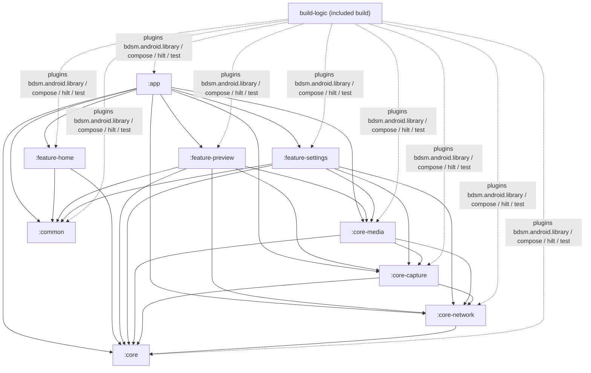

# BDSM — Análise técnica (versão VIVA)

> **Esta é a versão viva e atualizada** da análise. Reflete o código **como está hoje** (2026-10-03, depois das ondas de correção, otimização e refatoração). A análise original, escrita antes das correções, está congelada em `ANALISE_TECNICA_INICIAL_2026-10-03.md` (IDs A1–A10, M1–M56, B1–B60, L1–L13 e as 10 prioridades referem-se a ela). O plano executado está em `PLANO_DE_MELHORIA.md`.
>
> Base: branch `main`, HEAD `34dc225` **mais** o working tree com todas as alterações ainda **não commitadas** (nada deste trabalho foi commitado). Método: cada achado da versão histórica foi reverificado no código atual por leitura (Grep/Read), com evidência `arquivo:linha` ou nome de teste; as validações de build foram executadas em 2026-10-03. Onde algo só foi validado por compilação/testes unitários, o texto diz **NÃO VERIFICADO EM APARELHO**.

## Como ler

| Seção | Conteúdo |
|---|---|
| 1 | Resumo executivo do estado atual, com números medidos e resultado dos comandos de validação |
| 2 | Mapa de módulos e grafo de dependências atual |
| 3 | Pipeline de mídia e ciclo de vida atuais |
| 4 | Tabela de status de todos os achados (A, M, B, L e as 10 prioridades) |
| 5 | Achados novos encontrados durante o trabalho |
| 6 | Riscos remanescentes |
| 7 | Pendências |
| 8 | Evidência em aparelho (e o que NÃO foi verificado em aparelho) |

Legenda de status: **CORRIGIDO** (com evidência), **PARCIAL** (o que falta está dito), **ABERTO**, **N/A** (código removido).

---

## 1. Resumo executivo do estado atual

O BDSM (`applicationId com.bragastudio.mobile`) é um monitor de campo e ponte de vídeo para Android: captura de Camera2, UVC (HDMI-USB) ou Sony por Wi-Fi; motor OpenGL ES 3 nativo (LUT 3D, peaking, zebra, false color, scopes só no monitor); saídas limpas para gravação MP4 (H.264/HEVC, HLG10 opcional), NDI e BSP (H.264 sobre RTP/UDP, em desenvolvimento); servidor Link (Ktor/Netty :8080) autenticado por pareamento.

**O que mudou de fundamental desde a análise inicial:**

- **Segurança do Link:** toda rota `/api/*` (exceto pareamento e `discovery/info` mínimo) e `/ws/*` exige token obtido por pareamento com consentimento duplo; CORS aberto removido; path traversal fechado (`resolveSafe`); upload limitado a 32 MB; WebSocket com frame máximo de 8 KB.
- **Sessão de captura desacoplada da tela:** `MediaGraph` é dono único de câmera/GL/saídas/áudio; o `CaptureForegroundService` (`camera|microphone`) mantém REC/NDI/BSP vivos com tela apagada ou na Home.
- **Confiabilidade do take:** `RecState` (máquina de estados atômica), `MuxerGate` (vídeo não depende do áudio), eventos `RecordingEvent` (fonte perdida, disco cheio, erro de encoder), finalização fora da Main.
- **Build/entrega:** wrapper versionável com `distributionSha256Sum`, CI em push/PR, release exige keystore em tag, R8 + shrink de resources, ABIs filtradas, convention plugins (`build-logic`), detekt/ktlint com baseline, Kotlin 2.3.21, compileSdk 36, targetSdk 35.
- **Testes:** de 4 arquivos triviais para **294 testes unitários JVM** (mais 1 instrumentado de migração do Room), todos verdes.

### Números medidos (2026-10-03)

Medição sobre `src/` (exclui `build/`, `.git/`, terceiros). Linhas por `wc -l`.

| Item | Valor |
|---|---|
| Módulos Gradle | 9 (`app`, `common`, `core`, `core-capture`, `core-media`, `core-network`, `feature-home`, `feature-preview`, `feature-settings`) + included build `build-logic` (4 convention plugins, 211 linhas Kotlin/KTS) |
| Arquivos Kotlin de produção | 133, **26.714 linhas** |
| Arquivos Kotlin de teste | 35 (34 JVM + 1 instrumentado `MigrationTest`), 3.771 linhas |
| Total Kotlin | 168 arquivos, 30.485 linhas (histórico: 84 arquivos, 18.881 linhas) |
| C++ próprio | `GlesEngine.cpp` 1.200, `NdiEngine.cpp` 184, `GlesEngine.h` 165 = **1.549 linhas** (histórico 1.243); headers do SDK NDI à parte |
| Testes unitários JVM | **294** em 34 arquivos, 0 falhas, 0 ignorados (`core` 20, `core-capture` 30, `core-media` 98, `core-network` 60, `feature-preview` 61, `feature-settings` 25; `app`, `common`, `feature-home` sem testes) |
| APK debug | 43.303.303 bytes (41,3 MiB; arm64-v8a + armeabi-v7a) |
| APK release (R8 + shrink) | **19.281.078 bytes (18,4 MiB)**; histórico ≈ 70 MB |
| Lint (`lintDebug`) | **0 erros**, 97 avisos (histórico: 9 erros) |

Distribuição por módulo (Kotlin de produção):

| Módulo | Arquivos | Linhas | Histórico |
|---|---:|---:|---:|
| `app` | 3 | 436 | 318 |
| `common` | 3 | 496 | 391 |
| `core` | 21 | 1.910 | 1.165 |
| `core-capture` | 15 | 2.979 | 1.999 |
| `core-media` | 21 | 6.092 | 2.953 |
| `core-network` | 27 | 3.470 | 1.944 |
| `feature-home` | 3 | 990 | 1.850 |
| `feature-preview` | 22 | 5.095 | 4.354 |
| `feature-settings` | 18 | 5.246 | 3.907 |
| **Total** | **133** | **26.714** | 18.881 |

`PreviewHud.kt` caiu de 3.081 para 372 linhas (HUD fatiado em 12 arquivos `Hud*.kt`); o maior arquivo agora é `RecordingsScreen.kt` (1.312), seguido de `MediaGraph.kt` (1.213) e `RecordManager.kt` (1.067).

### Resultado dos comandos de validação (executados em 2026-10-03)

| Comando | Resultado |
|---|---|
| `assembleDebug` | **OK** |
| `assembleRelease` (R8, shrink, assinatura de debug local por falta de keystore) | **OK** (19,3 MB) |
| `lintDebug` | **OK**, 0 erros, 97 avisos (14 `NewerVersionAvailable`, 12 `GradleDependency`, 12 `UseKtx`, 12 `IconLauncherShape`, 10 `TrustAllX509TrustManager` do hutool/UVCAndroid, 3 `Aligned16KB`, 1 `OldTargetApi`, resto higiene) |
| `testDebugUnitTest` | **OK**, 294 testes, 0 falhas |
| `detekt` | **OK** (com baselines em `config/detekt/baseline-*.xml`) |
| `ktlintCheck` | **FALHA** em 2 módulos: `:core` (2 violações: ordem de imports em `SettingsRepositoryImpl.kt:3` e `function-signature` em `NdiNaming.kt:28`) e `:core-media` (16 violações em `MediaGraph.kt:1203,1206` e `NdiManager.kt`: espaços finais, vírgula final, linha em branco). São todas em código do nome NDI escrito **depois** da geração do baseline; o baseline não cobre. Correção é só formatação (`./gradlew ktlintFormat`), mas exige editar `.kt`, fora do escopo desta tarefa de documentação |

Nota de execução: ao rodar `assembleDebug assembleRelease lintDebug ... --continue` numa única invocação, a tarefa `:feature-settings:lintAnalyzeDebugUnitTest` falhou com `FileNotFoundException` em `build/generated/ksp/release/...DiagnosticsViewModel_Factory.java`: é uma **corrida** entre o KSP do release e o lint do debug (as duas tarefas compartilham o build dir do módulo), não um defeito de código. Rodando `lintDebug testDebugUnitTest` isoladamente: BUILD SUCCESSFUL.

Lint remanescente relevante: `Aligned16KB` só em `arm64-v8a/libjpeg-turbo212.so` (vem do `com.herohan:UVCAndroid:1.0.8`; histórico: 14 avisos); `TrustAllX509TrustManager` (hutool 5.6.3 transitivo do UVCAndroid, não usado pelo app); `OldTargetApi` (targetSdk 35 < 36); `ScopedStorage`/`MANAGE_EXTERNAL_STORAGE` aparecem pelo manifest da biblioteca, mas as permissões são removidas do manifest mesclado com `tools:node="remove"`.

---
## 2. Mapa de módulos e grafo de dependências ATUAL

Fonte: `project(...)` dos `build.gradle.kts`. Todas as dependências entre módulos são `implementation` (nenhum `api`). Não há ciclos. `core` e `common` não dependem de módulo nenhum do projeto.

Mudanças em relação à análise inicial:

- **Pacote de rede padronizado:** `com.braga.bdsm.network` virou `com.bragastudio.mobile.network` (namespace do módulo e diretório `core-network/src/main/java/com/bragastudio/mobile/network`). `BsmApplication` virou `BdsmApplication`; `BsmDatabase` virou `BdsmDatabase` (arquivo `bsm_database`, **nome do arquivo e o DataStore `bsm_settings` mantidos de propósito** para não perder dados do usuário).
- **`SonyCameraStatus` está em `:core`** (`core/src/main/java/.../core/model/SonyCameraStatus.kt`). A UI e o `MediaGraph` não importam mais o modelo da rede. Mas `core-media`, `core-capture` e `feature-preview/settings` **ainda dependem de `:core-network`** por outros motivos: `LinkTelemetry`/`TallyState` (telemetria e tally), cliente e `SonyNetwork` da Sony em `core-capture`. A meta "tirar `core-media -> core-network`" (plano 5.3) ficou **parcial**: os tipos Sony saíram, mas a dependência permanece.
- **`feature-settings` agora depende de `core-network`** (Link: pareados, `LinkServerController`) — o diagrama histórico de `BDSM_VISAO_TECNICA.md` estava errado nos dois sentidos.
- **`feature-home` encolheu para 3 arquivos** (Splash, Home, ViewModel): a galeria morta foi removida.
- **`build-logic`:** convention plugins `bdsm.android.library` (SDK 36/26, JVM 17, consumer rules, `isReturnDefaultValues`), `bdsm.android.compose` (plugin do compilador Compose + BOM), `bdsm.android.hilt` (KSP + Hilt) e `bdsm.android.test`. Os `build.gradle.kts` dos módulos ficaram só com namespace e dependências próprias. Versões vêm de `gradle/libs.versions.toml`.
- **`MediaGraph` encapsulado (parcial):** câmera, `NativeRenderer`, `NdiManager`, `BspManager` e os dispositivos de captura são `private` e expostos por `StateFlow`/métodos do grafo (`activeLenses`, `captureMetadata`, `manualLimits`, `recState`, `recordingEvents`, `sessionConsumers`...). **Resta público** `val recordManager`, `settingsRepository`, `lutRepository` e `context` (`MediaGraph.kt:77-84`); o `PreviewViewModel` ainda lê `mediaGraph.recordManager.isRecording/pendingFinalizations/recordingTimeMs` (`PreviewViewModel.kt:132-141`).
- **`StreamOutput`** (`core-media/domain/StreamOutput.kt`): interface comum a `NdiManager` e `BspManager` (`isActive`, `errorEvents`, `stop()`); o grafo itera `streamOutputs` para erros. Partida e métricas continuam específicas de cada saída.

### Tabela de módulos

| Módulo | Responsabilidade | Arquivos-chave |
|---|---|---|
| `:app` | `BdsmApplication` (StrictMode em debug, `AppVisibility`, `SonyNetwork.init`), `MainActivity` (imersivo, permissões, `startIfEnabled` do Link), `AppNavigation` (grafo plano com `Routes`, `safeNavigate`), manifest, versionamento, assinatura, R8, baseline profile escrito à mão | `BdsmApplication.kt`, `MainActivity.kt`, `navigation/AppNavigation.kt` |
| `:common` | Tema Material 3 e `SettingsComponents` (com `Role`/semântica) | `ui/theme/*`, `components/SettingsComponents.kt` |
| `:core` | Contratos e persistência: `SettingsRepository` (DataStore com `ReplaceFileCorruptionHandler`), Room `BdsmDatabase` v4, `RecordingStatus`, `NdiNaming`, `HardwareMonitorService`, `VideoScopes`, `SonyCameraStatus`, biblioteca de gravações (`core/recording/*`: `RecordingLibrary`, `RecordingListBuilder`, `RecordingFormat`, `ExportedCopy`) | `data/SettingsRepositoryImpl.kt`, `database/BdsmDatabase.kt`, `recording/RecordingLibrary.kt` |
| `:core-capture` | `CaptureDevice` (Camera2, UVC, Sony), descoberta de lentes, `AudioCaptureService` (sinks, `AudioMeter`, Bluetooth SCO), `CaptureLogic` (lógica pura testável) | `device/Camera2Device.kt`, `UvcCaptureDevice.kt`, `SonyRemoteCaptureDevice.kt`, `domain/AudioCaptureService.kt` |
| `:core-media` | `MediaGraph`, render nativo (JNI + C++), `RecordManager` + `RecState` + `MuxerGate` + `RecordingTimeline`, `NdiManager`, `BspManager` + `bsp/*`, `CaptureForegroundService`, `CaptureSessionPolicy`, `MediaStoreExporter`, `LutParser`/`LutRepositoryImpl`, `StreamOutput`, `VideoPlanning` | `domain/MediaGraph.kt`, `RecordManager.kt`, `graphics/NativeRenderer.kt`, `cpp/GlesEngine.cpp`, `cpp/NdiEngine.cpp`, `service/CaptureForegroundService.kt` |
| `:core-network` | Link: `LinkServer` (Netty), `LinkModule` (rotas Ktor testáveis com `testApplication`), `auth/LinkAuthManager` (pareamento), `LinkServerController` (liga/desliga persistido, pareados, revogar), `LinkTelemetry`/`MetadataCollector`/`LinkState`, `HttpRange`, `service/LinkServerService` + `PairingNotifier` + `TransferNotifier`, `sharing/*`, `sony/*` (+ `SonyNetwork`, `SonyProtocolRules`) | `LinkModule.kt`, `auth/LinkAuthManager.kt`, `LinkServerController.kt` |
| `:feature-home` | Splash e Home | `HomeScreen.kt` |
| `:feature-preview` | `PreviewScreen`, `PreviewViewModel`, HUD fatiado (`PreviewHud.kt` + `HudTopBars/HudBottomBar/HudRecControls/HudManualControls/HudDialPopovers/HudMenus/HudToolsCluster/HudAudioMeters/HudStatusOverlays/HudTheme/HudFormatters/HudLogic`), `SonyRemotePanel`, scopes (`ScopeBitmapHolder`, `ScopePixels`) | `PreviewScreen.kt`, `PreviewViewModel.kt` |
| `:feature-settings` | Configurações (destino da gravação, Link/pareados, licenças), NDI, LUTs, Diagnóstico, galeria de gravações sobre Room, roleta (easter egg) | `SettingsScreen.kt`, `LinkSettingsSection.kt`, `RecordingsScreen.kt`, `NdiSetupScreen.kt`, `LicensesScreen.kt` |

---

## 3. Pipeline de mídia e ciclo de vida ATUAIS

### 3.1 Cold start e serviços

- `BdsmApplication.onCreate` **não** inicia o servidor do Link nem injeta o `MediaGraph`. Faz StrictMode (só debug, `penaltyLog`), `appVisibility.attach` e `SonyNetwork.init`.
- A `MainActivity`, em primeiro plano, chama `LinkServerController.startIfEnabled()`; o preferência `enabled` (padrão **ligado**, persistida em SharedPreferences `bdsm_link_controller`) é conferida dentro do `onStartCommand` do `LinkServerService` (inclusive no restart `START_STICKY` com intent nulo). Se o sistema recusa o foreground, o serviço se encerra sem pedir reinício.
- `LinkServerService`: foreground `dataSync`, canal `bdsm_link_server_channel_v2` (IMPORTANCE_MIN) com ação "Desligar"; `LinkServer.start/stop` só enfileiram (canal único de comandos em IO), o bind do Netty acontece com `wait=false` e o mDNS só é registrado depois do bind (`ServerState` Starting/Running/Failed/Stopped). Android 15: `onTimeout` encerra o Link no limite do tipo `dataSync`.
- **Dois** foreground services agora: `LinkServerService` (`dataSync`, `core-network`) e `CaptureForegroundService` (`camera|microphone`, `core-media`).
- Permissões: `CAMERA` + `RECORD_AUDIO` (gate na `MainActivity`), `POST_NOTIFICATIONS`, `NEARBY_WIFI_DEVICES`/`ACCESS_FINE|COARSE_LOCATION (<=32)` para a Sony, `BLUETOOTH_CONNECT`/`MODIFY_AUDIO_SETTINGS` (SCO), `FOREGROUND_SERVICE_*`. `MANAGE/READ/WRITE_EXTERNAL_STORAGE` removidas do manifest mesclado (`tools:node="remove"`); `uses-feature` GLES 3.0 obrigatório, câmera/microfone/USB host opcionais; `allowBackup=false`, `dataExtractionRules`, `networkSecurityConfig` (cleartext só para `192.168.122.1`).

### 3.2 Sessão de captura desacoplada da tela

- `MediaGraph` (@Singleton) é dono de câmera, GL, REC/NDI/BSP e áudio. A `TextureView` é consumidora **opcional**: `attachPreviewSurface`/`detachPreviewSurface` são idempotentes e não reiniciam câmera de sessão viva.
- `SessionConsumers(recording, ndi, bsp)` com contagem de referência. `CaptureSessionPolicy` (lógica pura, `CaptureSessionPolicyTest`) decide: `detachAction` (soltar só o preview, ou desligamento completo), `shouldShutdownSession`, `planForeground` (tipos conforme CAMERA/RECORD_AUDIO concedidas), `audioNeeded` (REC, NDI com áudio ou VU do Preview) e o texto da notificação. Tolerância `INACTIVE_GRACE_MS = 1500`.
- `CaptureForegroundService` (`camera|microphone`): notificação com tempo e ação "Parar"; pedido no **início** do consumidor, com a Activity visível; encerra sozinho quando `MediaGraph.foregroundWanted` fica falso; se o sistema recusar, a sessão sobrevive só em primeiro plano.
- Sink de áudio no grafo: **REC antes de NDI** (L6). Áudio com contagem de referência no `AudioCaptureService` (sinks, fim do callback singleton).
- **Rotação:** `MainActivity` declara `configChanges` (a Activity não recria) e `screenOrientation=fullSensor`; o `GlesEngine` **congela a rotação das saídas** (`outputRotationDegrees`) enquanto qualquer saída (REC/NDI/BSP) estiver ativa e só acompanha o display sem saída (`GlesEngine.cpp:628-631`).
- **Perda da fonte** (L1): `observeCurrentDeviceState` + `SOURCE_LOSS_GRACE_MS = 1500` ms; durante REC finaliza com segurança e emite `RecordingEvent.SourceLost`.

### 3.3 Gravação (RecordManager)

- `RecState` (Idle/Preparing/Recording/Stopping) em `RecStateMachine` com `compareAndSet`: toque duplo não prepara duas vezes (`RecStateMachineTest`).
- `MuxerGate`: o muxer inicia com o formato do vídeo e o áudio entra quando houver (PCM ausente não descarta o take). `RecordingTimeline` unifica o PTS de A/V.
- Eventos `RecordingEvent` (`SourceLost`, `DiskFull`, `EncoderError`, `Stopped(reason: StopReason)`) emitidos via `SharedFlow`; piso de espaço livre verificado durante o take.
- Finalização (`muxer.stop`, cópia SAF, miniatura) fora da Main, com `NonCancellable`; `pendingFinalizations` na UI. Destino: app, **Galeria** (cópia exportada por `MediaStoreExporter` no fim do take, Android 10+; `contentUri` no registro) ou pasta SAF.
- Registro Room com `RecordingStatus` (enum), reconciliação de `IN_PROGRESS` órfão e importação de arquivos do disco por `RecordingLibrary`.

### 3.4 Render nativo

- Ordem dos passes por frame (`GlesEngine.cpp:633-652`): **preview primeiro** (latência do operador), depois gravação, depois BSP e **NDI por último**, pulado se não há receptor (`ndiHasReceivers` atômico). Passe de scopes depois (FBO 256x144 + PBO duplo, só com scope ativo).
- Uniforms com `GLint` em cache; `eglPresentationTimeANDROID` com o timestamp da SurfaceTexture em REC/BSP; `eglSwapInterval(0)` na surface corrente. Rotação congelada nas saídas.
- LUT com intensidade (`uLutMix`), 3D com meio texel e parser robusto com teto de tamanho. O shader de overlay e o limpo continuam strings dentro do `GlesEngine.cpp`.
- Cada saída ainda é um `drawPass` completo (até 4 por frame), sem FBO intermediário; scopes continuam contados em laço de CPU na thread GL.

### 3.5 Link, pareamento e telemetria

- `LinkModule` é uma extensão `Application.linkModule(deps)` testável com `testApplication` (`LinkServerRoutesTest`). Sem CORS. `intercept` em `/api` exige token (exceto `/api/pair/*` e `/api/discovery/info`, que sem token devolve só `deviceName/deviceModel/appVersion/authRequired:true`); `/ws` exige token. Token via `Authorization: Bearer` ou `?token=`.
- `LinkAuthManager`: pedido (`POST /api/pair/request`, corpo <= 2 KB) -> código de 4 dígitos mostrado no celular (`PairingNotifier`: diálogo com app visível, notificação com Permitir/Recusar em segundo plano via `PairingActionReceiver`) -> aprovação -> token de 128 bits entregue **uma única vez** em `GET /api/pair/status/{id}` (só ao mesmo IP); servidor guarda só o SHA-256; anti-spam (1 pendente por IP, 3 no total, cooldown de 5 s); revogar derruba o WebSocket em até um ciclo (500 ms) porque o token é revalidado a cada envio; `isAuthorized` compara em tempo constante.
- Telemetria real: `LinkTelemetry` (REC, fonte, lente, fps, microfone, nome NDI, tally) alimentada pelo `MediaGraph`; `MetadataCollector` só trabalha com clientes WS conectados; `LinkJson` com `encodeDefaults = true`.
- **Tally:** o cliente envia `{"type":"TALLY_UPDATE","state":"PROGRAM|PREVIEW|OFF"}` (campo `type`, não `event`) -> `LinkTelemetry.setTally` -> borda vermelha (PROGRAM ou REC local) ou verde (PREVIEW) no HUD (`HudLogic.tallyIndicator`).
- Downloads com `PartialContent`/Range (`HttpRange`, 416 em faixa inválida), filtro de status e notificação "copiado" só no último byte.
- `LutLibraryService.resolveSafe`: rejeita caminho absoluto/`..`/NUL/barra invertida/extensão fora de `.cube` e resolve symlink; upload com teto de 32 MB.

### 3.6 NDI e nome

- `NdiNaming` (`:core`): a **máquina** NDI é fixada em `BDSM` via `ndi-config.v1.json` (`{"ndi":{"machinename":"BDSM"}}`, gravado por `NdiManager` e apontado por `NDI_CONFIG_DIR` em `nativeSetConfigDir` antes do `NDIlib_initialize`). O nome do **sender** é o nome do aparelho (`Settings.Global.DEVICE_NAME`, senão o modelo) ou o definido pelo usuário; o prefixo legado `BDSM - ` é removido. Resultado visto no OBS/vMix: `BDSM (nome do sender)`. Renomear com o NDI ativo reinicia o sender com debounce de 500 ms.

### 3.7 Modelo de threads (atual)

| Thread / dispatcher | O que roda |
|---|---|
| Main | Compose, ViewModels; `attachPreviewSurface` (do `viewModelScope`); `UvcCaptureDevice.start` |
| `BDSM-GL-Render` | Todo o EGL/GLES, `updateTexImage`, `nativeRender`, upload de LUT |
| `BDSM-CameraThread` | `openCamera` e callbacks do `Camera2Device` |
| `BDSM-NDI-Thread` | `ImageReader` do NDI -> `NdiManager` |
| `Dispatchers.IO` (escopo do grafo com `SupervisorJob` + `CoroutineExceptionHandler`) | Coletores (`collectGuarded`), finalização do take, Link, Sony |
| `Dispatchers.Default` | `MetadataCollector`, scopes (conversão para bitmap), `CameraRepositoryImpl.scan` |

---
## 4. Tabela de status de todos os achados

Cada linha foi verificada por leitura do código atual (não por suposição). "Teste" indica que o teste existe e cobre o ponto (todos os 294 passam). Itens que só têm prova por compilação/testes JVM estão marcados com **NÃO VERIFICADO EM APARELHO**.

Placar: **A** 8 corrigidos, 2 parciais · **M** 41 corrigidos, 14 parciais, 1 aberto · **B** 20 corrigidos, 24 parciais, 16 abertos · **L** 1 corrigido, 11 parciais, 1 aberto.

### 4.1 Prioridades (as 10 da análise inicial)

| # | Prioridade | Status | Evidência / o que falta |
|---|---|---|---|
| 1 | Autenticação + opt-in no `LinkServer` e path traversal | **PARCIAL (núcleo corrigido)** | A1/A2: token por pareamento, CORS removido, `resolveSafe`; validado em aparelho (§8). Falta: padrão do Link é LIGADO (não opt-in), sem filtro de IP privado, sem `Origin` no WS |
| 2 | Versionar `gradle-wrapper.jar` | **PARCIAL** | `.gitignore:25-26` libera o jar (`git check-ignore` confirma a negação) e `distributionSha256Sum` está gravado, mas o jar ainda aparece como **não rastreado** (`??`): falta `git add` + commit |
| 3 | Cleartext Sony + vínculo de rede | **CORRIGIDO** (NÃO VERIFICADO EM APARELHO) | `network_security_config.xml` (só `192.168.122.1`), `SonyNetwork` (bind por socket); `SonyProtocolTest` |
| 4 | Gravação sobreviver a rotação/navegação | **CORRIGIDO** (parcial em aparelho) | `configChanges`, rotação das saídas congelada no GL, sessão desacoplada + FGS. Aparelho: Home durante REC OK; **rotação durante REC NÃO VERIFICADA** |
| 5 | Finalização/cópia SAF/Galeria fora da Main | **CORRIGIDO** | `RecordManager.stopRecording` em IO + `NonCancellable`, `COPYING` assíncrono, `MediaStoreExporter`/`GalleryExporter` em IO |
| 6 | Muxer não depender do áudio; estado imutável do take | **CORRIGIDO** | `MuxerGate`, `RecordingSession`, `RecordingTimeline`; `RecordingTimelineTest`, `RecStateMachineTest`. Ressalva: `buildHlgStaticInfo` ainda com 28 bytes ("verificar em aparelho") |
| 7 | BSP: SPS/PPS e IDR antes de commitar | **CORRIGIDO** (NÃO VERIFICADO EM APARELHO) | `BspManager.kt`: cache do `CODEC_CONFIG`, reenvio colado ao IDR, `PREPEND_HEADER_TO_SYNC_FRAMES`, keyframe forçado; sem teste da decisão de injeção |
| 8 | Release: keystore, R8, ABIs, 16 KB | **PARCIAL** | Gate de keystore em tag, R8 + shrink (APK 18,4 MiB), ABIs filtradas; 16 KB: resta `libjpeg-turbo212.so` do UVCAndroid |
| 9 | FGS do Link: semântica, start em background, `stop()` assíncrono | **CORRIGIDO** | `LinkServerService` (preferência conferida em `onStartCommand`, `promoteToForeground` em try/catch, `onTimeout` do Android 15), `LinkServer` com fila e `ServerState`; FGS ativo em aparelho |
| 10 | Blindagem do `MediaGraph` + API 29 + retriever | **CORRIGIDO** | `SupervisorJob` + handler + `collectGuarded` (M16); guarda API 29 (`MediaGraph.kt:700-708`); retriever por tarefa liberado no `finally` (A7) |

### 4.2 Altos (A1–A10)

| ID | Status | Evidência | O que falta |
|---|---|---|---|
| A1 | **PARCIAL** | `LinkModule.kt:89-95` (intercept em `/api` exige token, exceto `/api/pair/*` e `/api/discovery/info`), `:262-263` (`/ws`), CORS removido (`:81-82`); `auth/LinkAuthManager.kt` (SecureRandom, `MessageDigest.isEqual`, só o hash persistido, consentimento duplo); início fora do `Application` (`BdsmApplication.kt`, `MainActivity.kt:111-115`); notificação com "Desligar"; `LinkServerController` (toggle persistido, pareados, revogar). Testes: `LinkServerRoutesTest` (401 sem token, header/query, revogado volta a 401, fluxo de pareamento), `LinkAuthManagerTest`. **Aparelho: verificado** (§8) | `enabled` com padrão **true** (`LinkServerController.kt:43`; a análise pedia padrão false); sem filtro de IP de origem; sem validação de `Origin` no handshake do WS; bind em `0.0.0.0` (aceito); `/` e `/api/discovery/info` públicos (decisão deliberada, info mínima) |
| A2 | **CORRIGIDO** | `LutLibraryService.kt:60-81` `resolveSafe` (absoluto, `..`, `.`, vazio, `\`, NUL, profundidade > 4, extensão != `.cube`, canônico + `toRealPath` para symlink), usado em delete/checkConflict/save/get; rotas devolvem 400 (`LinkModule.kt:188,236`); upload com teto de 32 MB (413); gravação via `.part`; WS `maxFrameSize` 8 KB. Testes: `LutLibraryServiceTest` (travessia, absoluto, NUL, extensão, symlink, raiz nunca apagada), `LinkServerRoutesTest` (400/413). **Aparelho: verificado** | Pico de ~64 MB no upload (buffer + `toByteArray`); `computeHash` sem cache na listagem |
| A3 | **CORRIGIDO** (parte em aparelho) | `CaptureSessionPolicy` + `MediaGraph.detachPreviewSurface` (só solta a surface com consumidor ativo); `CaptureForegroundService` (`camera|microphone`); `keepScreenOn` (`PreviewScreen.kt:48-52`); `configChanges`; rotação das saídas congelada (`GlesEngine.cpp:563,627-631`); áudio por contagem de referência (coletor `audioDemand`). Testes: `CaptureSessionPolicyTest`, `RotationMappingTest`. **Aparelho:** Home durante REC e rotação com NDI ativo OK | Rotação **durante** REC e o fluxo real do FGS sem teste automatizado; comentário defasado sobre `PreviewViewModel.onCleared` em `MediaGraph.kt` |
| A4 | **CORRIGIDO** (NÃO VERIFICADO EM APARELHO) | `network_security_config.xml` (cleartext só `192.168.122.1`), `SonyNetwork` (`requestNetwork` + `bindSocket`, sem `bindProcessToNetwork`), usado em cliente, descoberta e liveview; `SonyProtocolTest` | NSC cobre só o IP fixo; câmera em modo infraestrutura (outro IP) continua bloqueada; `SonyNetwork.acquire` pede qualquer Wi-Fi sem INTERNET |
| A5 | **PARCIAL** | `.gitignore:25-26`, `distributionSha256Sum`, `wrapper-validation` no `release.yml` e `ci.yml` | `gradle-wrapper.jar` ainda **não rastreado** (`??`); `ci.yml`, módulos novos e renomeações também estão sem commit |
| A6 | **CORRIGIDO** | `RecordManager.stopRecording` em `IO + NonCancellable`; `prepareRecording*` em IO; cópia SAF fora do STOP via `launchPostProcess` (`COPYING`); `MediaStoreExporter`/`GalleryExporter` em IO; `LutRepositoryImpl.importLut` em IO; `RecStateMachine`. Testes: `RecStateMachineTest`, `GalleryExportRulesTest` | `GalleryExporter` (feature-settings) e `MediaStoreExporter` (core-media) duplicam lógica; laço de cópia sem `ensureActive()` |
| A7 | **CORRIGIDO** | `RecordingLibrary.probe` (uma instância por chamada, `release()` no `finally`, `Semaphore`), miniatura/duração do Room, `LruCache` por bytes (`RecordingsScreen.kt:305-309`). Testes: `RecordingListBuilderTest`, `RecordingFormatTest` (sem teste do `probe`) | Miniatura do `RecordManager` é salva em tamanho cheio e `decodeFile` não amostra (suspeita de memória com 4K) |
| A8 | **CORRIGIDO** (NÃO VERIFICADO EM APARELHO) | `BspManager.kt`: `KEY_PREPEND_HEADER_TO_SYNC_FRAMES`, `lastCodecConfig`, reenvio SPS/PPS + IDR, keyframe forçado no handshake, `stop()` ordenado com `cancelAndJoin`. Teste: `H264RtpPacketizerTest` (só o pacotizador) | Teste da decisão de SPS/PPS (privada) |
| A9 | **CORRIGIDO** | `LinkServerService.kt` (start em try/catch, `enabled` em `onStartCommand`, notificação mantida, `onTimeout`), `LinkServer.kt` (fila + `ServerState.Failed`). **FGS do Link ativo em aparelho** | Sem teste específico do serviço |
| A10 | **CORRIGIDO** (1 sub-item aberto) | `MuxerGate.kt` (só-vídeo após timeout do áudio), `RecordingTimeline.kt`, `RecordingSession`, `feedAudio` fatiando pela `capacity()`, `NEVER_STARTED` apaga e marca CORRUPTED, reconciliação de `IN_PROGRESS` (`BdsmDatabase.kt:115-121`). Testes: `RecordingTimelineTest`, `RecStateMachineTest`. **MP4 íntegro em aparelho** | `buildHlgStaticInfo` (28 bytes; `KEY_HDR_STATIC_INFO` espera 25) sem validação; origem comum `nanoTime` pode desalinhar A/V no caminho HDR direto (sem teste) |

### 4.3 Lacunas (L1–L13)

| ID | Status | Evidência | O que falta |
|---|---|---|---|
| L1 | **PARCIAL** | `MediaGraph.onCaptureStateChanged` + `SourceHealth` (`GraphLogic.kt`), `handleSourceLost` finaliza o REC e emite `SourceLost` (`HudLogic.kt` mostra); `GraphLogicTest` | NDI/BSP sem política de perda de fonte; nada para chamada, foco de áudio, silenciamento do SO, economia de energia, bateria baixa, térmico (zero `AudioFocus`/`PowerManager`/`Thermal*`) |
| L2 | **PARCIAL** | `PreviewViewModel.kt:105-130` reconstrói ISO e obturador da telemetria real; `hdrSupportedNow()`; `ManualControlMappingTest` | **WB e foco manuais** ainda iniciam em AUTO/null; a lente volta à principal; falta a fonte única (`StateFlow` no singleton) |
| L3 | **CORRIGIDO** | `LutRepositoryImpl.kt:51-86` sync no start e a cada `LutLibraryService.changes`; varredura recursiva por caminho, remove fantasmas; `LutLibraryServiceTest` (`changes emite apos upload e exclusao...`) | Sync sem teste (depende de DAO) |
| L4 | **PARCIAL** | `MediaLibraryService` só serve `COMPLETED/COPIED`; `HttpRange` (206/416), notificação só no último byte; `RecordingLibrary.sync`; `HttpRangeTest`, `LinkServerRoutesTest`, `LinkTelemetryAndMediaTest` | `RecordingLibrary.sync()` só roda ao abrir a galeria: `/api/media` fica defasado até alguém abrir a tela |
| L5 | **PARCIAL** | espelhamento por fonte (`setSourceMirrorX`, `uMirrorX`); NDI com proporção real | sem ajuste de proporção no render; liveview Sony esticado; zebra/false color pós-LUT vs scopes sem LUT sem escolha do operador |
| L6 | **PARCIAL** | `audioSink` no grafo: REC primeiro, NDI depois | envio NDI de áudio ainda síncrono na thread do `AudioRecord`, sem fila/descarte |
| L7 | **ABERTO** | NDI continua RGBA (`NdiEngine.cpp:96`, `ImageReader` RGBA_8888) | conversão para UYVY no GL |
| L8 | **PARCIAL** | `routeBluetoothIfNeeded` (`setCommunicationDevice` API 31+, `startBluetoothSco` antes), confere `routedDevice` | `BLUETOOTH_CONNECT` **não é pedida em runtime** (`MainActivity.requiredPermissions` só tem CAMERA, RECORD_AUDIO, POST_NOTIFICATIONS): no Android 12+ o SCO cai no log; **Bluetooth SCO NÃO VERIFICADO EM APARELHO** |
| L9 | **PARCIAL** | `AvailabilityCallback` (hotplug) em `CameraDiscoveryEngine` | câmera frontal descartada de propósito (`LensType.FRONT`/`getFrontCamera` mortos) e `BDSM_PLUGIN_OBS.md` listava "Câmera Frontal" (corrigido nesta revisão) |
| L10 | **PARCIAL** | `isRecording` real, `ndiStreamName`, nome único do aparelho (`DeviceNames`), dashboard reflete o REC real | sem estado térmico (o doc do OBS prometia; corrigido); sem "troca instantânea" de lente (só o ciclo de 500 ms) |
| L11 | **PARCIAL** | manifest do app: GLES 3.0 obrigatório, camera/microfone/usb.host `required=false` | **o manifest mesclado de release ainda traz `android.hardware.usb.host required="true"`** (o merge com o UVCAndroid sobrescreve; falta `tools:node="replace"`), o que exclui aparelhos sem USB host |
| L12 | **PARCIAL** | `LicensesScreen`/`OpenSourceLicenses` (nota LGPL do libusb, marca NDI), `OpenSourceLicensesTest` | `excludes += "/META-INF/{AL2.0,LGPL2.1}"` pode remover avisos; lista manual; questão jurídica não verificável em código |
| L13 | **PARCIAL** | R/B corrigido, buffer limpo a cada pedido, `takeSnapshot` com polling | captura sai do passe de preview (com overlays); `takeSnapshot` sem acionador na UI |

---

### 4.4 Médios (M1–M56)

Resumo: **CORRIGIDO 41, PARCIAL 14, ABERTO 1** (M53). Evidência por leitura do código; os testes citados são unitários JVM.

| ID | Status | Evidência (arquivo / teste) | O que falta |
|---|---|---|---|
| M1 | CORRIGIDO | `app/build.gradle.kts` (gate em `taskGraph.whenReady` falha `assemble/package/bundleRelease` em tag ou `-PrequireReleaseSigning=true` sem keystore); `release.yml` exige os 4 secrets e tag `vX.Y.Z`, keystore em `$RUNNER_TEMP` | — |
| M2 | CORRIGIDO | R8 + `isShrinkResources` no `:app` release; `app/proguard-rules.pro`, `core-network/consumer-rules.pro` etc.; `abiFilters` padrão arm64-v8a + armeabi-v7a; `mapping.txt` arquivado no CI. Release de 18,4 MiB gerado nesta sessão | Release com R8 **não testado em aparelho** |
| M3 | PARCIAL | `-DANDROID_SUPPORT_FLEXIBLE_PAGE_SIZES=ON`, NDK 27, `max-page-size=16384`, `-fvisibility=hidden` (`core-media/build.gradle.kts`, `CMakeLists.txt`); lint `Aligned16KB` de 14 para 3 avisos | `libjpeg-turbo212.so` do UVCAndroid 1.0.8 continua sem alinhamento de 16 KB |
| M4 | CORRIGIDO | `AndroidManifest.xml`: permissões amplas removidas, `usb.host` opcional, `allowBackup=false`, `dataExtractionRules` | `CHANGE_WIFI_STATE` possivelmente sem uso |
| M5 | CORRIGIDO | `SettingsRepositoryImpl.kt:28-32` (`ReplaceFileCorruptionHandler`), `.catch` de `IOException`, `distinctUntilChanged` nos flows | Sem teste do `SettingsRepositoryImpl` com arquivo corrompido |
| M6 | PARCIAL | `ci.yml` (push/PR: assembleDebug, lintDebug, testDebugUnitTest, detekt, ktlint); 294 testes | `UVCTest`/`UVCParamTest` (reflexão) e `SonyLiveviewParserTest` (reimplementa a conta) são testes sem valor, ainda no CI; sem teste do repositório de settings; **o `ktlintCheck` está falhando hoje** (ver §1) |
| M7 | PARCIAL | `RecordingStatus`; reconciliação de `IN_PROGRESS` na abertura do banco (`BdsmDatabase.kt:115-121`); `RecordingFormat` normaliza na leitura | Status ainda String com literais em `RecordManager.kt`/`MediaLibraryService.kt`; `/api/media` devolve 1920x1080 fixo (`MediaLibraryService.kt:52-54`) |
| M8 | CORRIGIDO | `Camera2Device.kt`: `HandlerThread`/executor únicos, token `generation` em todos os callbacks, `start()` idempotente; `CaptureLogicTest` | `onConfigureFailed` de `reconfigureSession` não confere `generation` |
| M9 | CORRIGIDO | `FpsPlanner.plan`, `CONTROL_AE_TARGET_FPS_RANGE`, `SENSOR_FRAME_DURATION`, `effectiveFps`; testes `fps_*` em `CaptureLogicTest` | **FPS real medido no aparelho: NÃO VERIFICADO EM APARELHO** |
| M10 | CORRIGIDO | `AudioCaptureService.kt`: `AudioSink` (`CopyOnWriteArrayList`), buffers reutilizados, recriação em `DEAD_OBJECT`; o grafo para o mic conforme `foregroundWanted` (`MediaGraph.kt:1053-1057`); `AudioMeterTest` | callback legado `onAudioBufferAvailable` sem uso |
| M11 | CORRIGIDO | `UvcCaptureDevice.kt`: `DeviceFilter` classe 0x0E, `activeDevice`, `negotiateFormat` + `UvcFormatPicker`; `CaptureLogicTest` (`uvc_*`) | **UVC/HDMI NÃO VERIFICADO EM APARELHO**; suspeita: filtro por classe 0x0E no `USBMonitor` pode descartar webcams com `deviceClass` 0xEF |
| M12 | CORRIGIDO | `ManualControls.resolveExposure`/`coerceFocus` (`CaptureLogic.kt`), `ManualLimits` publicados; testes `manual_*` | — |
| M13 | PARCIAL | `LensClassifier` por focal equivalente (inclui MACRO); testes `lente_*` | `physicalCameraIds` coletado e nunca usado; sem `setPhysicalCameraId`/`CONTROL_ZOOM_RATIO` |
| M14 | CORRIGIDO | `RecordingTimeline.kt` (`TimelineRebaser`), `PreMuxerQueue`, fatiamento do PCM pela capacidade do buffer AAC; `RecordingTimelineTest` | — |
| M15 | PARCIAL | `RecordManager.onFatal` -> `DiskFull`/`EncoderError`; `SpaceGuard` com `MIN_FREE_BYTES`; `MediaGraph.kt:1017-1020` para o take | Sem split de arquivo nem fMP4: queda abrupta ainda pode deixar MP4 sem `moov` |
| M16 | CORRIGIDO | `MediaGraph.kt:137-141` (`SupervisorJob` + handler), `collectGuarded`, guarda API 29 no `ImageReader` (700-708), fonte ativa em `StateFlow` | — |
| M17 | CORRIGIDO | `RecState.kt` (`RecStateMachine`, `compareAndSet`), `VideoPlanning.kt` (`MediaCodecList`, fallback H.265->H.264); `RecStateMachineTest`, `VideoPlannerTest` | — |
| M18 | CORRIGIDO | `eglSwapInterval(0)` por surface, `acquireLatestImage`, sem `memcpy`, `shared_mutex`, `ndiHasReceivers` pula o passe, fps do sender atômico | Estatística de drop usa 30 fps fixo (`NDI_SENDER_FPS`); **NDI em produção medido (CPU/temperatura): NÃO VERIFICADO EM APARELHO** além do teste de ligar/desligar |
| M19 | CORRIGIDO | `MediaGraph.kt:1134-1141` `distinctUntilChanged` + `updateMonitorParams` | `gridType`/`aspectRatioMarker` parâmetros mortos |
| M20 | CORRIGIDO | meio texel, `RGBA16F`, `uLutMix` (`GlesEngine.cpp`); `LutParser` robusto; `activateOnly` transacional; `LutParserTest` | Calibração visual da LUT: NÃO VERIFICADO EM APARELHO |
| M21 | CORRIGIDO | `BspControlChannel`/`BspManager`: socket em `finally`, RTT por id, `cancelAndJoin`, coletores guardados; `H264RtpPacketizerTest` | BSP **NÃO VERIFICADO EM APARELHO** |
| M22 | PARCIAL | R/B corrigido no nativo (`GlesEngine.cpp:601-617`), eixo Y no `NativeRenderer` | Snapshot ainda sai do passe de preview (com overlays) |
| M23 | CORRIGIDO | luma Rec.709 no shader, waveform e vectorscope; ferramentas independentes; `highp` | Calibração contra chart: NÃO VERIFICADO EM APARELHO |
| M24 | CORRIGIDO | `nativePtr` com `ReentrantReadWriteLock`; `ANativeWindow` liberada; `needSnapshot` atômico | polling de scopes usa `cancel()` |
| M25 | CORRIGIDO | `LinkJson` `encodeDefaults = true`; `LinkTelemetryAndMediaTest` | — |
| M26 | CORRIGIDO | `LinkTelemetry` alimentado pelo `MediaGraph`; `MetadataCollector` com bateria real e só com clientes WS | — |
| M27 | CORRIGIDO | `SonyProtocolRules` (host = origem do pacote, rede privada, `readLimited`), `XmlPullParser`; `SonyProtocolTest` | Sony **NÃO VERIFICADO EM APARELHO** |
| M28 | PARCIAL | `isOk()` em todos os métodos do cliente, `Mutex`, resync do liveview (`SonyProtocolTest`) | `SonyRemoteCaptureDevice` ainda ignora o `Boolean` de `setIsoSpeedRate`, `setShutterSpeed`, `actTakePicture` etc.: falha silenciosa para o usuário |
| M29 | CORRIGIDO | `PreviewScreen.kt:56-98,320-329` providers lidos nas folhas; `collectAsStateWithLifecycle`; scopes com bitmap reaproveitado em `Default`; `VuMeterModelTest`, `ScopePixelsTest` | `HudUiState @Immutable` e strong skipping não feitos; sem medição de recomposição |
| M30 | CORRIGIDO | `SonyRemotePanel.kt` (`SonyStatusChip`, `ShutterButton`), `PreviewHud.kt:353-364` | — |
| M31 | CORRIGIDO | `HudDialPopovers.kt:298-330` só chama `onSelect` ao mudar de índice; persiste ao soltar | Sem teste do gesto |
| M32 | CORRIGIDO | `HudAudioMeters.kt` (dBFS, peak-hold, clip por pico); `VuMeterModelTest`, `HudFormattersTest` | — |
| M33 | PARCIAL | semântica/`Role`/alvo mínimo no REC e na topbar; fonte mínima 11 sp | `HudBottomBar`, `HudToolsCluster`, `HudManualControls`, `HudMenus`: pouca semântica; alvos de 14–34 dp não auditados |
| M34 | PARCIAL | `PreviewHud.kt` 3.081 -> 372 linhas em 13 arquivos; `HudLogicTest`, `HudFormattersTest` | `CameraHUDOverlay` ainda recebe ~110 parâmetros (mais que os 78 originais); falta agrupar em estado/ações |
| M35 | CORRIGIDO | `PreviewViewModel.kt:202-203` (`hdrSupportedNow`), `toggleHdr` com aviso | **HDR NÃO VERIFICADO EM APARELHO** |
| M36 | CORRIGIDO | `MediaGraph.kt:231-233` `activeLenses` via `flatMapLatest`; `_currentLens` zerado ao trocar fonte | — |
| M37 | PARCIAL | `DisplayListener` filtra `DEFAULT_DISPLAY` (`PreviewScreen.kt:158`) | `fixTextureViewAspectRatio` ainda fixa 16:9 e ignora o tamanho real do stream (parâmetros `UNUSED_PARAMETER`) |
| M38 | CORRIGIDO | `RecordingsGalleryViewModel` sobre Room + `RecordingLibrary` (`RecordingsScreen.kt:116-250`); favoritos em lote; `RecordingListBuilderTest`, `RecordingFormatTest` | — |
| M39 | CORRIGIDO | rótulos reais por `probe` (`RecordingLibrary.kt:238-322`), duração com horas (`RecordingFormat.kt:25-33`) | — |
| M40 | CORRIGIDO | `LazyVerticalGrid`/`LazyColumn` com `key` (`RecordingsScreen.kt:716-760`) | — |
| M41 | CORRIGIDO | `DeleteConfirmationDialog`, bloqueio de take em andamento | Sem "Desfazer" |
| M42 | CORRIGIDO | `AppNavigation.kt` `safeNavigate` (`launchSingleTop`), `popBackStack(Routes.HOME, false)` | — |
| M43 | CORRIGIDO | `LutsViewModel.kt:162-170` -> `lutRepository.importLut(uri)` em IO com validação; `LutRepositoryNamesTest` | — |
| M44 | CORRIGIDO | `StorageDestination.kt` (App/Galeria/Pasta), `StorageAccess.kt`, diálogo "Destino" + "Restaurar padrão"; `StorageDestinationTest` | Galeria só no Android 10+; **exportação para a Galeria NÃO VERIFICADO EM APARELHO** |
| M45 | CORRIGIDO | `LutManagementScreen.kt` (snackbar, loading, confirmação, slider persistido) e `uLutMix` no GL | — |
| M46 | CORRIGIDO | campo NDI com commit em `onDone`/perda de foco, vazio volta ao padrão; renomear com debounce e `restartNdi`; `NdiNamingTest` | — |
| M47 | CORRIGIDO | "Sem rede"/"--" quando não há dado, bitrate "estimado" (`NdiSetupScreen.kt`, `LocalIpMonitor.kt`) | — |
| M48 | PARCIAL | enums `Resolution/Fps/Codec` na UI (`SettingsOptions.kt`), `VideoPlanning` unifica tabelas; `SettingsOptionsTest`, `GraphLogicTest` | `SettingsRepository` ainda persiste Strings; `SettingsViewModel` (315 linhas) ainda concentra NDI/Link/áudio/LUT |
| M49 | PARCIAL | internos do grafo privados; fonte ativa em `StateFlow` | `recordManager`, `settingsRepository`, `lutRepository`, `context` públicos (`MediaGraph.kt:77-84`); sem camada de domínio |
| M50 | CORRIGIDO | `PreviewScreen.kt:180-182,252-266` libera Surface/SurfaceTexture ao concluir o `detach`; `PreviewSurfaceRef` | — |
| M51 | CORRIGIDO | `MainActivity.kt:118-121` reaplica imersivo; `keepScreenOn`; cutout `shortEdges` em `values-v27` e `values-v31` | `keepScreenOn` só na tela de Preview |
| M52 | CORRIGIDO | `LinkModule.kt:311-320` `TALLY_UPDATE` -> `LinkTelemetry.setTally` -> `HudLogic.tallyIndicator`; `LinkTelemetryAndMediaTest`, `HudLogicTest` | Plugin OBS externo ainda não atualizado |
| M53 | ABERTO | só MP4 (`RecordManager.kt:259-271`); sem MOV, 150 Mbps nem controles de áudio por canal/ganho/monitor | features fora do escopo do hardening |
| M54 | PARCIAL | Preview 100% em `collectAsStateWithLifecycle` | `collectAsState` sem lifecycle em Home, Diagnóstico, LUTs, NDI, Gravações e Configurações |
| M55 | CORRIGIDO | `HardwareMonitorService.kt:44-68` `stateIn(WhileSubscribed)` com `catch` | Sem teste |
| M56 | PARCIAL | uniforms em cache, `eglPresentationTimeANDROID` em REC/BSP, preview primeiro, NDI pulado sem receptor | Ainda até 4 `drawPass` completos por frame; NDI sem PTS |

---

### 4.5 Baixos (B1–B60)

Resumo: **CORRIGIDO 20, PARCIAL 24, ABERTO 16**.

| ID | Status | Evidência | O que falta |
|---|---|---|---|
| B1 | ABERTO | manifest só com MAIN/LAUNCHER | `device_filter` USB, intent-filter, `singleTask` |
| B2 | ABERTO | `MainActivity` ainda exige CAMERA e RECORD_AUDIO juntos; `PreviewScreen.kt:138` `hasCameraPermission = true` constante | gate por destino; pedir áudio só no REC |
| B3 | ABERTO | coletores NDI/BSP só rodam com o grafo instanciado (`init` do `MediaGraph`) | UI distinguir "habilitado" de "transmitindo" |
| B4 | CORRIGIDO | `bdsm.android.library` fixa JVM 17; minify só no app | — |
| B5 | CORRIGIDO | `ci.yml` em push/PR; `release.yml` valida tag, `$VERSION` entre aspas, sem `--no-daemon` | — |
| B6 | CORRIGIDO | `abiFilters` arm64-v8a + armeabi-v7a | x86/x86_64 ainda versionados em `jniLibs` (peso do repositório) |
| B7 | PARCIAL | `lut_impl.txt` removido; `.vs/.vscode/.cxx` no `.gitignore` | sem `.gitattributes`; histórico `.git` não limpo |
| B8 | PARCIAL | catálogo único, `feature-home` usa `libs.*` | Room/SQLite/KSP declarados em `core-media` sem uso; Hilt/KSP em `common` |
| B9 | CORRIGIDO | 4 convention plugins; sem `kotlinCompilerExtensionVersion`; sem BOM em `common/build.gradle.kts` | — |
| B10 | CORRIGIDO | `gradle.properties`: 4 GB, parallel, caching, configuration-cache (`problems=warn`) | Jetifier mantido ligado |
| B11 | ABERTO | `scripts/*.bat` mantêm nome de APK errado e `exit /b 1` no sucesso | corrigir scripts |
| B12 | CORRIGIDO | `activateOnly`, `insertIfAbsent`, índice único em `filePath`, `MIGRATION_3_4` | — |
| B13 | PARCIAL | `StatFs` mede o volume real das gravações | defaults enganosos (bateria 100, temp 0) sem estado "desconhecido" |
| B14 | ABERTO | `SELECTED_LUT`, `MODERN_UI_ENABLED` órfãs, `Build.MODEL` no domínio | remover |
| B15 | PARCIAL | `toggleScopesVisibility` envia 0 quando oculto; polling só visível | `MediaGraph.kt:476,886` ignoram `isVisible`; códigos mágicos 1/2/3 |
| B16 | PARCIAL | `statusBarColor` só `<API 35` com `@Suppress` | cast `(view.context as Activity)`, `darkTheme` ignorado |
| B17 | PARCIAL | `Role.Button/Switch/RadioButton`, `}@Composable` corrigido | chevron em texto, cores literais, sem `modifier` |
| B18 | ABERTO | `@Provides` manuais, `@Binds @Singleton` redundante | trocar por `@Binds` |
| B19 | CORRIGIDO | buffers reutilizados, `AudioStreamInfo` real, mono->estéreo | — |
| B20 | PARCIAL | scan em `Default`, sem `join()` na Main | `openCamera` ainda no contexto do chamador (Main) |
| B21 | ABERTO | Sony: `catch (e: Exception)` engole cancelamento, comandos sem serialização, sem backoff | — |
| B22 | ABERTO | `runCatching { reconfigureSession }` ignora o resultado | — |
| B23 | ABERTO | `CaptureDevice` sem descritor de capacidades; `RECORDING` morto | — |
| B24 | PARCIAL | `detach` em `NonCancellable` sob mutex | `detachPreviewSurface()` sem identidade da surface; `LutsViewModel` ainda chama attach/detach |
| B25 | PARCIAL | flags `@Volatile`, `ptrLock` | `release()` ainda faz `join()` síncrono |
| B26 | PARCIAL | rename/resolução reinicia o NDI com debounce; `stopMetricsTracking` zera conexões | `WIFI_MODE_FULL_HIGH_PERF` (`NdiManager.kt:164`) deprecado |
| B27 | ABERTO | NDI e BSP coexistem sem exclusão ("nenhuma exclusividade forçada") | chave única `StreamingMode` |
| B28 | PARCIAL | `bspSettings.distinctUntilChanged()` | host/resolução/fps com BSP ativo não reinicia |
| B29 | PARCIAL | RTT real por id de heartbeat | `ERROR` ainda inalcançável; reconexão fixa de 2 s |
| B30 | PARCIAL | `rtpPort` validado, timeout de handshake | `readLine` sem limite; sem autenticação/criptografia |
| B31 | CORRIGIDO | `collectorJobs`, `cancelAndJoin`, delta negativo tratado (`BspManager.kt`) | — |
| B32 | CORRIGIDO | `H264RtpPacketizerTest` (11 testes) | `BspJson` sem teste |
| B33 | ABERTO | sem `WifiLock` no BSP; `RTP_PORT`/`context` mortos | — |
| B34 | PARCIAL | host validado (`SettingsRules.isValidHost`) | sem gate `BuildConfig.DEBUG`: card Dev e rota `diagnostics` abertos em release |
| B35 | ABERTO | NDI sem grupo/senha; sem aviso na UI | aviso de "sem criptografia" |
| B36 | CORRIGIDO | `LinkServer` com fila serializada, `wait=false`, `ServerState.Failed` | — |
| B37 | PARCIAL | parser `getEvent` com `JsonArray` e merge | sem teste com respostas gravadas |
| B38 | CORRIGIDO | namespaces XML e `effectivePort`; `SonyProtocolTest` | — |
| B39 | PARCIAL | "16:9" em `aspectOptions` | `GridAndAspectOverlay` ainda assume 16:9 |
| B40 | CORRIGIDO | HUD fatiado; UI clássica e `MinimalSettingValue` removidos | — |
| B41 | ABERTO | 0 `stringResource`; texto literal pt-BR | extração para `strings.xml`; `String.format` sem Locale em `HomeScreen.kt:741`, `DiagnosticsScreen.kt:209` |
| B42 | PARCIAL | faixas reais de ISO/obturador/foco, com testes | WB 5000K/5600K no mesmo modo; `getLensLabel` fixa 2x |
| B43 | PARCIAL | `ScopesCanvas.kt` removido | `takeSnapshot`/`saveSnapshotToGallery` sem chamador e sem `try/catch` |
| B44 | PARCIAL | Bitmap reaproveitado em `Default` | vectorscope esticado em 16:9 |
| B45 | ABERTO | scopes calculados na CPU a cada frame (`GlesEngine.cpp:660-686`) | throttle nativo, buffer reutilizável |
| B46 | CORRIGIDO | `playRecording`/`shareRecording`/`GalleryExporter` com tratamento e mensagem | — |
| B47 | PARCIAL | `Icons.Filled.Star`, `Role.Button` | fontes de 8–10 sp e alvos de 32–40 dp |
| B48 | CORRIGIDO | estado no ViewModel, `GalleryTab` só `ALL/FAVORITES` | — |
| B49 | ABERTO | `HomeScreen` com layouts duplicados, sem scroll no retrato, splash fixo | — |
| B50 | ABERTO | `RouletteScreen` ativa, prêmio de tema falso | — |
| B51 | CORRIGIDO | seleção por `device.id`, rótulos desambiguados | — |
| B52 | PARCIAL | marca NDI e tela de licenças (`OpenSourceLicenses.kt`) | README sem atribuição; textos de licença só em `jniLibs`; `libndi.so` x86 no repo |
| B53 | PARCIAL | `allowBackup=false`, regras de extração | ~238 `Log.*` sem `assumenosideeffects` |
| B54 | PARCIAL | `LutParser` com tetos; JNI confere comprimento | `sendFrameRgba` sem `GetDirectBufferCapacity` |
| B55 | PARCIAL | compileSdk 36, targetSdk 35, libs atualizadas | Ktor 2.3.13/Coil 2.7.0 em linhas antigas; targetSdk 36 pendente |
| B56 | CORRIGIDO | `HandlerThread` único; filtro UVC por classe | — |
| B57 | CORRIGIDO | sem `Log.d` no servidor; consumidor único | — |
| B58 | CORRIGIDO | `MediaLibraryService.deleteMedia` só apaga a linha se o arquivo sumiu | — |
| B59 | CORRIGIDO | sem mojibake; `.editorconfig` utf-8 | BOM residual em 3 arquivos; sem `.gitattributes` |
| B60 | CORRIGIDO | `ndkVersion = "27.0.12077973"`; plugin Compose do Kotlin | — |

---
## 5. Achados NOVOS (encontrados durante o trabalho)

Defeitos que **não** estavam na análise inicial e que os testes ou o lint pegaram. Todos corrigidos, exceto onde dito.

| # | Achado | Como apareceu | Correção / evidência |
|---|---|---|---|
| N1 | A lista de pareados (`LinkAuthManager.paired`) não era atualizada ao **aprovar** um pedido (só ao revogar); a UI mostrava "nenhum dispositivo" após parear | teste de auth (`LinkAuthManagerTest`) | `approve()` agora publica `_paired.value`; cobertura em `LinkAuthManagerTest` ("token valido apos aprovacao...", "revogar invalida o token e atualiza a lista") |
| N2 | O parser de `Range` devolvia 200 (arquivo inteiro) para faixa inválida em vez de **416** | `HttpRangeTest` / `LinkServerRoutesTest` | `HttpRange.kt`; teste `range fora do arquivo retorna 416 e id inexistente 404` (`LinkServerRoutesTest.kt:325`) |
| N3 | `resolveSafe` não resolvia **symlink de arquivo inexistente** no Windows (caminho canônico divergia da raiz e rejeitava/aceitava errado) | `LutLibraryServiceTest` no Windows | `LutLibraryService.resolveSafe`; teste `symlink para fora da raiz e rejeitado` (`LutLibraryServiceTest.kt:92`, ignora a verificação onde o SO não permite criar symlink) |
| N4 | `PackageInfo.longVersionCode` exige API 28: abrir Configurações no **Android 8.0/8.1** derrubaria o app (`NoSuchMethodError` não é `Exception`) | lint `NewApi` | `PackageInfoCompat.getLongVersionCode` (`SettingsScreen.kt:77`) |
| N5 | `ImageReader.newInstance(..., usage)` exige **API 29**: o NDI cairia em Android 8–9 | lint `NewApi` | guarda `SDK_INT >= Q` com fallback (`MediaGraph.kt:700-708`) |
| N6 | `ByteOrderMark` em arquivo do build | lint | `common/build.gradle.kts` sem BOM (resíduo em 3 arquivos `.kt`, sem efeito de lint) |
| N7 | `windowLayoutInDisplayCutoutMode` só existe na **API 27** (lint `NewApi` no tema base) | lint | `values-v27/themes.xml` com o atributo; `values-v31` também o repete (substitui o estilo inteiro) |
| N8 | Corrida de build: `lintAnalyzeDebugUnitTest` falha com `FileNotFoundException` em `build/generated/ksp/release` quando `assembleRelease` e `lintDebug` rodam na mesma invocação | execução desta sessão | não é defeito de código; rodar `lintDebug` separado de `assembleRelease` (ou sem paralelismo) |
| N9 | **`ktlintCheck` falha** em `:core` e `:core-media` (18 violações) em código de nome NDI escrito depois da geração do baseline | execução desta sessão | **ABERTO** (precisa `ktlintFormat`; fora do escopo de documentação) |
| N10 | O documento do plugin OBS descrevia a mensagem de tally com o campo `"event"`, mas o código só aceita `"type"` | conferência desta revisão | corrigido em `BDSM_PLUGIN_OBS.md` (docs); o código **não** foi alterado |
| N11 | O default `p_ndi_name = "BDSM - CAM"` ainda existe no `NdiEngine.cpp` como fallback quando o nome vem nulo (nunca ocorre pelo caminho normal, que passa por `NdiNaming`) | leitura do C++ | **ABERTO** (cosmético) |
| N12 | `PreviewViewModel.saveSnapshotToGallery` sem `try/catch` e sem chamador; Toast de sucesso antes de gravar | verificação de B43 | **ABERTO** (código morto) |
| N13 | `ktor-server-cors` ainda declarado em `core-network/build.gradle.kts` sem uso (o plugin não é instalado) | leitura | **ABERTO** (dependência morta) |
| N14 | O manifest **mesclado** de release traz `android.hardware.usb.host required="true"` (herdado do UVCAndroid) mesmo com `required="false"` no manifest do app | conferência do merged manifest | **ABERTO**: falta `tools:node="replace"` no `uses-feature` |
| N15 | `BLUETOOTH_CONNECT` é declarada mas nunca pedida em runtime; o roteamento SCO fica inalcançável no Android 12+ sem concessão manual | verificação de L8 | **ABERTO** |
| N16 | `gradle/wrapper/gradle-wrapper.jar` continua não rastreado pelo git (o `.gitignore` já o libera) | `git status` | **ABERTO**: `git add gradle/wrapper/gradle-wrapper.jar` |
| N17 | Miniatura do `RecordManager` salva em tamanho cheio e decodificada sem `inSampleSize` (bitmaps 4K de ~33 MB no cache da galeria) | verificação de A7 | **ABERTO** |

---

## 6. Riscos remanescentes

1. **Nada foi commitado.** Todo o trabalho (inclusive renomeações `Bsm*` -> `Bdsm*` e a troca de pacote de rede) está só no working tree; uma perda do diretório perde tudo. Prioridade imediata: commits temáticos numa branch.
2. **Release com R8 nunca rodou em aparelho.** Regras de Netty/Ktor/JNI/Room/Hilt foram escritas e o build passa, mas reflexão ofuscada só aparece em execução (NDI, Link, UVC, serialização).
3. **Link sem TLS e escutando em `0.0.0.0`.** HTTP em texto claro: o token trafega em claro na Wi-Fi. Sem filtro por faixa de IP privado e sem checagem de `Origin` no handshake do WebSocket (o CORS foi removido, mas o WS de navegador não é coberto por CORS). Aceito para LAN/hotspot, mas deve estar documentado ao usuário.
4. **Takes longos sem split/fMP4.** Queda abrupta do processo ou da bateria ainda pode deixar um MP4 sem átomo `moov` (M15 parcial).
5. **NDI/BSP coexistem sem exclusão** e o card/rota de Diagnóstico (que liga o BSP em texto claro para um IP digitado) está acessível em release (B27/B34).
6. **Gates de permissão e hot-plug:** o app inteiro exige câmera e microfone juntos (B2); plugar a placa UVC não abre o app (B1); filtro de classe 0x0E pode descartar webcams com classe 0xEF (suspeita, M11).
7. **Qualidade de manutenção:** `MediaGraph.kt` (1.213 linhas) e `RecordManager.kt` (1.067) são os próximos "PreviewHud"; `CameraHUDOverlay` ainda recebe ~110 parâmetros; `RecordingsScreen.kt` tem 1.312 linhas.
8. **Cobertura de testes só de lógica pura.** Não há teste de `MediaGraph`, `RecordManager` com codec real, ViewModels, UI/Compose, nem do `SettingsRepositoryImpl`; `UVCTest`/`UVCParamTest` e `SonyLiveviewParserTest` dão falsa sensação de cobertura.
9. **Dependências:** `libjpeg-turbo` (16 KB) e hutool 5.6.3 (`TrustAllX509TrustManager`) vêm do UVCAndroid 1.0.8; Ktor 2.3.13 e Coil 2.7.0 em linhas antigas; AGP 8.13.2 (último 8.x).
10. **Perda de dados no export:** com destino Galeria, a cópia exportada é a única fora do diretório privado do app (apagado na desinstalação); se o export falhar o take fica só no diretório do app.
11. **Higiene do repositório:** `.git` com lixo (`tmp_obj`, 53 MB), `libndi.so` x86 versionado, `Braga Digital Studio Mobile.zip` e `APK/` na raiz (verificar se versionados).
12. **Legal:** a análise L12 foi atendida tecnicamente (tela de licenças, marca NDI, nota LGPL do libusb), mas a revisão jurídica do `LICENSE` proprietário vs. dependências continua recomendada antes de distribuir.

---

## 7. Pendências

Fonte: `PLANO_DE_MELHORIA.md` (status final por fase) e esta verificação.

**Plataforma (próximo passo conjunto):** AGP 9 + Hilt 2.59+ + Kotlin 2.4 + compileSdk 37 (as versões atuais de Navigation 2.10, Activity 1.13 e BOM 2026.x exigem compileSdk 37 e AGP 9.1; Hilt 2.58 é o último compatível com AGP 8 e lê metadados Kotlin só até 2.3.0). **targetSdk 36** (hoje 35; mudanças de orientação/redimensionamento e back preditivo não validadas em aparelho). Migrar `hiltViewModel` para `androidx.hilt.lifecycle.viewmodel.compose`; reativar a regra `argument-list-wrapping` do ktlint.

**Desempenho:** **Baseline Profile medido com Macrobenchmark** (hoje `baseline-prof.txt` escrito à mão, cold start não medido); throttle nativo dos scopes (B45); FBO intermediário/passe único para as saídas (M56); `HudUiState @Immutable` + strong skipping medido (M29/M34).

**Funcionalidade:** **WB e foco manual completos no L2** (fonte única da verdade para controles manuais; hoje o ViewModel e o singleton ainda podem divergir após Home -> Preview); lentes físicas e `CONTROL_ZOOM_RATIO` (M13); câmera frontal e hot-plug de câmeras (L9); controles de áudio USB com canal/ganho/monitor, MOV/150 Mbps (M53); `StreamingMode` (exclusão NDI/BSP); Sony: tratar o `Boolean` dos comandos e dar feedback (M28); tap-to-focus.

**Rede/segurança:** filtro de endereço privado e validação de `Origin` no WebSocket; TLS opcional; atualizar o plugin OBS externo para `pair/request -> pair/status -> Bearer` e para o campo `type` do tally; aviso de "sem criptografia" no NDI/BSP.

**Build/higiene:** corrigir o `ktlintCheck` (N9); `ktlintFormat`; remover `ktor-server-cors`, Room/SQLite/KSP de `core-media`; commitar o wrapper e as mudanças; `git gc`; corrigir `scripts/*.bat`; BSP: `WifiLock`, limite no `readLine`, restart ao mudar host/resolução; gate `BuildConfig.DEBUG` do card Dev e remoção da roleta.

**Produto:** nome de máquina e nome do sender NDI (feito) -> opção de o usuário trocar a **máquina** (hoje fixa em `BDSM`); i18n (`strings.xml`); acessibilidade do HUD (M33, B47); Home (B49).

**Testes em aparelho pendentes:** ver §8.

---

## 8. Evidência em aparelho

**Aparelho de validação:** Samsung Galaxy S20 FE (SM-G780G), Android 13, Adreno 650, arm64-v8a. Build **debug** de 2026-10-03. (Um Galaxy A51 com Mali-G72 só serviu como linha de base antes das correções.)

### 8.1 Verificado em aparelho

| Área | Resultado |
|---|---|
| Instalação | Por cima, mantendo os dados: OK |
| Inicialização | App abre sem crash |
| Link | `LinkServer` escuta em `:8080`; foreground service do Link ativo |
| Autenticação | Sem token -> **401** em `GET /api/media`, `GET /api/luts`, `DELETE /api/media/{id}`, `POST /api/luts/upload`, `WS /ws/link`; token inválido (header e `?token=`) -> 401 |
| Rotas públicas | `GET /` e `GET /api/discovery/info` públicos (info mínima com `authRequired:true`) |
| CORS | Sem `Access-Control-Allow-Origin` para origem externa |
| Token válido | -> 200 |
| Path traversal (com token) | `../x.cube`, `a/../../x.cube`, caminho absoluto e extensão `.txt` -> **400**; nenhum arquivo criado fora de `luts/` |
| Upload/delete válidos | 200; delete com `..` -> 400 |
| Pareamento | `POST /api/pair/request` devolveu `requestId` e código; o diálogo "Conectar ao BDSM Link?" apareceu no celular com o mesmo código; usuário aprovou; token entregue **uma vez** (a segunda consulta de status não devolve o token) |
| Gravação | Iniciou; timecode correu; `CaptureForegroundService` em primeiro plano (`foregroundServiceType camera|microphone`); câmera aberta pelo app |
| Sessão desacoplada | Com o app na **Home** a gravação **continuou** (processo vivo, FGS ativo, câmera aberta, arquivo crescendo) |
| Parada | MP4 íntegro (2:09, átomo `moov` gravado, `MPEG4Writer` sem erro) |
| Rotação (parada) | Paisagem e retorno a retrato com o app aberto: a Activity **não foi recriada** (`configChanges`); o NDI ativo continuou |
| NDI | Ligado/desligado pela UI; com NDI ativo e app na Home, o log mostrou "Preview solto; sessão mantida" |
| Nome NDI | Na rede aparece **`BDSM (MNBF - F.E)`** (máquina fixada em `BDSM` via `ndi-config.v1.json` + `NDI_CONFIG_DIR`; sender = nome do aparelho ou definido pelo usuário; prefixo legado `BDSM - ` removido) — **confirmado pelo usuário no OBS** |

### 8.2 NÃO VERIFICADO EM APARELHO (validado só por compilação/testes unitários)

- **Rotação DURANTE a gravação ativa** (a rotação testada foi logo após parar o take, com NDI ativo). A rotação congelada nas saídas (`GlesEngine.cpp:628-631`) tem apenas leitura de código.
- **BSP**: receptor tardio, SPS/PPS reenviados, IDR no handshake (só `H264RtpPacketizerTest`).
- **Sony Wi-Fi / cleartext** (`network_security_config`, vínculo de rede por socket, `SonyProtocolTest`).
- **UVC / HDMI** (filtro de classe, hot-plug, negociação de formato).
- **Release com R8 em aparelho** (NDI, Link, UVC, Room/Hilt, serialização).
- **Bluetooth SCO** (`BLUETOOTH_CONNECT`, roteamento do microfone).
- **Exportação automática para a Galeria** (`MediaStoreExporter`).
- **Android 14/15** (tipos de FGS, `onTimeout` do `dataSync`, edge-to-edge forçado).
- **HDR** (HEVC Main10 HLG10, caminho câmera -> encoder).
- **Calibração** de scopes, peaking, zebra, false color e LUT (Rec.709, meio texel, `RGBA16F`).
- Também sem teste em aparelho: FPS efetivo 60 (M9), notificação de pareamento em segundo plano, revogação derrubando o WebSocket em <= ~500 ms, permissões negadas, perda da fonte durante o REC (`SourceLost`), disco cheio, `onTimeout` do Link, aviso do `RecordingEvent`, importação da galeria sobre o Room em massa, `LutsScreen`/attach-detach concorrente (B24).

---

## Adendo final (2026-10-03, após o levantamento acima)

Itens resolvidos ou comprovados depois da seção de status. **Estes valem sobre o que estiver dito acima.**

| Item | Antes | Agora | Evidência |
|---|---|---|---|
| N9 `ktlintCheck` | FALHA (18 violações) | **PASSA** | `ktlintFormat` aplicado; baselines regerados (`detektBaseline` e depois `ktlintGenerateBaseline`); `detekt ktlintCheck` OK |
| N14 / L11 `usb.host` | `required="true"` no manifest mesclado de release | **CORRIGIDO** | `tools:node="replace"` no `uses-feature` do app; merged manifest de release mostra `required="false"` |
| Rotação **durante** o REC | NÃO VERIFICADA em aparelho | **VERIFICADA** (S20 FE, Android 13) | Take 4K H.265 de 1:35 com o aparelho girado para todos os lados (`ROTATION_270 → 0 → 270 → 90`): processo e Activity não foram recriados, arquivo fechou com `moov`, decodifica inteiro, e a resolução permaneceu **3840×2160 do início ao fim** (rotação das saídas congelada no GL) |
| Nome do NDI | `LOCALHOST (BDSM - modelo)` | **`BDSM (MNBF - F.E)`** | `NdiNaming` + `ndi-config.v1.json` (`ndi.machinename`) via `NDI_CONFIG_DIR`; confirmado pelo usuário no OBS. O nome entre parênteses é o nome do aparelho ou o definido pelo usuário; o prefixo legado `BDSM - ` é removido; testes em `NdiNamingTest` |
| Gravação com NDI simultâneo + giro | não testado | **VERIFICADO** | NDI ligado durante giros e Home; log `Preview solto; sessão mantida` |
| Memória do Gradle | `-Xmx4g`, daemon ~4,1 GB de RAM, ocioso por 3 h | `-Xmx3g`, Kotlin daemon `-Xmx2g`, `org.gradle.daemon.idletimeout=600000` (10 min) | `gradle.properties`; build completo (debug + 294 testes + lint + release) executado com os novos limites sem `OutOfMemoryError` |

**Observação sobre o take gravado:** o `ffmpeg` aponta DTS repetido no vídeo (a cada ~117 quadros). Um take de setembro, **anterior a todas as mudanças**, tem o mesmo aviso, então não é regressão; vale investigar o arredondamento de PTS do encoder HEVC em outro momento. Os primeiros quadros do take têm pequenas lacunas de aquecimento do encoder.

**Validação final executada:** `assembleDebug` OK; `testDebugUnitTest` 294 testes, 0 falhas; `lintDebug` OK; `assembleRelease` OK (R8, 19,3 MB); `detekt` e `ktlintCheck` OK. Rodar `assembleRelease` e `lintDebug` na mesma invocação pode falhar por corrida de arquivos no Windows (bloqueio de `classes.jar`); rodados em sequência, passam. Se o bloqueio aparecer, `./gradlew --stop` resolve.

**Ainda NÃO verificado em aparelho:** BSP (receptor tardio/SPS-PPS), Sony Wi-Fi e cleartext, UVC/HDMI, release com R8 instalado, Bluetooth SCO (a permissão `BLUETOOTH_CONNECT` ainda não é pedida em tempo de execução), exportação automática para a Galeria, Android 14/15, HDR, calibração de peaking/scopes/LUT, 60 fps efetivo, notificação de pareamento em segundo plano, revogação derrubando o WebSocket, `SourceLost` e disco cheio.
