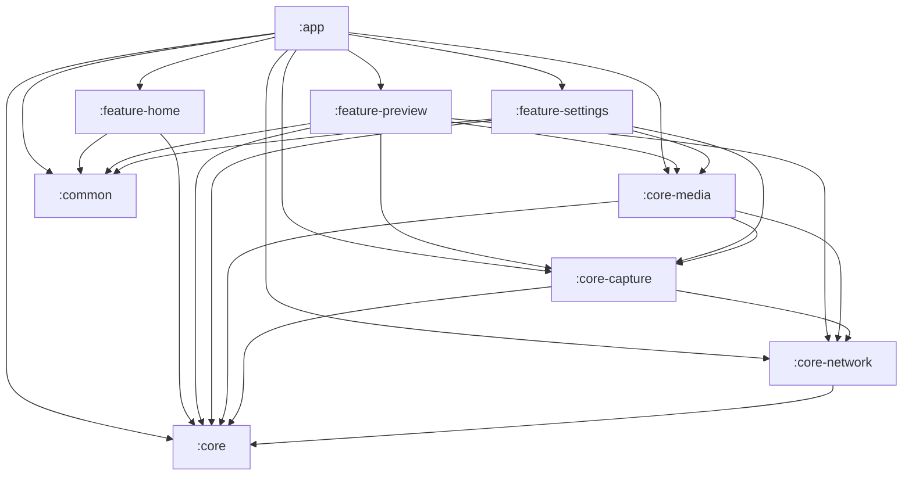
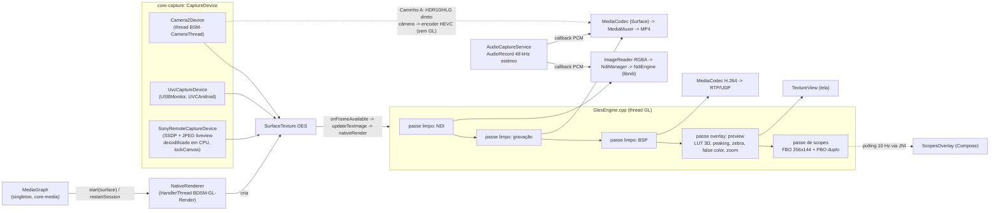
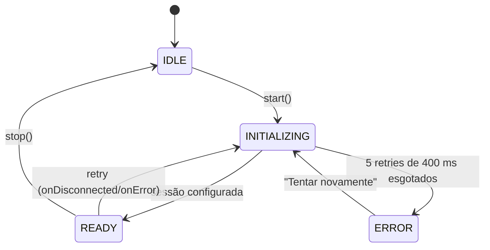
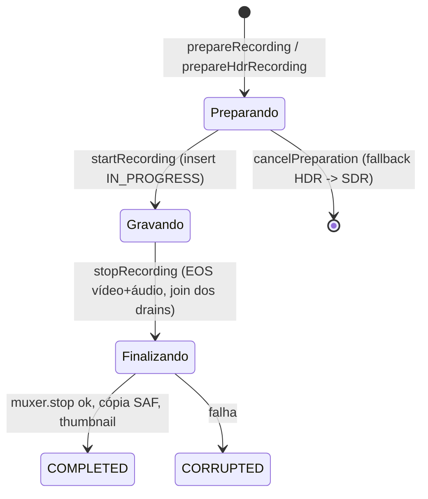
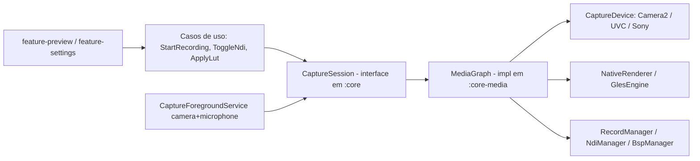
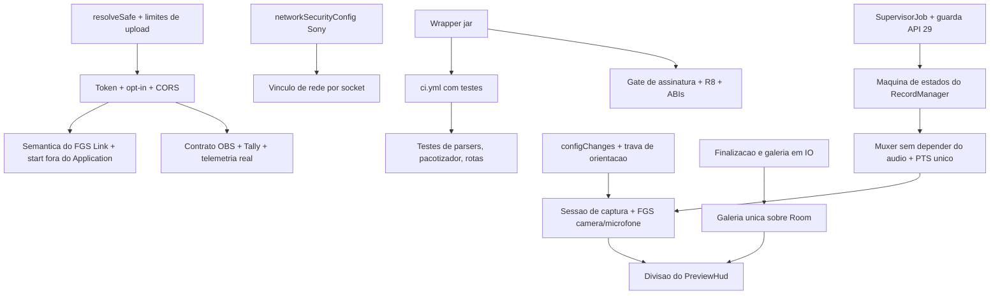

> **VERSÃO HISTÓRICA (congelada).** Esta é a análise feita no início do trabalho (2026-10-03), antes das correções e otimizações. Ela descreve o código COMO ERA. A versão viva e atualizada está em `ANALISE_TECNICA_COMPLETA.md`; o plano em `PLANO_DE_MELHORIA.md`.

# BDSM — Análise técnica completa do código

> Gerado em 2026-10-03 a partir da leitura integral do código (18 analisadores em paralelo: 12 módulos + 6 lentes transversais), com verificação independente de cada achado (1 a 3 verificadores), conferência de 60 citações, revisão de completude e execução real de `assembleDebug`, `lintDebug` e `testDebugUnitTest`.
> Estado analisado: branch `main`, HEAD `34dc225`, **incluindo** as alterações não commitadas (BSP / switch de desenvolvimento).
> Este arquivo é um relatório pontual: **não** substitui `ARQUITETURA.md` nem `BDSM_VISAO_TECNICA.md` (que têm divergências do código, listadas na Parte 1, §7).

## Como ler

| Parte | Conteúdo | Leia se você quer... |
|---|---|---|
| **1** | Como o app funciona e como é montado | entender a arquitetura, o pipeline de mídia, módulos, build e onde mexer |
| **2** | Achados, melhorias e boas práticas | priorizar correções (10 altos, 56 médios, 60 baixos), com correção recomendada e roadmap |
| **3** | Lacunas, evidência por execução, lint/testes e testes pendentes no aparelho | saber o que foi comprovado por execução e o que falta testar |

**Resumo em 6 linhas:** 9 módulos, ~18,9 mil linhas de Kotlin + ~1,2 mil de C++. O build passa e o BSP compila. As frentes de risco são: (1) `LinkServer` aberto na LAN sem autenticação e com path traversal; (2) gravação encerrada por rotação/navegação; (3) trabalho pesado na thread principal; (4) release/CI frágil (`gradle-wrapper.jar` fora do git, chave de debug, R8 desligado); (5) crashes em Android 8–9 (`ImageReader` API 29, `longVersionCode` API 28); (6) praticamente nenhum teste automatizado.

---

# Parte 1 — Como o BDSM funciona e como é montado

Relatório técnico, 2026-10-02. Repositório: `D:\Projetos\Braga Digital Studio Mobile`, branch `main`, HEAD `34dc225`. O estado analisado é o do disco, incluindo as alterações não commitadas (17 arquivos modificados e 3 novos, entre eles o BSP).

Convenções: caminhos relativos ao repositório; `arquivo:linha` indica a linha conferida no código. Onde uma afirmação veio apenas da leitura dos módulos e não foi reconferida nesta redação, o texto diz "segundo a leitura do módulo".

---

## 1. Resumo executivo

### O que é

O BDSM (Braga Digital Studio Mobile, `applicationId com.bragastudio.mobile`) transforma um celular Android em um **monitor de campo e ponte de vídeo para produção audiovisual**. Ele captura vídeo de três fontes:

- câmera interna, via Camera2;
- placa HDMI-USB ou webcam UVC, via UVCAndroid;
- câmera Sony por Wi-Fi, via Camera Remote API.

O vídeo passa por um motor OpenGL ES 3 nativo. Esse motor desenha ferramentas de monitoramento (LUT 3D, focus peaking, zebra, false color e scopes) apenas na tela, e envia um frame "limpo" para as saídas: gravação em MP4 (H.264 ou HEVC, com HDR10/HLG opcional), transmissão NDI e, em desenvolvimento, o protocolo próprio BSP (H.264 sobre RTP/UDP). Um servidor HTTP/WebSocket embutido (Ktor/Netty, porta 8080) expõe telemetria, gravações e LUTs para a rede local.

### Para quem

Operadores de câmera, diretores de fotografia e equipes de transmissão ao vivo que usam o celular como monitor com LUT e scopes, ou como câmera NDI/streaming para OBS, vMix e afins. O app é single-activity, em modo imersivo, e o HUD é pensado para uso em paisagem.

### Stack

| Camada | Tecnologia |
|---|---|
| Linguagens | Kotlin 1.9.22 (UI, domínio, rede), C++17 (render e NDI), GLSL ES 3.00 (shaders inline) |
| Build | Gradle 8.13 (wrapper), AGP 8.13.2, KSP 1.9.22-1.0.17, catálogo `gradle/libs.versions.toml` |
| UI | Jetpack Compose (BOM 2024.02.01, compiler 1.5.10), Material 3, Navigation Compose 2.7.7 |
| DI | Hilt 2.51 |
| Persistência | Room 2.6.1 (schema v3) e DataStore Preferences 1.0.0 |
| Rede | Ktor 2.3.8 (apenas engine Netty), `kotlinx-serialization`, NSD (mDNS) |
| Mídia | Camera2, UVCAndroid 1.0.8, MediaCodec/MediaMuxer, AudioRecord, EGL/GLES3, NDI SDK 6 (`libndi.so` proprietária) |
| SDKs | `minSdk 26`, `compileSdk`/`targetSdk 34`, Java 17 |

### Números medidos

Medição feita com comandos de leitura em 2026-10-02/03. Exclui `build/`, `.git/` e bibliotecas de terceiros.

| Item | Valor |
|---|---|
| Módulos Gradle | 9 (`app`, `common`, `core`, `core-capture`, `core-media`, `core-network`, `feature-home`, `feature-preview`, `feature-settings`) em `settings.gradle.kts` |
| Arquivos Kotlin | 84 no disco (81 rastreados pelo git, mais 3 do BSP não rastreados) |
| Linhas Kotlin | 18.881 no disco (18.281 rastreadas, mais 600 do BSP) |
| C++ próprio | `GlesEngine.cpp` 992 linhas, `NdiEngine.cpp` 144, `GlesEngine.h` 107; total 1.243 |
| Headers do SDK NDI | `core-media/src/main/cpp/ndi/Include/` (versionados; contam à parte, cerca de 2,3 mil linhas dos 3.456 de `.h` rastreados) |
| Scripts Gradle | 11 arquivos `.kts` |
| Testes | 4 arquivos: 2 unitários triviais de reflexão sobre UVC, 1 parser Sony, 1 `MigrationTest` instrumentado |

Distribuição por módulo (Kotlin):

| Módulo | Arquivos | Linhas |
|---|---:|---:|
| `app` | 3 | 318 |
| `common` | 3 | 391 |
| `core` | 15 | 1.165 |
| `core-capture` | 15 | 1.999 |
| `core-media` | 12 | 2.953 |
| `core-network` | 14 | 1.944 |
| `feature-home` | 5 | 1.850 |
| `feature-preview` | 8 | 4.354 |
| `feature-settings` | 9 | 3.907 |
| **Total** | **84** | **18.881** |

Observação de escala: `feature-preview/.../PreviewHud.kt` sozinho tem 3.081 linhas (16% de todo o Kotlin do projeto), e `MediaGraph.kt` tem 594.

---

## 2. Mapa de módulos e grafo de dependências real

### Grafo (a partir dos `project(...)` dos `build.gradle.kts`)

Todas as dependências entre módulos são `implementation`; não há nenhum `api`. Por isso `core-media` e `feature-preview` repetem `core-network` só para enxergar tipos da Sony.



Evidência: `app/build.gradle.kts:146-153`; `core-capture/build.gradle.kts:49-50`; `core-media/build.gradle.kts:58-65`; `core-network/build.gradle.kts:39`; `feature-home/build.gradle.kts:56-57`; `feature-preview/build.gradle.kts:54-60`; `feature-settings/build.gradle.kts:53-56`. `core` e `common` não dependem de nenhum módulo do projeto; não há ciclos.

Duas consequências arquiteturais:

- **A regra "a UI só fala com o MediaGraph" não é imposta pelo build.** `feature-preview` e `feature-settings` enxergam `core-capture` e `core-media` por inteiro.
- **`feature-settings` não depende de `core-network`**, ao contrário do diagrama de `.docs/BDSM_VISAO_TECNICA.md`. Já `feature-preview` depende, e importa tipos de `com.braga.bdsm.network.sony`.

### Tabela de módulos

| Módulo | Responsabilidade | Depende de | Arquivos-chave |
|---|---|---|---|
| `:app` | Casca: `Application`, única `Activity`, `NavHost`, manifest, versionamento e assinatura | todos os outros 8 | `BsmApplication.kt`, `MainActivity.kt`, `navigation/AppNavigation.kt`, `AndroidManifest.xml`, `build.gradle.kts` |
| `:common` | Tema Material 3 escuro fixo e componentes de configurações | nenhum | `ui/theme/Theme.kt`, `ui/theme/Color.kt`, `components/SettingsComponents.kt` |
| `:core` | Contratos e persistência: `SettingsRepository` (DataStore), Room (`BsmDatabase` v3), `HardwareMonitorService`, `VideoScopes` | nenhum | `data/SettingsRepositoryImpl.kt`, `domain/SettingsRepository.kt`, `database/BsmDatabase.kt`, `domain/HardwareMonitorService.kt` |
| `:core-capture` | Fontes de vídeo (`CaptureDevice`: Camera2, UVC, Sony), descoberta de lentes, captura de áudio, repositório de gravações | `core`, `core-network` | `domain/CaptureDevice.kt`, `device/Camera2Device.kt`, `device/UvcCaptureDevice.kt`, `device/SonyRemoteCaptureDevice.kt`, `domain/AudioCaptureService.kt` |
| `:core-media` | Hub de mídia: `MediaGraph`, render nativo (JNI + C++), gravação, NDI, BSP, LUT, scopes | `core-capture`, `core`, `core-network` | `domain/MediaGraph.kt`, `graphics/NativeRenderer.kt`, `cpp/GlesEngine.cpp`, `cpp/NdiEngine.cpp`, `domain/RecordManager.kt`, `domain/NdiManager.kt`, `domain/BspManager.kt` |
| `:core-network` | Servidor Link (Ktor/Netty), mDNS, serviços de mídia e LUT, cliente da Sony Camera Remote API | `core` | `LinkServer.kt`, `service/LinkServerService.kt`, `MetadataCollector.kt`, `sony/*.kt` |
| `:feature-home` | Splash e Home | `common`, `core` | `SplashScreen.kt`, `HomeScreen.kt`, `HomeViewModel.kt` (e uma galeria morta, ver seção 5.10) |
| `:feature-preview` | Tela de monitor: TextureView, HUD e scopes | `core-media`, `core-capture`, `core-network`, `common`, `core` | `PreviewScreen.kt`, `PreviewViewModel.kt`, `PreviewHud.kt`, `components/scopes/*` |
| `:feature-settings` | Configurações, NDI, LUTs, gravações, diagnóstico, easter egg | `common`, `core`, `core-media`, `core-capture` | `SettingsScreen.kt`, `SettingsViewModel.kt`, `NdiSetupScreen.kt`, `LutManagementScreen.kt`, `RecordingsScreen.kt`, `DiagnosticsScreen.kt` |

Nota de nomenclatura: o código de rede mora no pacote `com.braga.bdsm.network`, fora do padrão `com.bragastudio.mobile.*` usado nos demais módulos.

---

## 3. Ciclo de vida: startup, permissões e serviços em segundo plano

### 3.1 Cold start

```mermaid
sequenceDiagram
    participant OS as Android
    participant App as BsmApplication
    participant Hilt as Hilt (grafo)
    participant Svc as LinkServerService
    participant MC as MetadataCollector
    participant Act as MainActivity
    participant Nav as AppNavigation

    OS->>App: onCreate (main thread)
    App->>Hilt: injeta MetadataCollector (cascata: LinkServer, DiscoveryService, DeviceInfo, MediaLibrary, LutLibrary, TransferNotifier)
    App->>Svc: LinkServerService.start() (startForegroundService)
    App->>MC: startCollecting() (loop Default a ~2 Hz)
    Svc->>Svc: startForeground; API 34+: stopForeground(REMOVE)
    Svc->>Svc: LinkServer.start (Netty :8080) + mDNS _bdsm._tcp
    OS->>Act: onCreate
    Act->>Act: modo imersivo; gate CAMERA + RECORD_AUDIO
    Act->>Nav: setContent (somente com permissões)
    Nav->>Nav: splash (~2,2 s) -> home
```

Pontos conferidos:

- `BsmApplication.kt:24` chama `LinkServerService.start(this)` e `:26` chama `metadataCollector.startCollecting()`. O servidor sobe **em todo cold start, sem ação do usuário e sem autenticação**. Nenhuma tela chama `LinkServerService.stop()`.
- O `MediaGraph` e os singletons de mídia **não** nascem na `Application`. Eles são criados pelo Hilt quando o primeiro ViewModel que os injeta é construído: `PreviewViewModel` ou `LutsViewModel`. Consequência: flags de NDI/BSP gravadas no DataStore pelas telas de configuração só viram transmissão real depois que o usuário passa por Preview ou LUTs (segundo a leitura de `app-shell` e `bsp-wip`).
- `HardwareMonitorService` (singleton) começa um laço de 2 s no `init`, no primeiro ViewModel que o injeta (Home, Preview, Settings ou Recordings), e nunca é cancelado.

### 3.2 Permissões

| Permissão | Quando é pedida | Observação |
|---|---|---|
| `CAMERA`, `RECORD_AUDIO` | `MainActivity`, via `RequestMultiplePermissions`, só se alguma faltar | Enquanto não concedidas, a UI mostra tela preta com "Tentar novamente" e "Abrir Configurações". O `AppNavigation` só é composto depois |
| `POST_NOTIFICATIONS` (API 33+) | Junto com as anteriores, mas **só se câmera ou áudio faltarem** | Não é pedida isoladamente |
| `NEARBY_WIFI_DEVICES` (API 33+) ou `ACCESS_FINE_LOCATION` (até 32) | Sob demanda em `PreviewScreen`, ao escolher a fonte SONY (`PreviewScreen.kt`, `requestSonySourceSwitch`) | Manifest usa `neverForLocation` e `maxSdkVersion=32` |
| Permissão de USB | Pedida pela biblioteca (`USBMonitor.requestPermission`) quando a fonte "USB" está ativa e o preview aberto | Não há `intent-filter` de `USB_DEVICE_ATTACHED` nem `device_filter` no manifest |
| `REQUEST_IGNORE_BATTERY_OPTIMIZATIONS`, `MANAGE_EXTERNAL_STORAGE` | **Nunca pedidas** | A segunda é herdada por merge de manifest do UVCAndroid |

### 3.3 Serviços em segundo plano

Existe **um único** serviço: `LinkServerService` (`core-network/.../service/LinkServerService.kt`), foreground service de tipo `dataSync`, `exported=false`, `START_STICKY`.

- Em `LinkServerService.kt:78-93` ele chama `startForeground` e, no Android 14+, `stopForeground(STOP_FOREGROUND_REMOVE)` logo depois (linha 92). Na prática, no API 34+ o serviço deixa de ser foreground e a notificação some, contrariando o KDoc do próprio arquivo.
- **Não há foreground service de câmera ou microfone.** A captura e a gravação pertencem à tela de Preview.

### 3.4 Navegação

`AppNavigation.kt` define um `NavHost` com 9 rotas string planas, sem argumentos (linhas 56, 65, 84, 105, 117, 122, 128, 133 e 138):

| Rota | Tela | Módulo |
|---|---|---|
| `splash` | `SplashScreen` | `feature-home` |
| `home` | `HomeScreen` | `feature-home` |
| `preview` | `PreviewScreen` | `feature-preview` |
| `settings` | `SettingsScreen` | `feature-settings` |
| `easter_egg` | `RouletteScreen` | `feature-settings` |
| `diagnostics` | `DiagnosticsScreen` | `feature-settings` |
| `luts` | `LutManagementScreen` | `feature-settings` |
| `ndi_setup` | `NdiSetupScreen` | `feature-settings` |
| `recording` | `RecordingsScreen` (a de `feature-settings`) | `feature-settings` |

Todos os ViewModels vêm de `hiltViewModel()` escopado ao `NavBackStackEntry`. As telas `settings`, `ndi_setup`, `diagnostics` e `recording` usam o mesmo `SettingsViewModel` (uma instância por entrada da pilha). O botão Home dentro do Preview faz `navigate("home") { popUpTo("preview") inclusive }`, o que empilha uma segunda instância de `home` (segundo a leitura do módulo).

### 3.5 Eventos de ciclo de vida que afetam a mídia

`PreviewScreen.kt:185-188` e `:247-248`: `ON_STOP` e `onSurfaceTextureDestroyed` chamam `viewModel.detachSurface()`, que executa `MediaGraph.detachPreviewSurface` em `NonCancellable`. Esse método fecha a câmera, **para a gravação em andamento** e destrói o engine nativo. Como a `MainActivity` não declara `configChanges`, girar o aparelho (0/90 para 90/270) recria a Activity e encerra a gravação. Rotações 90 para 270 não recriam e são tratadas por um `DisplayListener`.

---

## 4. O pipeline de mídia ponta a ponta

### 4.1 Diagrama



### 4.2 Fluxo de um frame

1. A fonte de captura escreve na `Surface` de uma `SurfaceTexture` ligada à textura `GL_TEXTURE_EXTERNAL_OES` criada pelo `GlesEngine`.
2. O listener `onFrameAvailable` posta uma tarefa na `HandlerThread "BDSM-GL-Render"` (`NativeRenderer.kt:32`): `nativeUpdateTexImage`, `SurfaceTexture.updateTexImage`, `getTransformMatrix`, `nativeSetTransformMatrix`, `nativeRender`.
3. `GlesEngine::render` faz um `drawPass` por saída ativa, na ordem **NDI, gravação, BSP, preview** (`GlesEngine.cpp:526-545`). NDI, gravação e BSP usam o `cleanProgram`; só o preview usa o `overlayProgram`. Cada passe faz `eglMakeCurrent`, desenho de um triangle strip e `eglSwapBuffers`.
4. Depois do preview, o contexto volta ao pbuffer 1x1. Se há scope ativo, o frame é redesenhado num FBO 256x144 e lido por `glReadPixels` em um de dois PBOs (ping-pong). O histograma, a waveform e o vectorscope são **contados na CPU, na própria thread GL** (`updateScopes`, `GlesEngine.cpp:590`).

### 4.3 Modelo de threads

| Thread / dispatcher | Dono | O que roda |
|---|---|---|
| Main | Android / `viewModelScope` | Compose, ViewModels, `attachSurface`/`detachSurface`, `toggleRecording`, timer de gravação (30 ms), `UvcCaptureDevice.start` e `USBMonitor` |
| `BDSM-GL-Render` (HandlerThread) | `NativeRenderer` | Todo o EGL/GLES: criação do engine, troca de surfaces, `updateTexImage`, `nativeRender`, upload de LUT, snapshot |
| `BSM-CameraThread` (HandlerThread) | `Camera2Device` | `openCamera` e callbacks do dispositivo; callbacks da sessão rodam num `Executor` próprio por sessão |
| `BDSM-NDI-Thread` (HandlerThread) | `MediaGraph.startNdi` | Listener do `ImageReader` -> `NdiManager.feedImage` -> `sendFrameRgba` (JNI) |
| `Dispatchers.IO` | Escopos próprios de `MediaGraph`, `RecordManager`, `BspManager`, `AudioCaptureService`, `SonyRemoteCaptureDevice`, `LinkServer` | Coletores de settings, polling de scopes (100 ms), drenagem dos encoders, `AudioRecord.read`, Ktor `start(wait=true)`, canal de controle BSP |
| `Dispatchers.Default` | `MetadataCollector`, métricas do `NdiManager` | Loop de telemetria do Link (2 Hz), métricas NDI (1 s) |
| Threads do Netty | Ktor | Atendem HTTP e WebSocket |
| Thread do `USBMonitor` | UVCAndroid | Callbacks `onDeviceOpen`, `onDetach` |

Sincronização usada: `previewLifecycleMutex` (`MediaGraph.kt:55`), `sessionMutex` no `Camera2Device`, `captureMutex` no `AudioCaptureService`, `renderMutex` e `dataMutex` no `GlesEngine` (`GlesEngine.cpp:273`, `:604`), `ndiMutex` no `NdiEngine`. Há também `delay(100)` e `delay(200)` usados como "handshake" com a thread GL (segundo a leitura de `media-kotlin`).

### 4.4 Dono de cada recurso

| Recurso | Quem cria | Quem destrói | Observação |
|---|---|---|---|
| `GlesEngine`, EGLContext, pbuffer, textura OES, FBO, PBOs, textura 3D da LUT | `NativeRenderer.prepareRenderer` (na thread GL) | `NativeRenderer.release` (`nativeDestroy`, `quitSafely`, `join`) | Destruído em todo `detachPreviewSurface` |
| `SurfaceTexture` / `Surface` da câmera | `NativeRenderer` | `NativeRenderer.release` | Entregue ao `CaptureDevice.start` |
| Sessão e `CameraDevice` | `Camera2Device` | `Camera2Device.stop` | Retry com token `generation` |
| `MediaCodec` de vídeo e áudio, `MediaMuxer`, input `Surface` | `RecordManager` | `RecordManager.stopRecording` / `cancelPreparation` | EGLSurface correspondente fica no `GlesEngine` |
| `ImageReader` e thread do NDI, sender NDI, `MulticastLock`/`WifiLock` | `MediaGraph.startNdi` e `NdiManager` | `MediaGraph.stopNdi` e `NdiManager` | Persistem se o Preview sair, sem frames |
| Encoder H.264, `DatagramSocket`, canal TCP do BSP | `BspManager` | `BspManager.stop` | Idem NDI |
| `AudioRecord` | `AudioCaptureService.startCapture` | `stopCapture` | Segundo a leitura, nenhum caminho de saída do Preview chama `stopCapture` |
| Netty, NSD | `LinkServer`, `DiscoveryService` | `LinkServerService.onDestroy` | Vida do serviço |

Não existe um dono único do ciclo de vida de captura/gravação: quem decide abrir e fechar câmera, GL, gravação e áudio é a tela de Preview.

### 4.5 Máquinas de estado importantes

**`CaptureState`** (cada `CaptureDevice`; `core-capture/.../domain/CaptureDevice.kt`):



O valor `RECORDING` existe no enum, mas nunca é usado.

**Gravação** (`RecordManager` + linha no Room):



Os estados na tabela `recording_table` são `IN_PROGRESS`, `COMPLETED`, `CORRUPTED` e `DELETED`. O muxer só inicia quando as duas trilhas (vídeo e áudio) já têm formato.

**Conexão BSP** (`BspConnectionState` em `bsp/BspControlChannel.kt`): `DISCONNECTED`, `CONNECTING`, `CONNECTED`, `RECONNECTING`, `ERROR`. Na prática `ERROR` é inalcançável, e o canal tenta reconectar a cada 2 s indefinidamente. Não há máquina de estados formal para NDI nem para o `MediaGraph` como um todo.

---

## 5. Subsistema por subsistema

### 5.1 Captura de vídeo (`core-capture`)

Contrato: `CaptureDevice` (`domain/CaptureDevice.kt`) define `start/stop/switchCamera` (suspend), controles manuais síncronos (ISO, obturador, balanço de branco, foco), torch, estabilização, HDR e `setCameraHdrSurface`, com defaults no-op para o que só o Camera2 faz. O estado é exposto como `StateFlow<CaptureState>`.

Quem escolhe a fonte é o `MediaGraph`, não o módulo. `CaptureModule` só faz `@Binds` de `Camera2Device` como `CaptureDevice`; o `MediaGraph` injeta as três classes concretas e, ao coletar `videoSettings` (`MediaGraph.kt:113-135`), troca `captureDevice` quando `videoSource` muda: `"USB"` para UVC, `"SONY"` para Sony, qualquer outro valor para Camera2. Depois reaplica torch, estabilização e HDR e reinicia a sessão. Não existe autodetecção de USB conectado nem fallback automático para a câmera interna.

**Camera2Device**
- Abre a câmera em `HandlerThread "BSM-CameraThread"`. A sessão usa `SessionConfiguration` (API 28+) com `Executor` próprio, ou a API legada.
- Falhas (`onDisconnected`, `onError`, `onConfigureFailed`) disparam `scheduleRetry`: até 5 tentativas a cada 400 ms, invalidadas pelo contador `generation`; depois `CaptureState.ERROR`.
- Controles manuais guardam o valor num campo e chamam `updateCaptureRequest()`, que reconstrói o `CaptureRequest` e chama `setRepeatingRequest`. Não há `CaptureCallback`, então não existe telemetria de volta nem faixa de FPS.
- **HDR "Caminho A"**: na gravação HEVC com HLG10 suportado, `setCameraHdrSurface` recria a sessão com dois outputs (preview SDR e o `Surface` do encoder), serializado por `sessionMutex`. Se a HAL recusar, o `MediaGraph` cai para o caminho GL 8-bit.

**UvcCaptureDevice**
- `start()` roda no Main, cria o `USBMonitor` e pede permissão ao primeiro dispositivo listado. Em `onDeviceOpen` abre o `UVCCamera` em 1920x1080 MJPEG, com fallback para 1280x720 YUYV. Formato fixo, sem negociação (NV12 ausente).

**SonyRemoteCaptureDevice**
- Três jobs em `Dispatchers.IO`: conexão/streaming (SSDP, `startRecMode`, `startLiveview`, leitura do socket), renderização (a cada 16 ms decodifica o último JPEG com `BitmapFactory` e desenha com `lockCanvas`) e telemetria (`getEvent` a 1 Hz). Reconecta em laço infinito com atraso de 2 a 3 s.

**CameraDiscoveryEngine + CameraRepositoryImpl**: varrem `CameraManager.cameraIdList`, classificam lentes por distância focal e publicam `StateFlow<List<CameraInfoModel>>`. `LensType.MACRO` nunca é atribuído.

### 5.2 Render nativo e shaders (`core-media/src/main/cpp`)

- `libbdsm-media.so` agrupa dois motores independentes: `GlesEngine` (EGL/GLES3) e `NdiEngine` (sender NDI). O CMake gera o alvo `bdsm-media`; `NativeRenderer` e `NdiManager` o carregam com `System.loadLibrary("bdsm-media")`.
- **Contexto**: um único EGLContext ES3, com pbuffer 1x1 como "home surface" (o contexto nunca fica preso a uma janela que pode ser destruída). A escolha de `EGLConfig` tem fallbacks em 4 etapas, incluindo um específico para Mali.
- **Saídas** ("slots"): preview, gravação, NDI e BSP; cada uma é uma `ANativeWindow` com `EGLSurface`.
- **Shaders** são raw strings em `GlesEngine.cpp`: `VERTEX_SHADER` (linha 10), `FRAGMENT_CLEAN` (linha 47) e `FRAGMENT_OVERLAY` (linha 60). A pasta `cpp/shaders/` está vazia.
  - Vertex: aplica `uSTMatrix`, rotação em torno do centro, espelhamento horizontal incondicional (`1-x`) e, só no preview, zoom e pan.
  - Fragment limpo: uma amostra OES.
  - Fragment overlay: LUT 3D, depois uma cadeia exclusiva "peaking, senão zebra, senão false color". Peaking usa Sobel 3x3 sobre luma Rec.601; zebra usa listras diagonais estáticas; false color tem três faixas fixas.
- **Não existem** no shader: de-squeeze anamórfico, safe areas, RGB parade, intensidade de LUT. `gridType` e `aspectRatioMarker` chegam ao `nativeSetSettings` mas são ignorados (grid e aspecto são desenhados em Compose).
- **JNI**: apenas Java para nativo. Não há `AttachCurrentThread`, `GlobalRef` nem callbacks nativo-para-Java.
- **Ciclo de vida**: `NativeRenderer.release()` posta `nativeDestroy`, chama `quitSafely` e `join`. O `MediaGraph` chama `release()` ao sair da preview.
- `core-media/src/main/cpp/lut_impl.txt` é um resto de código Vulkan em UTF-16, fora do build.

### 5.3 LUTs

- **Formato**: `.cube` 3D. `LutParser` (`core-media/.../domain/LutParser.kt`) lê assets, arquivo ou URI para `FloatArray` RGBA e quantiza para bytes (8 bits, truncando).
- **Catálogo**: `LutRepositoryImpl` (em `core-media/.../persistence/`) mantém `lut_table` no Room e sincroniza assets e `getExternalFilesDir/luts` (`syncLutsFromDisk`, chamado no `init` do `LutsViewModel`). `core-media/src/main/assets/luts/` está **vazio**: não há LUTs embutidas versionadas.
- **Ativação**: `setActiveLut` faz `clearActiveLut()` e `setActiveLut(id)` em duas queries sem `@Transaction`; o `Flow getActiveLut()` pode emitir `null` intermediário.
- **Aplicação**: o coletor do `MediaGraph` (`MediaGraph.kt:154-155`, IO) parseia o `.cube` e chama `NativeRenderer.setLutData`, que posta na thread GL e faz `glTexImage3D` RGBA8. A LUT só é aplicada no **preview**; NDI, gravação e BSP saem sem LUT.
- **Importação**: `LutManagementScreen` + `LutsViewModel.importLut` (`GetContent("*/*")`, cópia para `getExternalFilesDir/luts`, insert no Room). O Link também aceita upload por `POST /api/luts/upload`.
- `LutManager.kt` é legado e sem uso; `LutsScreen` (variante com preview) não tem rota.

### 5.4 Gravação (`RecordManager`)

- Vídeo: `MediaCodec` H.264 ou HEVC com input `Surface`. Áudio: AAC. Container: **somente MP4** (`MediaMuxer`).
- Arquivo escrito primeiro em `getExternalFilesDir(Movies)` (`RecordManager.kt:121`). Se há pasta SAF configurada (`OpenDocumentTree` + `takePersistableUriPermission`), o arquivo é **copiado** para ela após o stop; o arquivo local permanece.
- Início (`MediaGraph.startRecording`, linha 298): escolhe o caminho HDR (HEVC Main10 + HLG, `hdrEnabled` e `supportsTrueHdr`) ou o caminho GL SDR. Entrega a `Surface` do encoder (ao `GlesEngine` ou à sessão Camera2), espera 200 ms e inicia os codecs, o timer de 30 ms (Main), o insert `IN_PROGRESS` no Room e dois jobs de drenagem em `Dispatchers.IO`.
- PTS: é renormalizado por trilha (corrige o vídeo nascer com `nanoTime` absoluto). O áudio é injetado com timestamp de relógio de parede relativo a `audioStartTimeNs`.
- Parada: `setCameraHdrSurface(null)`, `setRecordSurface(null)`, `delay(100)`, EOS de vídeo e áudio, `join` dos jobs em `NonCancellable`, `muxer.stop`, cópia SAF, e uma coroutine em IO extrai duração e thumbnail (`MediaMetadataRetriever`) e atualiza o Room para `COMPLETED` ou `CORRUPTED`.
- Ponto frágil: a finalização (cópia SAF e `muxer.stop`) roda no dispatcher do chamador, que é o Main.
- Opções oferecidas na UI: resolução 1080p/1440p/4K, 24/30/60 fps, bitrate 25/50/100 Mb/s, codec H.264/H.265.

### 5.5 Áudio

- `AudioCaptureService` (`core-capture/.../domain/`): `AudioRecord` com fonte `CAMCORDER`, 48 kHz, estéreo, PCM16, fixos. Calcula RMS em dBFS para o VU e entrega `ByteArray` por **um callback singleton** (`onAudioBufferAvailable`) instalado pelo `PreviewViewModel`.
- O callback alimenta `NdiManager.feedAudio` (se `ndiSettings.isAudioEnabled`) e `RecordManager.feedAudio`.
- `AudioManagerService` (`core-media`) enumera entradas (mic interno, USB, Bluetooth SCO, headset) via `AudioDeviceCallback` e guarda a selecionada. A cada troca o `PreviewViewModel` reinicia a captura.
- Não há seleção de canal L/R, ganho nem monitoramento; o VU é RMS, sem peak-hold.

### 5.6 NDI

- **Kotlin**: `NdiManager` (262 linhas) adquire `MulticastLock` e `WifiLock`, chama `initNDI`, calcula métricas (bitrate, "latência", drop, conexões, última resolução) a cada 1 s e expõe `StateFlow`/`SharedFlow` de erros.
- **Entrada de vídeo**: `MediaGraph.startNdi` (linha 347) cria uma `HandlerThread` e um `ImageReader` RGBA_8888 com 3 buffers (presets HD/FHD/QHD/UHD) e entrega a `Surface` ao `GlesEngine`. O GL desenha o passe limpo nela; o listener chama `feedImage` e `sendFrameRgba`.
- **Nativo** (`NdiEngine.cpp`): copia o frame para um buffer estático (`memcpy`) e chama `NDIlib_send_send_video_v2` com `clock_video` ativo, a 30 fps fixos. Áudio PCM16 é convertido para float planar e enviado com `send_audio_v2`. Tudo sob `ndiMutex`. Não há `glReadPixels` nem PBO no NDI.
- **Ativação**: o coletor de `ndiSettings` (`MediaGraph.kt:175`) só reage à **borda de `isEnabled`**. Mudar nome ou resolução com o NDI ativo não reinicia nada.
- O SDK é proprietário: `libndi.so` das 4 ABIs em `core-media/src/main/jniLibs/` e os headers estão versionados.

### 5.7 BSP — trabalho em andamento (não commitado)

BSP (Braga Stream Protocol) é um segundo caminho de saída ao lado do NDI: vídeo limpo em **H.264 sobre RTP/UDP**, com um canal de controle TCP em JSON por linha. O receptor (`bsp_receiver`) é um programa externo que **não está neste repositório**. O `README_SWITCH_DEV.txt` (não rastreado) afirma que o pacote não foi compilado.

Arquivos novos: `core-media/.../domain/BspManager.kt` (248 linhas), `bsp/BspControlChannel.kt` (188) e `bsp/H264RtpPacketizer.kt` (164). Alterações em `MediaGraph`, `NativeRenderer`, `GlesEngine.cpp/.h` (terceiro slot `bspSurface`), `SettingsRepository*` (`BspSettings` e chaves `bsp_*`), `SettingsViewModel` e `DiagnosticsScreen`.

```mermaid
sequenceDiagram
    participant UI as DiagnosticsScreen
    participant DS as DataStore
    participant MG as MediaGraph (IO)
    participant BM as BspManager
    participant GL as GlesEngine
    participant PC as Receptor (PC)

    UI->>DS: setNdiEnabled(false); setBspEnabled(true) (duas transações)
    DS-->>MG: bspSettings (isEnabled && host != "")
    MG->>BM: start(encoder H.264 CBR 12 Mbps, UDP)
    BM-->>MG: Surface de entrada do encoder
    MG->>GL: setBspSurface (post na thread GL)
    MG->>BM: connectTo(host)
    BM->>PC: TCP 7070 HELLO (nome, resolução, fps)
    PC-->>BM: ACCEPT (rtpPort)
    loop por frame
        GL->>BM: drawPass limpo + eglSwapBuffers (encoder)
        BM->>PC: RTP/UDP (Single NAL ou FU-A, clock 90 kHz)
    end
    loop 1 s
        BM->>PC: HEARTBEAT (sem ACK em 5 s derruba a sessão)
        PC-->>BM: KEYFRAME_REQUEST / PACKET_LOSS_REPORT
    end
```

Constantes: controle TCP na porta fixa **7070** (`BspManager.kt:36`) e RTP/UDP na **7071** (linha 37, comentada como porta fixa, embora a `rtpPort` venha no `ACCEPT`). Mensagens: `HELLO`, `ACCEPT`, `HEARTBEAT`, `HEARTBEAT_ACK`, `KEYFRAME_REQUEST`, `PACKET_LOSS_REPORT`, `BYE`.

Lacunas conhecidas (segundo a leitura do módulo): SPS/PPS não são reenviados (o `CODEC_CONFIG` é ignorado); frames anteriores ao handshake são descartados; o RTT exibido é o tempo de escrita local do heartbeat, não um RTT real; a perda reportada só é exibida; não há exclusão mútua real NDI/BSP (o `PreviewViewModel.toggleNdi` liga o NDI sem desligar o BSP); sem autenticação nem criptografia; sem testes; `BspManager.stop` libera o codec sem esperar o job de drenagem.

### 5.8 LinkServer, rede e Sony (`core-network`)

**LinkServer** (`LinkServer.kt`): `embeddedServer(Netty, port = 8080)` (linha 58) sem host explícito, portanto em `0.0.0.0`. CORS `anyHost()` (linha 88). Sem autenticação, TLS ou limite de upload. Rotas:

| Método e caminho | Função |
|---|---|
| `GET /` | Dashboard HTML inline que abre o WebSocket |
| `GET /api/discovery/info` | Nome, modelo, versão, bateria, armazenamento (`DeviceInfoService`) |
| `GET /api/media`, `GET /api/media/{id}/download`, `GET /api/media/{id}/thumbnail`, `DELETE /api/media/{id}` | Gravações do Room (`MediaLibraryService`); busca por id, sem caminho vindo do cliente |
| `GET /api/luts`, `POST /api/luts/upload`, `DELETE /api/luts/{path...}` | LUTs em `getExternalFilesDir/luts` (`LutLibraryService`); upload multipart com SHA-256 e resposta 409 em conflito |
| `WS /ws/link` | `LinkState` em JSON a cada 500 ms; o servidor não lê mensagens recebidas |

Pontos de atenção de segurança (detalhados na Parte de melhorias): `LutLibraryService` usa `File(lutsDir, relativePath)` sem canonicalização, o que permite path traversal em upload e exclusão; o `LinkState` é majoritariamente fixo (`MetadataCollector`: "Internal Camera", "Wide", 60 fps; só a bateria é real).

**mDNS**: `DiscoveryService` registra `_bdsm._tcp` ("BDSM Link") na porta 8080, sem atributos TXT.

**Cliente Sony** (`sony/`): `SonyCameraDiscovery` (SSDP M-SEARCH, fallback `192.168.122.1:8080`), `SonyCameraClient` (JSON-RPC por `HttpURLConnection`, HTTP em texto claro), `SonyLiveviewSocketReader` (socket TCP cru, framing de 8 + 128 bytes, JPEG de no máximo 2 MB, último frame vence via `AtomicReference`) e `SonyCameraModels`.

**Notificações**: `TransferNotifier` publica "Gravações copiadas" e "LUTs sincronizados" a partir dos endpoints.

### 5.9 Persistência e configurações (Room + DataStore)

**Room** (`BsmDatabase`, arquivo `bsm_database`, versão 3, `exportSchema = true`, schemas em `core/schemas/.../1.json`, `2.json`, `3.json`):

| Tabela | Chave | Conteúdo |
|---|---|---|
| `lut_table` | `id` (TEXT) | 15 colunas: nome, arquivo, caminho, tipo, tamanho, datas, `isActive`, `isBuiltIn`, categoria, autor, versão, SHA-256 |
| `recording_table` | `id` (TEXT) | 17 colunas: arquivo, caminho, thumbnail, duração, tamanho, resolução, fps, codec, bitrate, áudio, `createdAt`, `isFavorite`, `status`, `projectTag`, `contentUri` (v3) |

Migrações explícitas `MIGRATION_1_2` (cria `recording_table`) e `MIGRATION_2_3` (adiciona `contentUri`), sem `fallbackToDestructiveMigration`, cobertas por `MigrationTest` (instrumentado). Não há índices, chaves estrangeiras nem `TypeConverter`. As interfaces `LutRepository` e `RecordingRepository` ficam em `core`; as implementações ficam em `core-media` e `core-capture`.

**DataStore** `bsm_settings` (`SettingsRepositoryImpl.kt:28-53`): 23 chaves, todas lidas por `data.map`. Cinco `Flow`s (`videoSettings`, `monitorSettings`, `ndiSettings`, `bspSettings`, `isModernUiEnabled`) derivam do mesmo `data`, então **qualquer escrita reemite os cinco**. Não há tratamento de `IOException`, `corruptionHandler` ou migrações. Quase tudo é `String` ou `Int` livres.

| Grupo | Chave | Tipo | Padrão |
|---|---|---|---|
| Vídeo | `video_resolution` | String | `"1080p"` |
| Vídeo | `video_fps` | Int | 30 |
| Vídeo | `video_bitrate` | Int (Mbps) | 50 |
| Vídeo | `video_codec` | String | `"H.264"` |
| Vídeo | `video_source` | String (`Camera`, `USB`, `SONY`) | `"Camera"` |
| Vídeo | `recording_dir` | String (URI SAF; removida se nula) | ausente |
| Vídeo | `save_to_gallery` | Boolean | true (não usada pelo `RecordManager`) |
| Vídeo | `video_stabilization` | Boolean | false |
| Vídeo | `video_hdr` | Boolean | false |
| Monitor | `zebra_threshold` | Int | 100 |
| Monitor | `fp_color` | String | `"Red"` |
| Monitor | `fp_sensitivity` | String | `"Medium"` |
| Monitor | `selected_lut` | String | `"Nenhum (Desativado)"` (sem escritor na UI; a LUT ativa real está no Room) |
| UI | `modern_ui_enabled` | Boolean | true (sem escritor) |
| NDI | `ndi_enabled` | Boolean | false |
| NDI | `ndi_name` | String | `"BDSM - <MODEL>"` |
| NDI | `ndi_audio_enabled` | Boolean | true |
| NDI | `ndi_resolution` | String (não commitada) | `"FHD"` |
| BSP | `bsp_enabled` | Boolean (não commitada) | false |
| BSP | `bsp_name` | String (não commitada) | `"BDSM - <MODEL>"` |
| BSP | `bsp_target_host` | String (não commitada) | `""` |
| BSP | `bsp_resolution` | String (não commitada) | `"FHD"` |
| BSP | `bsp_fps` | Int (não commitada) | 30 |

Fluxo reativo central: a UI escreve no DataStore; o `MediaGraph` coleta os `Flow`s no seu escopo IO e **reage** (troca de fonte, liga/desliga NDI/BSP, aplica LUT), em vez de ser chamado pela UI.

### 5.10 UI

**Home** (`feature-home/HomeScreen.kt`): tela de navegação pura, com layouts retrato e paisagem. Mostra `HardwareMetrics` (bateria, temperatura da bateria, armazenamento, Wi-Fi, a cada 2 s) e atalhos para Monitor, NDI, Gravações, LUTs e Configurações. Não há seleção de fonte aqui. O splash dura cerca de 2,2 s fixos.

**Preview + HUD** (`feature-preview`): `PreviewScreen.kt` (469 linhas) hospeda o `TextureView`, os gestos (pinça/arrasto para zoom 1x a 5x e pan, duplo toque para resetar, toque simples para ocultar o HUD), o `DisplayListener` de rotação, o observer de lifecycle e a permissão Sony. Coleta cerca de 35 `StateFlow`s do `PreviewViewModel` e os repassa a `CameraHUDOverlay` (`PreviewHud.kt:195`, 78 parâmetros). A UI "moderna" é o único caminho real (padrão `true` no DataStore, ninguém escreve `false`); o ramo clássico (`TopBarProfessional`, `LeftToolsSidebarProfessional`, `SonyRemoteControlPanel`) é código morto na prática.

Ferramentas do HUD (UI moderna):

| Área | Ferramentas |
|---|---|
| Topbar | NDI (liga/desliga); Resolução (1080p/1440p/4K), FPS (24/30/60), Bitrate (25/50/100), Codec (H.264/H.265), Fonte (Camera/USB/SONY) e Microfone (toque cicla; toque longo abre menu); lanterna, estabilização OIS/EIS e HDR HLG10 (sempre visível, desabilitado se indisponível); indicadores de Wi-Fi, bateria, tempo restante, timecode e chip REC; botões Home e Settings |
| Barra inferior | Grid (OFF/3x3/4x4/Centro); ISO, Obturador, WB, Foco e Iris (só Sony) em régua horizontal, em que arrastar tudo à esquerda volta ao AUTO (ocultos com fonte USB); VU estéreo de 16 segmentos |
| Rail esquerdo | Scopes (toggle; tocar no overlay cicla Histograma/Waveform/Vectorscope), Zebra (limiar 0-100 em anel), Focus Peaking (cor e sensibilidade), False Color, LUT (lista e "Gerenciar LUTs..."), Aspect (OFF/4:3/16:9/2.35:1/1:1) |
| Direita | Botão REC (60 dp) e seletor de lente |
| Overlays | `TallyBorder` (borda pulsante vermelha enquanto grava; não é tally de OBS), `GridAndAspectOverlay`, `ZoomControl` (mini-mapa), `ScopesOverlay` (160x90 dp), `Snackbar` de erros |

Scopes na UI: histograma desenhado com `Path`; waveform e vectorscope convertem um `IntArray` 256x256 em `Bitmap` na composição (Main) a cada 100 ms.

**Settings** (`feature-settings`): `SettingsScreen` agrupa Áudio, Câmera (fonte), Vídeo/Codificação, Armazenamento (pasta SAF, "Salvar na Galeria"), Monitoramento (zebra, peaking), Conectividade (NDI), Biblioteca (LUT), Sistema (Diagnóstico) e Sobre (5 toques abrem a roleta `RouletteScreen`). `NdiSetupScreen` mostra IP local, switches de transmissão e áudio, nome do stream, métricas reais e presets de resolução. `DiagnosticsScreen` lista capacidades de cada câmera e hospeda o card de dev "Protocolo de Transmissão" (NDI/BSP), sem gate de build.

**Gravações**: a tela usada pela rota `recording` é `feature-settings/RecordingsScreen.kt` (1.162 linhas). Ela **ignora o Room**: lista `getExternalFilesDir(Movies)` direto do disco (mp4, mov, mkv), extrai miniatura e duração com `MediaMetadataRetriever` em paralelo, mantém favoritos só em memória e usa metadados fixos. Excluir, compartilhar e salvar na galeria rodam no thread do clique; excluir deixa órfãs a linha do Room e a miniatura. Reproduzir abre um player externo (`ACTION_VIEW` via `FileProvider`). Já `feature-home/RecordingsScreen.kt` e `RecordingsViewModel.kt` (baseados em Room e Coil) **não têm nenhum call site**: são código morto (segundo a leitura do módulo, em torno de 860 linhas dos 1.850 de `feature-home`).

---

## 6. Build, código nativo, CI/CD e versionamento

### 6.1 Gradle

- Wrapper em Gradle 8.13 (`gradle/wrapper/gradle-wrapper.properties`). `settings.gradle.kts` inclui os 9 módulos, usa `FAIL_ON_PROJECT_REPOS` com `google()` e `mavenCentral()`, e filtra grupos no `pluginManagement`.
- O catálogo `gradle/libs.versions.toml` centraliza plugins e a maioria das bibliotecas, mas tem entradas duplicadas (`room-*` e `androidx-room-*`) e não contém o Compose compiler (1.5.10), nem `compileSdk`, `minSdk` e JVM 17, repetidos à mão em cada módulo. `feature-home` usa coordenadas fixas fora do catálogo (`hilt-navigation-compose 1.1.0`, `lifecycle-viewmodel 2.7.0`, `documentfile 1.0.1`). `core-network` usa JVM 1.8; os demais, 17.
- `gradle.properties`: apenas `jvmargs` de 2 GB, `useAndroidX`, `enableJetifier`, `nonTransitiveRClass` e `code.style`. Sem paralelismo, build cache nem configuration cache.
- `isMinifyEnabled = false` em todos os módulos (`app/build.gradle.kts:99`), e os `proguard-rules.pro` referenciados não existem.

### 6.2 Código nativo

- Somente `core-media` tem `externalNativeBuild`. `core-media/src/main/cpp/CMakeLists.txt` (CMake 3.22.1, C++17) compila `GlesEngine.cpp` e `NdiEngine.cpp` em `libbdsm-media.so` e linka `log`, `android`, `GLESv3`, `EGL` e a `libndi.so` importada de `jniLibs/${ANDROID_ABI}/` (`CMakeLists.txt:9`).
- Não há `ndkVersion` nem `abiFilters` em nenhum `build.gradle.kts`: o NDK é o padrão do AGP na máquina (a documentação cita 25.1.8937393; os `.cxx` locais usam 27.0.12077973) e as 4 ABIs (`arm64-v8a`, `armeabi-v7a`, `x86`, `x86_64`) vão no APK.
- 12 arquivos de `jniLibs` e os headers do SDK NDI estão rastreados pelo git, com os textos de licença ao lado.

### 6.3 Versionamento e assinatura

- `app/build.gradle.kts`: `baseVersionName = "1.0.0"` (linha 23); `versionCode` derivado por `semanticVersionCode` (major*10000 + minor*100 + patch, logo 1.0.0 = 10000). O CI sobrescreve o nome com `-PforceReleaseVersion`. Tags com sufixo (por exemplo `1.0.0-rc1`) têm o patch lido como 0 e repetem o versionCode anterior.
- Assinatura de release: `signingConfig "release"` montado a partir de `local.properties` (ignorado) ou das variáveis `KEYSTORE_BASE64`, `KEYSTORE_PASSWORD`, `KEY_ALIAS`, `KEY_PASSWORD`; o keystore é decodificado para `keystore/bdsm-release.jks` (ignorado). **Sem keystore, o release cai silenciosamente na chave de debug.**
- `minSdk 26`, `targetSdk 34` (`app/build.gradle.kts:81-82`).

### 6.4 CI/CD

Um único workflow, `.github/workflows/release.yml`:

1. Gatilho: push de tag `v*` ou `workflow_dispatch`.
2. JDK 17 Temurin, `gradle/actions/setup-gradle@v4`, `chmod +x gradlew`.
3. `./gradlew assembleRelease [-PforceReleaseVersion=<tag sem v>] --no-daemon`, com os 4 secrets de assinatura no ambiente.
4. Localiza o APK, envia como artefato e, quando é tag, publica o Release com `softprops/action-gh-release@v2`.

Lacunas: não roda testes nem lint, não roda em push ou PR, e publica o APK mesmo sem os secrets (assinado com a chave de debug). Além disso, **`gradle/wrapper/gradle-wrapper.jar` está ignorado por `.gitignore:25` (`*.jar`) e não é rastreado** (`git ls-files gradle` lista só o catálogo e o `.properties`); em um checkout limpo do CI o `./gradlew` não teria o jar.

Fluxo local: `bdsm.bat` e `scripts/*.bat` (ignorados pelo git) chamam `assembleDebug`, `assembleRelease`, `installDebug` e `test`, e copiam o APK para `APK/` (também ignorada).

### 6.5 Testes

| Teste | Tipo | Observação |
|---|---|---|
| `core-capture/src/test/.../UVCTest.kt`, `UVCParamTest.kt` | JUnit | Triviais, reflexão sobre UVCAndroid |
| `core-network/src/test/.../SonyLiveviewParserTest.kt` | JUnit | Reimplementa o parsing dentro do teste, sem exercitar código de produção |
| `core/src/androidTest/.../MigrationTest.kt` | Instrumentado | Migrações 1-2-3 do Room; exige device ou emulador |

Não há testes de `MediaGraph`, `RecordManager`, ViewModels ou UI.

---

## 7. Divergências entre a documentação existente e o código real

Documentos: `.docs/ARQUITETURA.md`, `.docs/BDSM_VISAO_TECNICA.md`, `.docs/BDSM_PLUGIN_OBS.md`, `README.md`, `README_en.md`. `README_SWITCH_DEV.txt` não é rastreado.

| Afirmação do doc | Realidade | Evidência |
|---|---|---|
| A classe de aplicação é `App` (`ARQUITETURA.md:69`) | É `BsmApplication` | `app/src/main/java/com/bragastudio/mobile/BsmApplication.kt` |
| Existe `CameraPreviewScreen` e rotas Settings aninhadas (`ARQUITETURA.md:70-74`) | Composable `PreviewScreen`; grafo plano de 9 rotas | `AppNavigation.kt:56-142`; `PreviewScreen.kt` |
| Gravação em `core-capture/recording/` com `RecordingEngine`, `H264Encoder`, `AacEncoder`, `MediaMuxerWrapper`, `AudioController` | Essas classes não existem; gravação em `RecordManager` (core-media), áudio em `AudioCaptureService` (core-capture) | `core-media/.../domain/RecordManager.kt`; pasta `corecapture/recording/` vazia |
| Biblioteca nativa `libbsm-media.so` | `libbdsm-media.so` | `CMakeLists.txt`; `System.loadLibrary("bdsm-media")` em `NativeRenderer.kt`/`NdiManager.kt` |
| Shaders em `cpp/shaders/`, "um único passe com overlays" | Shaders são strings em `GlesEngine.cpp:10-131`; um passe por saída (limpo para NDI, gravação, BSP) mais passe de overlay no preview e passe de scopes | `GlesEngine.cpp:526-545`; `cpp/shaders` vazio |
| NDI recebe frames "via PBO/glReadPixels" | Usa `ImageReader` RGBA_8888 e `memcpy`; PBO só serve aos scopes | `MediaGraph.kt:347-401`; `NdiEngine.cpp`; `GlesEngine.cpp:443-452` |
| Scopes calculados na GPU (compute shader/FBO) | GPU só reduz para 256x144; a contagem é em laços de CPU na thread GL | `GlesEngine.cpp:590-681` |
| Anamorphic de-squeeze, safe areas, false color por IRE 0-100, zebra animada | Inexistentes ou simplificados: sem de-squeeze nem safe areas; false color de 3 faixas fixas; zebra estática | `GlesEngine.cpp:94-127`; `grep` por "squeeze" retorna 0 |
| Ativação de LUT com intensidade (0-1) e `LutManager` | Não há intensidade; `LutManager` é código morto; o fluxo real passa por `LutRepositoryImpl` e `MediaGraph` | `LutParser.kt`; shader sem uniform de intensidade |
| "Câmera interna (CameraX/Camera2)" | Só Camera2; sem dependência CameraX | `libs.versions.toml`; `Camera2Device.kt` |
| `CameraDiscovery`, `UvcCapture`, `LinkStateManager` | `CameraDiscoveryEngine`, `UvcCaptureDevice`; `LinkStateManager` não existe (há `LinkState` e `MetadataCollector`) | `core-capture/.../discovery/`, `device/`; `core-network/.../LinkState.kt` |
| `incrementVersionPatch` e `versionCode` fixo em 1 (`ARQUITETURA.md` §8) | `baseVersionName` + `semanticVersionCode` (1.0.0 = 10000) | `app/build.gradle.kts:23-35, 84` |
| CI roda `assembleDebug` e não há `signingConfigs` de release | CI roda `assembleRelease`; `signingConfig` release montado por env/`local.properties` | `release.yml:39-47`; `app/build.gradle.kts:44-77` |
| NDK 25.1.8937393 e ABIs como configuração | Sem `ndkVersion` nem `abiFilters`; `.cxx` local usa NDK 27.0.12077973 | Nenhum `.kts`; CMake local |
| `HardwareMonitorService` mede temperatura de CPU, memória e FPS | Mede bateria, temperatura da bateria, armazenamento (`filesDir`) e Wi-Fi; CPU/GPU foram removidos | `HardwareMonitorService.kt` (comentários "REMOVIDO") |
| Telemetria do Link com lente/fonte/FPS reais, `ndiStreamName` e status térmico | `MetadataCollector` devolve "Internal Camera", "Wide", 60 fps fixos; `LinkState` não tem `ndiStreamName` | `MetadataCollector.kt:58-67` (segundo a leitura de `core-network`) |
| Tally OBS -> celular por WebSocket (`TALLY_UPDATE`) | O handler só envia; nada lê mensagens. O `TallyBorder` é a borda de REC local | `LinkServer.kt:209-223`; `PreviewHud.kt:860` |
| `README.md`: LinkServer "(NDI/REST/WebSocket)" | O servidor não implementa NDI; o NDI está em `core-media` | `core-network/`; `NdiManager.kt` |
| `README.md`: `:common` tem "rotas e modelos de domínio" | Só tema e `SettingsComponents`; rotas são strings no `:app` | `common/src/...` |
| Gestos de toque para foco manual | Toque simples alterna o HUD; sem tap-to-focus | `PreviewScreen.kt:219-224` |
| Gravação MP4/MOV, HEVC 50-150 Mbps, gravação direta em SD/SSD | Só MP4; bitrates 25/50/100; grava em `getExternalFilesDir` e copia ao SAF no final | `RecordManager.kt:121,128,540-548`; `PreviewViewModel.kt:343-347` |
| Galeria de gravações com busca, filtros, favoritos e player (`ARQUITETURA.md:118`, `VISAO:120`) | Na tela ativa busca/filtro têm `onClick = { }`, favoritos só em memória, player externo; a galeria com Room (`feature-home`) é código morto | `RecordingsScreen.kt:371-376, 128`; `AppNavigation.kt:19,139` |
| `.docs/BDSM_VISAO_TECNICA.md`: `feature-settings` depende de `core-network` | Não depende; `feature-preview` depende e não aparece no diagrama | `feature-settings/build.gradle.kts:53-56` |
| Ktor "Netty/CIO" e "AGP 8.4+" | Só Netty; AGP 8.13.2 | `core-network/build.gradle.kts`; `libs.versions.toml` |
| Comentário do manifest: `REQUEST_IGNORE_BATTERY_OPTIMIZATIONS` usada pela `MainActivity`; processo vinculado à rede da câmera | Nenhum dos dois comportamentos existe | `AndroidManifest.xml:22-24, 41-44`; busca por `bindProcessToNetwork` sem resultados |
| KDoc de `LinkServerService`: o serviço mantém o servidor vivo em segundo plano | No API 34+ remove o estado foreground logo após iniciar | `LinkServerService.kt:78-93` |
| Nenhum documento cita BSP, o caminho HDR HLG10, o foreground service, o servidor sem autenticação nem o switch de dev | Todos existem no código | `bsp/*`, `BspManager.kt`, `Camera2Device.kt`, `LinkServerService.kt` |
| `README_SWITCH_DEV.txt`: 8 arquivos editados; RTT real; os dois protocolos nunca competem | 17 arquivos modificados e 3 novos; RTT é o tempo de escrita local; não há exclusão real (o HUD liga o NDI sem desligar o BSP) | `git status`; `BspControlChannel.kt`; `PreviewViewModel.kt:431` |
| `README_SWITCH_DEV.txt` cita `BspSetupScreen` de produção | Não existe | Busca no repositório |
| Comentários internos desatualizados | `BsmDatabase.kt:78-80` fala de `lut_database` (o nome real é `bsm_database`); `MediaGraph.kt:277-281` cita `PreviewViewModel.onCleared()` que não existe; `PreviewViewModel.kt:310-312` diz que o `MediaGraph` reenvia zebra/peaking no próximo frame, o que não ocorre | Arquivos citados |

---

## 8. Pontos fortes do projeto

1. **Separação clara entre casca e módulos**: `:app` tem cerca de 318 linhas de Kotlin; `core` e `common` são folhas sem ciclos, e as features não dependem umas das outras.
2. **Pipeline de render bem pensado**: separação entre passe "limpo" (NDI, gravação, BSP) e passe de overlay (só preview) garante que zebra, LUT, peaking e scopes jamais contaminem o arquivo ou o stream.
3. **Scopes com custo controlado**: FBO de 256x144 e PBO duplo (leitura assíncrona, 1 frame de latência) evitam stall de GPU.
4. **Robustez do contexto EGL**: pbuffer como superfície-base, cadeia de fallbacks de `EGLConfig` (incluindo Mali) e drenagem de erros GL antes do `updateTexImage`.
5. **Camera2 resiliente**: retry com `generation`, `sessionMutex`, fallback de câmera lógica para física, consulta de `CameraCharacteristics` antes de pedir recursos, e caminho HDR HLG10 direto câmera para encoder com fallback para SDR.
6. **Gravação cuidadosa**: EOS explícito de áudio e vídeo, watchdog de drenagem, `NonCancellable` no fechamento, rebase de PTS e estados persistidos (`IN_PROGRESS`/`COMPLETED`/`CORRUPTED`).
7. **Ciclo de vida do preview serializado**: `previewLifecycleMutex` e fechamento da câmera em `NonCancellable` evitam câmera presa.
8. **Fluxo reativo unidirecional**: UI -> DataStore/Room -> `Flow` -> `MediaGraph` reage; `StateFlow` com `WhileSubscribed(5000)` e `SharedFlow` sem replay para eventos de erro, unificados em `MediaGraph.errorEvents`.
9. **Room disciplinado**: schemas exportados, migrações explícitas, sem fallback destrutivo e teste de migração.
10. **Contrato `CaptureDevice` extensível**: três fontes heterogêneas atrás da mesma interface, com defaults no-op.
11. **Manifest enxuto**: apenas `MainActivity` é exportada; `LinkServerService` e `FileProvider` não são; `FileProvider` com escopo mínimo (`Movies`); `PendingIntent` imutáveis; permissões Sony sob demanda.
12. **Release pronto para CI**: versionCode semântico derivado, assinatura por secrets/`local.properties` sem segredos no repositório, `FAIL_ON_PROJECT_REPOS`.
13. **Comentários que explicam o porquê** de decisões e bugs corrigidos (por exemplo `uSTMatrix` zerado no passe de scopes, `_v2` do canal de notificação), embora alguns tenham envelhecido.
14. **Primeira camada do BSP limpa**: fragmentação RTP/FU-A correta (NRI preservado, bits S/E, marker no último pacote), canal de controle com heartbeat e reconexão, sem tocar na lógica de NDI e gravação do `GlesEngine`.

---

## 9. Guia de navegação do código

| Se você quer mexer em... | Comece por | Depois olhe |
|---|---|---|
| Inicialização do app, permissões, imersivo | `app/.../BsmApplication.kt`, `MainActivity.kt` | `AndroidManifest.xml` |
| Rotas e transições | `app/.../navigation/AppNavigation.kt` | A tela de destino em `feature-*` |
| Versão, assinatura, dependências globais | `app/build.gradle.kts`, `gradle/libs.versions.toml` | `.github/workflows/release.yml` |
| Orquestração de mídia (trocar fonte, ligar/desligar saídas) | `core-media/.../domain/MediaGraph.kt` | `NativeRenderer.kt`, coletores em `MediaGraph.kt:113-206` |
| Abrir/trocar câmera interna, ISO, obturador, WB, foco, torch | `core-capture/.../device/Camera2Device.kt` | `CameraDiscoveryEngine.kt`, `CameraInfoModel.kt` |
| Entrada USB (placas HDMI-USB) | `core-capture/.../device/UvcCaptureDevice.kt` | `core-capture/build.gradle.kts` (UVCAndroid) |
| Câmera Sony por Wi-Fi | `core-capture/.../device/SonyRemoteCaptureDevice.kt` | `core-network/.../sony/*` |
| HDR10/HLG | `Camera2Device.reconfigureSession`/`setCameraHdrSurface` | `RecordManager.prepareHdrRecording`, `MediaGraph.startRecording` (linha 298) |
| Shaders, LUT 3D, peaking, zebra, false color | `core-media/src/main/cpp/GlesEngine.cpp` (linhas 10-131) | `NativeRenderer.updateX`, `GlesEngine.h` |
| Scopes (cálculo) | `GlesEngine::updateScopes` (linha 590) | `MediaGraph.startScopePolling` (linha 452), `feature-preview/.../components/scopes/*`, `core/.../VideoScopes.kt` |
| Parsing e catálogo de LUT | `core-media/.../domain/LutParser.kt`, `persistence/LutRepositoryImpl.kt` | `feature-settings/.../LutsViewModel.kt`, `LutManagementScreen.kt` |
| Gravação (codecs, muxer, destino SAF, thumbnail) | `core-media/.../domain/RecordManager.kt` | `MediaGraph.startRecording`/`stopRecording`, `core-capture/.../RecordingRepositoryImpl.kt` |
| Áudio (captura, VU, dispositivos) | `core-capture/.../AudioCaptureService.kt` | `core-media/.../AudioManagerService.kt`, `PreviewViewModel.setupAudioRouting` |
| NDI | `core-media/.../domain/NdiManager.kt`, `cpp/NdiEngine.cpp` | `MediaGraph.startNdi` (linha 347), `NdiSetupScreen.kt` |
| BSP (WIP) | `core-media/.../domain/BspManager.kt` | `bsp/BspControlChannel.kt`, `bsp/H264RtpPacketizer.kt`, `DiagnosticsScreen.kt`, `README_SWITCH_DEV.txt` |
| Servidor Link, rotas REST/WebSocket, dashboard | `core-network/.../LinkServer.kt` | `sharing/*`, `MetadataCollector.kt`, `LinkState.kt` |
| Serviço em segundo plano / notificações de transferência | `core-network/.../service/LinkServerService.kt` | `TransferNotifier.kt`, `DiscoveryService.kt` |
| Configurações persistidas (nova chave) | `core/.../SettingsRepository.kt` e `data/SettingsRepositoryImpl.kt` | `SettingsViewModel.kt`, consumo em `MediaGraph.kt` |
| Banco (nova coluna ou tabela) | `core/.../database/BsmDatabase.kt`, `*Entity.kt`, `*Dao.kt` | `core/schemas/`, `MigrationTest.kt` |
| HUD do monitor (botões, dials, popovers) | `feature-preview/.../PreviewHud.kt` (`CameraHUDOverlay`, linha 195) | `PreviewScreen.kt`, `PreviewViewModel.kt` |
| Gestos, ciclo da superfície, rotação | `feature-preview/.../PreviewScreen.kt` | `MediaGraph.attachPreviewSurface`/`detachPreviewSurface` (linhas 234, 273) |
| Telas de configuração | `feature-settings/.../SettingsScreen.kt` | `SettingsViewModel.kt`, `common/.../SettingsComponents.kt` |
| Galeria de gravações (a usada) | `feature-settings/.../RecordingsScreen.kt` | `RecordingRepositoryImpl.kt` (para migrar ao Room) |
| Home, splash, métricas de hardware | `feature-home/.../HomeScreen.kt`, `HomeViewModel.kt` | `core/.../HardwareMonitorService.kt` |
| Tema e componentes visuais | `common/.../ui/theme/Theme.kt`, `Color.kt` | `components/SettingsComponents.kt` |
| Nova fonte de vídeo | Implementar `CaptureDevice` em `core-capture/.../device/` | Registrar no `when(videoSource)` de `MediaGraph.kt:122-126` |


---

# Parte 2 — Achados, melhorias e boas práticas

**App:** BDSM — Braga Digital Studio Mobile (`D:\Projetos\Braga Digital Studio Mobile`)
**Data:** 2026-10-02
**Escopo:** achados verificados (1 a 3 verificadores independentes por achado), fundidos por tema, com severidade final. Os trechos de código usados como exemplo foram conferidos no repositório quando indicado; os demais seguem as correções validadas pelos verificadores.

> Convenção: `arquivo:linha` é relativo à raiz do repositório. "votes" citados entre parênteses são confirmações/verificadores. Onde o verificador rebaixou a severidade alegada, o texto usa a severidade final.

---

## 1. Sumário executivo

### 1.1 Visão geral

Foram recebidos **215 achados confirmados** (0 refutados). Muitos descrevem o mesmo defeito visto por lentes diferentes (segurança, concorrência, qualidade, performance, roadmap). Depois da fusão, o relatório lista **126 linhas** (10 altos detalhados, 56 médios e 60 baixos, ou cerca de 120 itens únicos se descontadas as remissões M43, M53 e M54). A contagem é aproximada, porque a fronteira entre "um item" e "um subitem" é um julgamento; **a lista é a fonte de verdade**.

O app é bem modularizado (9 módulos, Hilt, Room com migrações explícitas, DataStore, `MediaGraph` como fachada de mídia, passes GL "limpos" separados do overlay de monitor). Os problemas se concentram em quatro frentes:

1. **Superfície de rede aberta**: o `LinkServer` sobe sempre, sem autenticação, com CORS aberto e com path traversal no serviço de LUT.
2. **Ciclo de vida da captura preso à tela de Preview**: rotação, tela apagada, navegação e Home encerram a gravação, e o microfone nunca é parado.
3. **Trabalho pesado na thread principal** e tratamento de erro frágil na finalização de gravação, no NDI/BSP e na galeria.
4. **Higiene de build/release**: `gradle-wrapper.jar` ignorado pelo git, release que cai silenciosamente na chave de debug, R8 desligado, 4 ABIs, libs nativas sem alinhamento de 16 KB, CI sem testes.

### 1.2 Contagem por severidade (após fusão, aproximada)

| Severidade | Itens únicos | Observação |
|---|---|---|
| Alta | 10 | Vários achados que chegaram como "critical" foram rebaixados para "high" pelos verificadores (vetor é a LAN, não a internet). |
| Média | 56 | Inclui vários que chegaram como "high" e foram rebaixados (FPS, hdrToggle, zebra, BSP). |
| Baixa | 60 | Maioria é higiene, acessibilidade, i18n, código morto e hardening. |
| **Total** | **126 linhas** | A partir de 215 achados brutos (sem nenhum refutado por inteiro). |

### 1.3 Contagem por categoria (achados brutos, antes da fusão)

| Categoria | Achados brutos |
|---|---|
| Bug funcional | 71 |
| Performance | 30 |
| Segurança | 19 |
| Concorrência / ciclo de vida | 16 |
| Crash-risk | 13 |
| Arquitetura | 13 |
| Build / entrega / CI | 12 |
| Manutenibilidade | 12 |
| Boas práticas | 10 |
| Feature gap (prometido x implementado) | 8 |
| Testes | 5 |
| Acessibilidade | 3 |
| i18n | 2 |
| Docs | 1 |
| **Total** | **215** |

### 1.4 As 10 prioridades mais importantes

| # | Prioridade | Justificativa em 1 linha |
|---|---|---|
| 1 | Autenticação + opt-in no `LinkServer` e correção do path traversal no `LutLibraryService` | Qualquer host da LAN apaga e baixa gravações e escreve fora de `luts/`. É o único serviço que escuta em porta aberta na LAN sem autenticação (o de maior alcance); SSDP sem limite (M27) e o canal BSP (B30) são vetores secundários. |
| 2 | Versionar `gradle/wrapper/gradle-wrapper.jar` | `.gitignore:25` (`*.jar`) impede `./gradlew` em clone limpo/CI; hoje nenhum release sai do CI. |
| 3 | `networkSecurityConfig` (cleartext) para a fonte Sony + vínculo de rede | Com `targetSdk` 34, o HTTP para `192.168.122.1` tende a ser bloqueado e a fonte Sony fica inoperante. |
| 4 | Gravação sobreviver à rotação/navegação (configChanges, trava de orientação, `detach` sem parar REC) | Girar o aparelho encerra o take; para um gravador profissional é o maior risco de confiabilidade. |
| 5 | Tirar a finalização da gravação (muxer, cópia SAF, EOS) e a cópia para a Galeria da Main | Risco de ANR em takes longos; hoje cópia de GBs roda no `onClick`. |
| 6 | Muxer não depender do áudio + estado de sessão imutável no `RecordManager` | Sem PCM o vídeo inteiro é descartado e o registro vira COMPLETED com arquivo vazio. |
| 7 | BSP: enviar SPS/PPS (CODEC_CONFIG) e IDR ao conectar, antes de commitar o trabalho | `BspManager.kt:192,204` descarta o config; o receptor tardio nunca decodifica. |
| 8 | Release: falhar sem keystore em tag, ligar R8, filtrar ABIs, alinhar libs a 16 KB | APK de ~70 MB sem ofuscação, assinado com chave de debug se faltar segredo, bloqueio futuro de targetSdk 35+. |
| 9 | Foreground service do Link: decidir semântica, tratar start em background, `stop()` fora da Main | `stopForeground` no API 34 rebaixa o serviço; `startForegroundService` em `Application.onCreate` pode derrubar o processo. |
| 10 | Blindagem anti-crash do `MediaGraph`: `SupervisorJob` + handler, guarda de API 29 no `ImageReader`, um `MediaMetadataRetriever` por tarefa | Uma exceção em coletor derruba o app; o NDI crasha em Android 8-9; miniaturas trocadas e risco de OOM na galeria. |

---

## 2. Críticos e altos

Nenhum achado permaneceu "critical" após a verificação. Os dez itens abaixo são os "high" fundidos.

### A1. LinkServer: sem autenticação, sempre ligado, CORS aberto, escuta em 0.0.0.0

**Fontes fundidas:** app-shell, core-network, lens-security, lens-quality, lens-architecture, lens-concurrency, lens-performance, lens-roadmap-gap (todos 3/3).

**Contexto.** O app expõe um servidor Ktor/Netty na porta 8080 (dashboard, API de mídia e de LUT, WebSocket de telemetria), anunciado por mDNS (`_bdsm._tcp`) para o plugin OBS.

**Evidência.**
- `app/src/main/java/com/bragastudio/mobile/BsmApplication.kt:24` chama `LinkServerService.start(this)` em todo `onCreate` (conferido), sem preferência de opt-in.
- `core-network/.../LinkServer.kt:58` usa `embeddedServer(Netty, port = port, ...)` sem `host`, ou seja, 0.0.0.0.
- `LinkServer.kt:87-89`: `install(CORS) { anyHost() }`. Não há `Authentication` em todo o módulo.
- Rotas abertas: `GET /` (92-94), `GET /api/discovery/info` (97-100; modelo, bateria, espaço), `GET /api/media` (102-105), `GET /api/media/{id}/download` (107-119), `GET /api/media/{id}/thumbnail` (121-129), `DELETE /api/media/{id}` (131-139), `GET /api/luts` (141-144), `DELETE /api/luts/{path...}` (146-155), `POST /api/luts/upload` (157-206) e `WS /ws/link` (209).
- `LinkServerService.kt:91-93` remove a notificação no API 34; `LinkServerService.stop()` não tem chamadores; não há toggle em Configurações.

**Impacto.** Qualquer dispositivo no mesmo Wi-Fi (estúdio, evento, hotspot) lista, baixa e apaga gravações e LUTs. O POST multipart de upload é uma requisição CORS "simples" (sem preflight), então uma página aberta no navegador de alguém na LAN também consegue disparar o upload. Ressalva dos verificadores: o CORS padrão do Ktor só libera GET/POST/HEAD, então um DELETE cross-origin a partir de página web esbarra no preflight; para um invasor direto na LAN isso é irrelevante. Vetor é rede adjacente, por isso "high" e não "critical".

**Correção recomendada (em ordem de custo/benefício).**
1. **Opt-in persistido** (`linkEnabled`, default `false`) no `SettingsRepository`, com toggle em Configurações. Duas armadilhas: (a) `onStartCommand` (`LinkServerService.kt:74`) devolve `START_STICKY` (:105); no restart o `intent` chega nulo e cai no ramo `else` (:82), então a flag deve ser checada **dentro** do `onStartCommand` antes de `linkServer.start()`; (b) não ler DataStore com `runBlocking` em `Application.onCreate`, e não chamar `startForegroundService` ali (ver A9). Iniciar a partir da `MainActivity` em primeiro plano.
2. **Token de pareamento** de 128 bits (`SecureRandom`), guardado no DataStore, exibido na UI como URL/QR. Comparar com `MessageDigest.isEqual`. Sem nova dependência, via plugin próprio:
```kotlin
val LinkAuth = createApplicationPlugin("LinkAuth") {
    onCall { call ->
        val path = call.request.path()
        if (path == "/") return@onCall            // HTML estático sem dados
        val supplied = call.request.queryParameters["token"]
            ?: call.request.headers[HttpHeaders.Authorization]?.removePrefix("Bearer ")
        val ok = supplied != null && MessageDigest.isEqual(
            supplied.toByteArray(), tokenProvider().toByteArray())
        if (!ok) call.respond(HttpStatusCode.Unauthorized)
    }
}
```
   Alternativa: `io.ktor:ktor-server-auth:2.3.8` (não está no catálogo). Pontos de integração: navegador e OBS Dock **não conseguem enviar header** em `GET /` nem em `new WebSocket(...)`; portanto aceite `?token=` e faça o JS do dashboard (`LinkServer.kt:~493`) repassar `location.search` para a URL do WS. Valide também `Origin` no handshake do WS (anti cross-site WebSocket). Atualize `.docs/BDSM_PLUGIN_OBS.md` e o plugin.
3. **CORS**: remover `anyHost()` (o dashboard é same-origin). Exigir `Authorization` força preflight e barra CSRF cego.
4. **Exposição**: manter 0.0.0.0 (hotspot/Ethernet/USB-C são casos de uso documentados) e filtrar `remoteAddress` em interceptor, aceitando só loopback, link-local e faixas privadas (IPv6 ULA `fc00::/7` precisa de teste manual de bytes, `isSiteLocalAddress` não cobre).
5. **Transparência**: indicador na UI e notificação visível com ação "Parar" enquanto o servidor estiver no ar.
6. Documentar que HTTP em texto claro não protege contra sniffing na mesma Wi-Fi. TLS autoassinado quebra o OBS Dock (CEF) e foi desaconselhado pelos verificadores.

**Esforço:** M.

---

### A2. Path traversal e upload sem limite em `LutLibraryService`

**Fontes fundidas:** core-network (3/3), lens-security (3/3), lens-quality (3/3), lens-concurrency (3/3), lens-performance (3/3), lens-roadmap-gap (3/3). Todas chegaram como "critical" ou "high"; final: **high**.

**Evidência (conferida no arquivo).** `core-network/.../sharing/LutLibraryService.kt` usa `File(lutsDir, relativePath)` sem canonicalizar nem validar extensão em `deleteLut` (l.55), `checkConflict` (l.74), `saveLut` (l.88) e `getLutFile` (l.100, código morto: nenhuma rota o usa). `relativePath` vem do campo multipart (`LinkServer.kt:167-168`) ou de `{path...}` (146-148). O upload faz `part.streamProvider().readBytes()` (`LinkServer.kt:172`) sem limite; `computeHash` (l.104-114) lê o arquivo inteiro e é chamado para cada `.cube` a cada `GET /api/luts`; `maxFrameSize = Long.MAX_VALUE` no WebSocket (83). O laço de limpeza de diretórios (l.60) compara `parent != lutsDir`.

**Impacto.** `relativePath = "../..."` permite escrever e apagar arquivos fora de `luts/`, dentro do diretório externo do app (`getExternalFilesDir`, ex.: `files/Movies/*.mp4` em `RecordManager.kt:121` e `files/thumbnails/*` em `RecordManager.kt:572`; como `deleteLut`/`saveLut` não validam a extensão, dá para apagar gravações e miniaturas). Alcançar o armazenamento interno (`databases/`, `datastore/`) com uma cadeia longa de `../` até a raiz é plausível, mas **não foi testado**. Nuances dos verificadores: o POST não sobrescreve arquivo existente (`checkConflict` devolve 409 quando o hash difere), então sobrescrever o Room exige DELETE com `..` seguido de POST; o alcance é o sandbox do app, não o armazenamento todo; `checkConflict` também funciona como oráculo de hash de arquivos arbitrários. O upload sem limite causa OOM, que derruba também a gravação em curso (mesmo processo).

**Correção.**
```kotlin
// LutLibraryService
private val lutsRoot by lazy { lutsDir.canonicalFile }

internal fun resolveSafe(rel: String): File? {
    if (rel.isBlank() || rel.length > 255 || rel.startsWith("/")) return null
    if (rel.any { it == '\\' || it.isISOControl() }) return null          // cobre \u0000
    val seg = rel.split('/')
    if (seg.size > 4 || seg.any { it.isEmpty() || it == "." || it == ".." }) return null
    return try {
        val f = File(lutsRoot, rel).canonicalFile
        if (f != lutsRoot && f.toPath().startsWith(lutsRoot.toPath()) &&
            f.extension.equals("cube", ignoreCase = true)) f else null
    } catch (e: IOException) { null } catch (e: SecurityException) { null }
}
```
Pontos que a versão ingênua erra: (1) `canonicalFile` lança `IOException` com NUL, daí o `try`; (2) usar **uma raiz canônica única** e trocar a comparação do laço da l.60 para `parent.path != lutsRoot.path`, senão o laço pode subir e apagar `luts/` e pastas acima; (3) validar **uma vez na rota**, antes de `checkConflict`/`saveLut`/`deleteLut`, e responder 400 (os métodos retornam `Boolean`/`File?`, `null` em `checkConflict` significa "pode enviar"); (4) remover `getLutFile` ou passá-lo por `resolveSafe`.

Upload: validar `Content-Length` (413; lembrar que chunked não tem header) e copiar em streaming para temporário **no mesmo diretório** com extensão não-`.cube` (`.upload-<uuid>.part`), com contador de bytes (teto ~16-32 MB, um `.cube` 65³ tem ~7-10 MB; **não** usar 2 MB) e `DigestInputStream`; só então `checkConflict` e `Files.move(ATOMIC_MOVE)` (API 26 ok). Processar `relativePath` depois de ler todas as partes. `maxFrameSize` do WS para ~64 KB. `getLutsList`: cache `(path, lastModified, size) → hash`.

**Testes:** extrair `LutPathResolver(base: File)` puro e testar com `TemporaryFolder`: `../x.cube`, `a/../../x.cube`, absoluto, NUL, extensão errada, symlink.

**Esforço:** S para o traversal; M com streaming e testes.

---

### A3. Gravação (e NDI/BSP) encerrada por rotação, ON_STOP e navegação; microfone nunca para

**Fontes fundidas:** app-shell (3/3), lens-concurrency (3/3), lens-performance (3/3), lens-roadmap-gap (3/3), preview-rest (medium, 3/3), lens-architecture (medium).

**Contexto.** O pipeline de captura é desligado junto com a `TextureView` do Preview.

**Evidência.**
- `app/src/main/AndroidManifest.xml:54-58`: `screenOrientation="fullSensor"` sem `configChanges` (a Activity é recriada na rotação).
- `PreviewScreen.kt:185-187` (ON_STOP) e `:247-253` (`onSurfaceTextureDestroyed`) chamam `viewModel.detachSurface()`.
- `MediaGraph.kt:273-296` (`detachPreviewSurface`): `captureDevice.stop()`, `stopRecording()` se gravando (287-289) e `nativeRenderer.release()` (293).
- Abrir Configurações a partir do HUD (`AppNavigation.kt:92`) remove a `TextureView` e dispara o mesmo caminho.
- Não há `keepScreenOn` (grep vazio); `WAKE_LOCK` declarado e não usado; o único FGS é `dataSync` do Link.
- Áudio: `PreviewViewModel.kt:190-206` instala callback no singleton `AudioCaptureService` e chama `startCapture`; `AudioCaptureService.stopCapture` (l.120) não tem chamadores; o ViewModel não tem `onCleared()`.

**Impacto.** Girar o aparelho, o timeout de tela, Home ou abrir Configurações encerra o REC (o arquivo é finalizado limpo, mas truncado, sem aviso). NDI/BSP perdem frames porque o GL é destruído. O microfone fica aberto fora do Preview (indicador de privacidade, bateria) e o callback retém um ViewModel destruído. Ressalva: parar a câmera no ON_STOP é decisão deliberada (`PreviewScreen.kt:175-180`); o bug real é a rotação e a navegação, e gravar em background é decisão de produto.

**Correção em camadas (do mais barato ao mais estrutural).**
1. **Tela acesa**: `DisposableEffect(view) { view.keepScreenOn = true; onDispose { view.keepScreenOn = false } }` com `val view = LocalView.current` no `PreviewScreen`. Evita o cast `(context as Activity)`. Não precisa de `WAKE_LOCK`.
2. **Rotação**: adicionar `android:configChanges="orientation|screenSize|screenLayout|smallestScreenSize|keyboardHidden|uiMode|density|fontScale|locale|layoutDirection"` na `MainActivity`. **Obrigatório combinar com trava de orientação durante o take**, porque o vertex shader aplica `uRotationDegrees` também nos passes limpos de gravação/NDI/BSP (`GlesEngine.cpp:26-31,479,571`) e o encoder tem W×H fixo em paisagem (`RecordManager.kt:152-170`). Sem a trava, girar durante o REC mudaria o enquadramento do arquivo (falha silenciosa pior). Implementar: `activity.requestedOrientation = SCREEN_ORIENTATION_LOCKED` enquanto `isRecording`/NDI/BSP ativos, restaurando `FULL_SENSOR` ao parar; ou congelar a rotação dos passes limpos com um uniform separado.
3. **Navegação**: bloquear ou confirmar Configurações/Home no HUD durante REC (`PreviewHud.kt:1106,2009-2017`) até existir a sessão desacoplada.
4. **Desacoplar** (esforço L, ver §5.4): `detachPreviewSurface` passa a apenas soltar a surface de preview (`clearPreviewSurface`) enquanto houver REC/NDI/BSP; `captureDevice.stop()` e `nativeRenderer.release()` só quando nada estiver ativo. O `GlesEngine` já desenha sem preview, só com o pbuffer (`GlesEngine.cpp:526-545`). `attachPreviewSurface` deve ser idempotente e comparar identidade da surface (`isCameraStarted` é código morto). Sem foreground service de câmera/microfone o Android 9+ revoga a câmera em background; o FGS novo (`camera|microphone`, `FOREGROUND_SERVICE_CAMERA/MICROPHONE`, `ServiceCompat.startForeground`) deve ser iniciado com a Activity visível.
5. **Áudio**: mover roteamento e posse do `AudioCaptureService` para o `MediaGraph` (ou um `AudioRouter` singleton) com contagem de referência de sinks (REC, NDI com áudio, VU visível); chamar `stopCapture()` quando não houver consumidor. Mínimo: `onCleared()` que limpa o callback **somente se ainda for o dele** (compare-and-clear).
6. Aviso explícito "Gravação interrompida: app saiu do primeiro plano" enquanto o FGS não existe.

**Esforço:** M (itens 1-3, 6), L (itens 4-5).

---

### A4. Fonte Sony: HTTP em texto claro bloqueado e sem vínculo à rede da câmera

**Fontes fundidas:** app-shell, build-ci (2 achados), core-network, lens-concurrency (todos 3/3). Também: lens-security (SSDP/XML, medium), lens-roadmap-gap.

**Evidência.** `SonyCameraClient.kt:19,43-44` e `SonyCameraDiscovery.kt:22,99-100,149-150` usam `HttpURLConnection` para `http://192.168.122.1:8080`. O `<application>` (`AndroidManifest.xml:46-53`) não tem `usesCleartextTraffic` nem `networkSecurityConfig`; `res/xml` só tem `file_paths.xml`; o manifest mesclado também não. `targetSdk = 34` (`app/build.gradle.kts:82`). Os `catch` devolvem `null/false` (`SonyCameraClient.kt:72-74`, `Discovery:141,159-161`), então a falha é silenciosa e `SonyRemoteCaptureDevice.kt:105-111` fica em "procurando" para sempre. O comentário do manifesto (l.22-24) promete vínculo à rede da câmera, mas não há `bindProcessToNetwork`/`requestNetwork` no código.

**Impacto.** No Android 9+ o cleartext é bloqueado por padrão (não validado em aparelho). Mesmo liberado, a rede `DIRECT-xxxx` não tem internet e o Android pode rotear o tráfego pela rede móvel. Só o `Socket` cru do liveview (`SonyLiveviewSocketReader.kt:39`) escaparia, mas nunca é alcançado.

**Correção.**
```xml
<!-- app/src/main/res/xml/network_security_config.xml -->
<network-security-config>
    <base-config cleartextTrafficPermitted="false"/>
    <domain-config cleartextTrafficPermitted="true">
        <domain includeSubdomains="false">192.168.122.1</domain>
    </domain-config>
</network-security-config>
```
referenciar com `android:networkSecurityConfig="@xml/network_security_config"` no `<application>`. Limitações: a NSC não aceita CIDR nem wildcard para IP; câmeras em modo infraestrutura têm outro IP (vem do `LOCATION` do SSDP). Se esse modo for suportado, ou usar `base-config cleartextTrafficPermitted="true"` (os únicos HTTP de saída são os arquivos Sony; o Ktor é entrada) ou falar HTTP/1.1 por `Socket` cru (fora da política; permite `network.socketFactory`). Não existe toggle em runtime para cleartext. **Rede**: preferir vínculo por socket (`ConnectivityManager.requestNetwork` com `TRANSPORT_WIFI`, `network.openConnection`, `network.socketFactory`, `network.bindSocket(datagramSocket)`) a `bindProcessToNetwork`, que desviaria também NDI e LinkServer. `SonyLiveviewSocketReader.kt:39`: trocar `Socket(host, port)` por `Socket()` + `bindSocket` + `connect(addr, 3000)` (hoje sem timeout). Logar a exceção completa e validar em Android 9+ com dados móveis ligados.

**Esforço:** S (NSC) + M (vínculo de rede).

---

### A5. `gradle-wrapper.jar` ignorado pelo git

**Fonte:** build-ci (3/3).

**Evidência (conferida).** `.gitignore:25` contém `*.jar` e não há negação. `git ls-tree` mostra só `gradle-wrapper.properties`; `gradlew:118,216` monta `CLASSPATH=gradle/wrapper/gradle-wrapper.jar`; `release.yml:32-45` executa `chmod +x ./gradlew` e `./gradlew assembleRelease`.

**Impacto.** Clone limpo/CI falha com `GradleWrapperMain` não encontrado. O release hoje só funciona na máquina com o jar local.

**Correção.**
```gitignore
*.jar
!gradle/wrapper/gradle-wrapper.jar
```
`git add -f gradle/wrapper/gradle-wrapper.jar`. No CI adicionar `gradle/actions/wrapper-validation@v4` antes do build e preencher `distributionSha256Sum` no `gradle-wrapper.properties`.

**Esforço:** S.

---

### A6. Trabalho bloqueante na Main: finalização da gravação, cópia SAF, galeria, joins

**Fontes fundidas:** media-kotlin, lens-architecture, lens-concurrency, lens-performance, lens-quality, home (todos 3/3).

**Evidência.**
- `PreviewViewModel.kt:232-239` chama `mediaGraph.stopRecording()/startRecording()` em `viewModelScope` (Main.immediate); `withContext(NonCancellable)` não troca de dispatcher.
- `RecordManager.kt:491-548` (`stopRecording`): `signalAudioEndOfStream` (até 20×50 ms, 615-640), `codec.stop/release`, `mediaMuxer.stop` (511-525) e, no `finally`, `input.copyTo(output)` do MP4 inteiro para o destino SAF (538-548). `prepareRecordingInternal` (119-209) faz `DocumentFile.createFile` (IPC), `MediaMuxer`, `createEncoderByType/configure` na Main.
- `Camera2Device.kt:110-118,534-547` e `NativeRenderer.kt:295-311` fazem `thread.join()` no chamador (Main via `detachPreviewSurface`).
- `CameraRepositoryImpl.refresh()` (50-54) chama `discoveryEngine.scan()` síncrono.
- Galeria viva: `feature-settings/.../RecordingsScreen.kt:188,256` chamam `saveVideoToGalleryMediaStore` (copyTo, 1128-1144) direto do `onClick`; `catch (_: Exception) {}` engole tudo; falta `IS_PENDING`.
- `LutsViewModel.importLut` (123-178) copia na Main e não fecha o `FileOutputStream` (l.131).

**Impacto.** Com pasta SAF e takes longos, a cópia pode passar de 5 s (ANR); a 50 Mbps são ~22 GB/h. O temp local nunca é apagado (espaço em dobro). A cópia só ocorre com pasta SAF configurada (`recordingDirectoryUri` é nulo por padrão); sem ela o bloqueio é menor, mas `muxer.stop`/`codec.stop` continuam na Main.

**Correção.**
- Corpo inteiro de `stopRecording` em `withContext(Dispatchers.IO + NonCancellable)`. Só `Dispatchers.IO` sem `NonCancellable` deixaria o muxer sem `stop()` e o MP4 corrompido se o chamador for cancelado; o mesmo vale para `detachPreviewSurface`, que usa `NonCancellable` para que o fechamento da câmera conclua mesmo se o `viewModelScope` for cancelado quando a tela sai. Atenção: `MediaGraph.kt:277-281` cita um `PreviewViewModel.onCleared()` que **não existe**; se for desejado, crie um `onCleared()` real que chame `detachPreviewSurface()` e remova o callback de áudio. Em `startRecording`, IO com `try/catch` que chama `recordManager.cancelPreparation()` ao falhar.
- Buffer da cópia de 256 KiB-1 MiB; marcar o registro `COPYING` e mover a cópia para fora do caminho do STOP (a UI não pode ficar presa em "gravando" durante a cópia).
- **Não apagar o temp** após a cópia sem migrar `RecordingsScreen`, `MediaLibraryService`, `RecordingRepositoryImpl` e a extração de duração/thumb para `contentUri`. **Não** usar `MediaMuxer(FileDescriptor)` direto no SAF como substituto: exige fd seekable "rw", que provedores de nuvem não dão; no máximo como opção para pastas locais, com fallback.
- Galeria: extrair `GalleryExporter.export(file): Result<Uri>` com `withContext(Dispatchers.IO)`, laço manual com `ensureActive()`, `IS_PENDING` só em `SDK_INT >= Q`, `delete(uri)` em `NonCancellable` no erro, relançar `CancellationException`, Toast/Snackbar no fim ("N de M salvos"). API 26-28: declarar `WRITE_EXTERNAL_STORAGE maxSdkVersion=28` e pedir em runtime, ou SAF. Para lotes grandes, escopo de aplicação ou FGS (WorkManager não está no catálogo). Derivar o MIME de `MimeTypeMap` (hoje fixo `video/mp4`, 1132).
- Joins: `withContext(Dispatchers.IO) { thread.join() }` com timeout; `scan()` em `Dispatchers.Default`.
- Evitar toque duplo em REC com estado `STARTING/STOPPING` (ver M-table, item sobre máquina de estados).

**Esforço:** M.

---

### A7. `MediaMetadataRetriever` compartilhado entre corrotinas, nunca liberado; cache por contagem com bitmaps full-size

**Fontes fundidas:** home (3/3, high), settings (3/3, medium), lens-quality, lens-performance. Final: **high** (falha de integridade de dados exibidos + vazamento + risco de OOM).

**Evidência.** `feature-settings/.../RecordingsScreen.kt:1079` cria um único `MediaMetadataRetriever`; 1081-1097 dispara um `async` por arquivo (IO) que chama `setDataSource`, `getFrameAtTime(1000000)` e `extractMetadata` na mesma instância; nenhum `release()` no arquivo; `catch (_: Exception) {}` em 1103. `thumbnailMemoryCache = LruCache<String, Bitmap>(50)` (l.95) conta entradas, sem `sizeOf`: 50 frames 4K ≈ 1,6 GB.

**Impacto.** Miniatura/duração trocadas entre vídeos e **cacheadas sob a chave errada**, vazamento nativo, risco de OOM/kill.

**Correção (etapa 1, sem Room).**
```kotlin
val sem = Semaphore(3)
items.map { item -> async {
    sem.withPermit {
        val r = MediaMetadataRetriever()
        try {
            r.setDataSource(item.path)
            val dur = r.extractMetadata(METADATA_KEY_DURATION)?.toLongOrNull()
            val bmp = if (Build.VERSION.SDK_INT >= 27)
                r.getScaledFrameAtTime(1_000_000, OPTION_CLOSEST_SYNC, 480, 270)
            else r.getFrameAtTime(1_000_000, OPTION_CLOSEST_SYNC)?.let { scaleDown(it, 480) }
            ...
        } finally { r.release() }
    }
} }
```
Não usar `MediaMetadataRetriever().use {}`: só implementa `AutoCloseable` no API 29 (minSdk 26 → `IncompatibleClassChangeError`/lint `NewApi`); o mesmo vale para `RecordManager.kt:563-569`, onde o `release()` só roda no caminho de sucesso. Cache: `LruCache` com `sizeOf = byteCount/1024` e `maxKb = maxMemory/8`. Parar de engolir exceções (relançar `CancellationException`). Etapa 2 (ver §5.2): usar `thumbnailPath` e `durationMs` do Room; alternativa Coil + `coil-video 2.6.0`.

**Esforço:** S-M.

---

### A8. BSP: SPS/PPS nunca enviados nem repetidos; corridas de parada

**Fontes fundidas:** bsp-wip (3/3 high), lens-concurrency, lens-performance, lens-quality, lens-architecture (medium). Final: **high** para SPS/PPS; o resto aparece em §3 (M-BSP).

**Evidência (conferida).** `core-media/.../domain/BspManager.kt:170-210`: o laço de drenagem nunca lê `bufferInfo.flags`; `INFO_OUTPUT_FORMAT_CHANGED` só faz `continue` (192); todo buffer com `size > 0` vai a `packetizer?.sendEncodedFrame` (204), e o `packetizer` só existe depois do ACCEPT (154-159). O `MediaFormat` (92-108) não define `KEY_PREPEND_HEADER_TO_SYNC_FRAMES` (grep "prepend" = 0). `forceKeyframe` só é setado em pedido do receptor ou `requestKeyframe()` manual (165-168); nada o chama ao conectar.

**Impacto.** O buffer `BUFFER_FLAG_CODEC_CONFIG` sai uma vez após o `start()` e é descartado; receptor que conecta depois, ou reconecta, só decodifica no próximo IDR (até 2 s, `KEY_I_FRAME_INTERVAL=2`) ou nunca, em encoders que não prefixam SPS/PPS. Depende do aparelho.

**Correção.**
```kotlin
@Volatile private var paramSets: ByteArray? = null
// no laço:
if (bufferInfo.flags and MediaCodec.BUFFER_FLAG_CODEC_CONFIG != 0) {
    paramSets = data; codec.releaseOutputBuffer(outputStatus, false); continue
}
val isKey = bufferInfo.flags and MediaCodec.BUFFER_FLAG_KEY_FRAME != 0
val payload = if (isKey && paramSets != null && !startsWithSps(data)) paramSets!! + data else data
packetizer?.sendEncodedFrame(payload, bufferInfo.presentationTimeUs)
```
Concatenar `paramSets + IDR` num único `sendEncodedFrame` (o `splitAnnexBIntoNalUnits` gera SPS, PPS e IDR com o mesmo timestamp RTP e marker só no último NAL). **Não** chamar `sendEncodedFrame` separado para SPS/PPS (o marker iria no PPS). Fallback: `csd-0`/`csd-1` de `INFO_OUTPUT_FORMAT_CHANGED`. Quando um novo `H264RtpPacketizer` for criado (collector de `negotiatedRtpPort`), chamar `requestKeyframe()`; não enviar do collector (o `sequenceNumber` não é thread-safe). `@Volatile` em `forceKeyframe` e `packetizer`. Em API 29+, `KEY_PREPEND_HEADER_TO_SYNC_FRAMES=1` como defesa adicional (minSdk 26: o caminho manual continua obrigatório). Opcional: `sprop-parameter-sets` no HELLO.

**Esforço:** M.

---

### A9. Foreground service do Link: rebaixado no API 34, start em background pode derrubar o app

**Fontes fundidas:** core-network (3/3 high), app-shell, lens-concurrency, lens-architecture, lens-quality (medium).

**Evidência.** `LinkServerService.kt:85` `startForeground`; `:91-93` `stopForeground(STOP_FOREGROUND_REMOVE)` em API ≥ 34 (REMOVE de propósito, para esconder a notificação). `BsmApplication.kt:24` chama `startForegroundService` incondicionalmente (conferido). `LinkServerService.kt:105` `START_STICKY`. `linkServer.stop()` (`:77,:110`) bloqueia até ~3 s na Main (`LinkServer.kt:72-77`). `LinkServerService.stop()` (61-66) usa `startService` e não tem chamadores.

**Impacto.** No Android 14 o serviço deixa de ser foreground logo depois de iniciar e o processo pode ser morto em background, contradizendo o KDoc e o commit 50a1cac. O restart sticky com processo em background em API 31+ pode lançar `ForegroundServiceStartNotAllowedException` (não verificado em execução). O limite de 6 h e o `onTimeout` do Android 15 **só** valem com `targetSdk ≥ 35; hoje é 34 e `onTimeout` nem compila (compileSdk 34).

**Correção.**
1. Decidir o contrato: (a) Link vive em background → manter a notificação (remover o `stopForeground`), com ação "Parar"; (b) Link só com app visível → não usar FGS, iniciar/parar com `ProcessLifecycleOwner`.
2. Mover `LinkServerService.start()` para `MainActivity.onStart`; manter só `metadataCollector.startCollecting()` no Application. Envolver `startForeground` no serviço em `try/catch(Exception)` (não capturar `ForegroundServiceStartNotAllowedException` por nome com minSdk 26) e, na falha, `stopSelf()` + `START_NOT_STICKY`.
3. `stop()` com `context.stopService(intent)`; `server.stop(500, 1000)` fora da Main.
4. `ServiceCompat.startForeground(..., FOREGROUND_SERVICE_TYPE_DATA_SYNC)` é reforço opcional. `onTimeout` só junto do bump para compileSdk/targetSdk 35 (avaliar `specialUse`).
5. `LinkServer.start` hoje engole `BindException` (só `Log.e`), o mDNS anuncia mesmo sem bind e `server != null` impede nova tentativa: expor `StateFlow<ServerState>` e registrar o NSD só depois do bind.

**Esforço:** M.

---

### A10. `RecordManager`: muxer depende do áudio, estado frágil, A/V desalinhado

**Fontes fundidas:** lens-quality (3/3 high), lens-roadmap-gap (3/3 high), media-kotlin (medium), lens-performance, lens-concurrency (medium). Final: **high**.

**Evidência.**
- `RecordManager.kt:349`: o muxer só inicia quando vídeo **e** áudio têm formato; `:362` só escreve com `muxerStarted`, `:391` libera e descarta. O AAC só emite formato após receber PCM.
- Sem áudio (AudioRecord falhou, USB, mic ocupado): `AudioCaptureService.kt:56-58` retorna sem erro, `:112-115` só faz `printStackTrace`; `stopRecording` só libera o muxer dentro de `if (muxerStarted)` (520-526); o registro vira COMPLETED com 0 bytes (588).
- `:599-602` zera `currentRecordingId`/`currentFilePath`/`currentDestinationUri` dentro de `scope.launch` assíncrono: um novo take iniciado logo em seguida tem o estado apagado.
- Rebase de PTS independente por trilha (376-386) apaga o offset real entre o primeiro frame de vídeo e o primeiro bloco de áudio; PTS do áudio é `nanoTime` no fim do bloco (312); `GlesEngine` não usa `eglPresentationTimeANDROID`.
- `feedAudio` (307) faz `put(pcmData)` sem checar capacidade (`KEY_MAX_INPUT_SIZE=16384`, `:199`); no `catch` (316-318) o índice dequeued não é devolvido.
- `IN_PROGRESS` nunca é reconciliado (`RecordingRepositoryImpl.kt:112` só limpa COMPLETED).
- `buildHlgStaticInfo` (466-489) monta 28 bytes no layout mdcv+clli; `KEY_HDR_STATIC_INFO` espera 25 bytes (tipo 0 + primárias R,G,B,W + luminâncias + MaxCLL/MaxFALL, little-endian). Verificar em aparelho.

**Impacto.** Takes vazios sem aviso, primeiro IDR perdido (≤ ~1 s de P-frames), lip-sync deslocado (a magnitude exata não foi medida), áudio que some em aparelhos com `getMinBufferSize*2 > 16 KiB`, registros zumbis em `/api/media`. Atenuante: `MainActivity.kt:79` só mostra o app com `RECORD_AUDIO` concedida, então o caso "permissão negada" é improvável; falha de AudioRecord ou de mic USB é o gatilho real.

**Correção (plano resumido, ver §5.5).**
1. `RecordingSession` imutável por take (`id, file, destUri, settings, muxer, codecs`), capturada e zerada de forma síncrona no stop e passada ao job.
2. **Fila pré-muxer**: copiar os dados (`ByteBuffer.allocate(size)`, novo `BufferInfo`) de vídeo e áudio até o muxer iniciar; teto de ~2 s/8 MB; descartar vídeo até o primeiro `KEY_FRAME` se cortar; pedir sync frame.
3. **Áudio**: decidir na origem (expor `isCapturing` do `AudioCaptureService`); se não há captura, não criar o codec de áudio e iniciar o muxer só com vídeo + `reportError`; se há, esperar ~1,5-2 s antes do fallback vídeo-only. Alternativa: injetar PCM de silêncio por timer para manter as duas trilhas. Não usar um fallback fixo de 300 ms: depois de `MediaMuxer.start()` não dá para adicionar trilha.
4. Base de tempo única no eixo `System.nanoTime`: `videoPts = ptsVideoUs - audioStartNs/1000`; `audioPts = (nowNs - audioStartNs)/1000 - blockDurationUs`; subtrair o **mesmo** mínimo das duas trilhas. Para HDR direto da câmera, converter conforme `SENSOR_INFO_TIMESTAMP_SOURCE`.
5. Fatiar o PCM pela `capacity()` do input buffer e devolver o índice no `catch`.
6. Muxer não iniciado → `release()`, apagar arquivo vazio, `reportError`, status `CORRUPTED` (já existe; `FAILED` não é tratado em lugar nenhum).
7. Reconciliar `IN_PROGRESS` no boot (via DAO, antes de qualquer take; não dentro da sync chamada pela UI sem excluir o take ativo).
8. Manter a coluna de status como `TEXT` (constantes/`TypeConverter`) para não exigir migração do Room.

**Esforço:** M-L.

---

## 3. Médios

### 3.1 Tabela

Esforço: S ≤ 1 dia, M ≈ 1-3 dias, L ≈ 1-2 semanas.

| # | Item (fontes fundidas) | Local | Impacto | Correção | Esforço |
|---|---|---|---|---|---|
| M1 | Release cai na chave de debug e o CI publica (build-ci 3/3, lens-security) | `app/build.gradle.kts:101-105`, `release.yml:70-76` | Release "oficial" assinado com debug; quebra canal de atualização | Em tag, falhar sem os 4 secrets (passo do workflow com `if: startsWith(github.ref,'refs/tags/')`); `taskGraph.whenReady` para `assemble/package/bundleRelease`; `KEYSTORE_FILE` por env em vez de gravar o `.jks` na configuração; `getMimeDecoder()` | M |
| M2 | R8 desligado, 4 ABIs, APK ~70 MB, `app/proguard-rules.pro` e `core-network/consumer-rules.pro` inexistentes (referenciados em `app/build.gradle.kts:100` e `core-network/build.gradle.kts:17,25`; os demais módulos têm `consumer-rules.pro` quase vazios) (build-ci 3/3, lens-*) | `app/build.gradle.kts:99`, `core-network/build.gradle.kts:17,23-25`, `core-media/src/main/jniLibs/*` | APK 2-3x maior, sem ofuscação; ligar minify sem regras quebra Netty/Ktor/JNI | `minify`+`shrinkResources` só no app; `-keep class io.netty.** {*;}`, `-keep class io.ktor.server.netty.** {*;}`, `-dontwarn` para ausentes (usar `missing_rules.txt`); `abiFilters arm64-v8a, armeabi-v7a`; arquivar `mapping.txt` no CI; keep de JNI e UVC redundante | M |
| M3 | Libs nativas sem alinhamento de 16 KB (build-ci 2/2, media-native 3/3) | `core-media/src/main/cpp/CMakeLists.txt:26-33`; `.so` do UVCAndroid | Bloqueio ao subir `targetSdk` 35+/Play; falha em páginas 16 KB | `-DANDROID_SUPPORT_FLEXIBLE_PAGE_SIZES=ON` ou NDK r28; fixar `ndkVersion`; `-Wl,--exclude-libs,ALL`, `-fvisibility=hidden`, `static compileShader`; validar com `llvm-readelf -lW`. `.so` do UVCAndroid (4096) exigem upgrade/troca. Medido: o `libndi.so` de arm64-v8a e x86_64 já tem LOAD alinhado a 16 KB; só `libbdsm-media.so` (4096) e os `.so` do UVCAndroid precisam de ajuste, e as ABIs de 32 bits não são afetadas | M |
| M4 | Manifest herda `MANAGE_EXTERNAL_STORAGE`, `usb.host` obrigatório, backup e FileProvider estreito (app-shell 2/2, lens-security 2/2) | `AndroidManifest.xml:2-53`, `file_paths.xml:3`; merge de UVCAndroid 1.0.8 | Risco Play, filtro de aparelhos sem host USB, backup de DB/DataStore | `xmlns:tools`; `tools:node="remove"` para MANAGE/READ/WRITE_EXTERNAL_STORAGE; `usb.host required="false"`; `dataExtractionRules` ou `allowBackup=false`; remover `ACCESS_FINE_LOCATION`, `NEARBY_WIFI_DEVICES`, `CHANGE_WIFI_STATE`, `CHANGE_NETWORK_STATE`, `REQUEST_IGNORE_BATTERY_OPTIMIZATIONS` sem uso | S |
| M5 | DataStore sem tratamento de corrupção e flows sem `distinctUntilChanged` (core-common 2/2, 2/2; lens-architecture, lens-concurrency) | `SettingsRepositoryImpl.kt:20,56-96` | Arquivo corrompido derruba o app a cada abertura; toda escrita reemite `videoSettings` e refaz `setRepeatingRequest` | `ReplaceFileCorruptionHandler`, `.catch { e -> if (e is IOException) emit(emptyPreferences()) else throw e }`, `.distinctUntilChanged()` nos 5 flows; teste com arquivo corrompido | S |
| M6 | Sem testes e CI só em tag (core-common 2/2, lens-quality 3/3, core-network 2/2, build-ci 2/2) | `.github/workflows/release.yml:6-10,39-46`; `UVCTest`/`UVCParamTest`/`SonyLiveviewParserTest` | Regressões chegam ao release; o único teste Sony reimplementa a aritmética sem instanciar a produção | `ci.yml` em push/PR com `testDebugUnitTest lintDebug`; `unitTests.isReturnDefaultValues=true`; testes reais para `LutParser`, `H264RtpPacketizer`, `LutPathResolver`, `SettingsRepositoryImpl` (DataStore injetável), conversões do HUD; apagar os testes por reflexão | M |
| M7 | Registro de gravação: `IN_PROGRESS` órfão, status em String, unidades inconsistentes (`bitrate`, `resolution`) (core-common 2/2) | `RecordManager.kt:234,559`; `RecordingRepositoryImpl.kt:112`; `MediaLibraryService.kt:38` | Linhas zumbis; `split("x")` em `"1080p"` cai no padrão | `RecordingStatus` (enum com coluna TEXT), reconciliar no boot, padronizar bps e `WxH`, escapar `LIKE` | M |
| M8 | `Camera2Device` não idempotente (core-capture 3/3, lens-concurrency 3/3) | `Camera2Device.kt:122-189,220-224,265,516` | Vaza `HandlerThread`/executor; `onOpened` tardio deixa câmera aberta; `onDisconnected` antigo apaga o device novo; retry infinito sem chegar a ERROR | `start()` idempotente; token de geração em todos os callbacks (não usar `camera !== cameraDevice` em `onError`); handler único por vida do singleton ou encerrar só após resolver a tentativa pendente; `ExecutorCompat.create(handler)`; modelo de dono único na `cameraHandler`; resetar `openAttempts` em `onConfigured`; fechar session/device ao esgotar retries | M |
| M9 | FPS/resolução escolhidos não chegam à câmera (lens-performance, lens-roadmap-gap, lens-architecture, core-capture) | `Camera2Device.kt:199,483,318-397,604-606`; `MediaGraph.kt:114-144` | 24/30/60 só no `KEY_FRAME_RATE`; NDI fixo em 30; resolução só após reentrar na tela | Ver §7; `CONTROL_AE_TARGET_FPS_RANGE` em `updateCaptureRequest`, escolher o range de `CONTROL_AE_AVAILABLE_TARGET_FPS_RANGES`, validar com `getOutputMinFrameDuration`, `SENSOR_FRAME_DURATION` no AE_MODE_OFF, bloquear RES/FPS durante REC, expor fps efetivo | M |
| M10 | `AudioCaptureService`: callback singleton prende ViewModel, captura nunca para, loop sem `try/catch` (core-capture 2/2, preview-rest 2/2) | `AudioCaptureService.kt:47,88-111,120`; `PreviewViewModel.kt:190-207` | Mic aberto fora do Preview; `ERROR_DEAD_OBJECT` vira `delay(10)` eterno; aloca `ByteBuffer` por bloco | Ver A3 item 5; trocar callback por `SharedFlow(DROP_OLDEST)` ou lista de sinks; `ByteArray` reutilizado; validar `STATE_INITIALIZED`; ler `channelCount/sampleRate` reais; fonte MIC/UNPROCESSED com dispositivo externo | M |
| M11 | UVC sem `DeviceFilter`: pede permissão a qualquer USB, destrói câmera com qualquer `onDetach`, sem negociar formato (core-capture 2/2, 2/2, 2/2) | `UvcCaptureDevice.kt:59-65,78-85,121-128` | Teclado/pendrive recebe pedido; desplugar qualquer periférico derruba o preview; fixo em 1080p MJPEG/720p YUYV; `UVCCamera` não destruído no `catch` | `setDeviceFilter(... class 0x0E)`; guardar o `UsbDevice` ativo; `camera.destroy()` no catch e antes de substituir; enumerar `supportedSizeList`; estados `NO_DEVICE/PERMISSION_DENIED/DISCONNECTED`. (A "corrida de threads" foi refutada: callbacks rodam na Main) | M |
| M12 | Controles manuais sem validação de faixa; exposição parcial indefinida (core-capture 2/2) | `Camera2Device.kt:326-347,397,550-582` | Só ISO manual deixa o shutter no template da HAL e a UI diz "AUTO"; sem telemetria de volta | Ler `SENSOR_INFO_*_RANGE`, `coerceIn`; completar o outro valor do último `CaptureResult`; `CaptureCallback` → `StateFlow<CaptureMetadata>` | M |
| M13 | Lentes: sem câmeras físicas de uma lógica, classificação por distância focal bruta, `MACRO` inalcançável (core-capture 2/2) | `CameraDiscoveryEngine.kt:107,145-183` | Em Pixel/Samsung/Xiaomi, ultrawide e tele inacessíveis ou rotulados errado | `physicalCameraIds`, focal equivalente 35 mm, `OutputConfiguration.setPhysicalCameraId` ou `CONTROL_ZOOM_RATIO` (API 30+) | L |
| M14 | Sync A/V: rebase por trilha, overflow do input AAC (media-kotlin 3/3) | `RecordManager.kt:312,376-386,307,316-318` | Ver A10 | Ver A10 itens 4-5 | M |
| M15 | Erros do drain engolidos; sem checagem de espaço; sem split (media-kotlin 3/3) | `RecordManager.kt:399-402,211-274` | UI segue "gravando" com disco cheio; MP4 sem `moov` após crash | `fatalError` + evento coletado pelo `MediaGraph` (que chama o `stopRecording()` existente); `releaseOutputBuffer` em `finally`; `StatFs` com piso 100-200 MB; split manual no `KEY_FRAME` (MediaMuxer não tem `setNextOutputFile`); fMP4 exigiria Media3 | L |
| M16 | `MediaGraph`: escopo sem `SupervisorJob`, `ImageReader` API 29 sem guarda, ordem de init, `captureDevice` sem `@Volatile` (media-kotlin 3/3, lens-quality 3/3, lens-architecture 2/2, lens-concurrency 2/2) | `MediaGraph.kt:53,357-362,107-206,45,124-141` | Exceção em coletor derruba o app e cancela os irmãos; `NoSuchMethodError` ao ligar NDI em Android 8-9 (persistido, repete a cada abertura) | `CoroutineScope(SupervisorJob()+Dispatchers.IO+CoroutineExceptionHandler)` mantendo IO; `try/catch(Throwable)` com rethrow de `CancellationException` em cada coletor; `if (SDK_INT >= 29) ImageReader.newInstance(...,usage) else ImageReader.newInstance(w,h,fmt,3)`; mover `init` para o fim da classe; `StateFlow<CaptureDevice>` + `flatMapLatest` para lentes; **não** usar `collectLatest` nos coletores de settings/NDI/BSP (cancelaria a troca no meio) e **não** pôr `withLock` dentro de `restartSession` (mutex não reentrante → deadlock) | M |
| M17 | `RecordManager` sem máquina de estados; vazamento em falha de prepare/start; toque duplo em REC; sem `MediaCodecList` (media-kotlin 2/2, lens-quality, lens-architecture) | `RecordManager.kt:42-53,93,205-208,270-273`; `PreviewViewModel.kt:232-239` | Dois toques preparam duas vezes e vazam encoder; falha após `configure()` retém codec de hardware; 4K60/HEVC sem fallback | `sealed RecState` + `Mutex`; `releaseAll()` idempotente em qualquer catch; botão REC desabilitado em `Preparing/Stopping`; `areSizeAndRateSupported`, fallback H.265→H.264; unificar a tabela de resolução duplicada (`RecordManager.kt:152-161` e `MediaGraph.kt:419-428`) | M |
| M18 | NDI: backpressure na thread GL, `ndiMutex` compartilhado com o áudio, `memcpy` redundante, métricas enganosas, fps/aspecto fixos (media-native 3/3, 2/2, 2/2; lens-roadmap-gap 3/3; media-kotlin 2/2) | `GlesEngine.cpp:522,526-545`; `NdiEngine.cpp:33,55-79,87`; `MediaGraph.kt:357-382`; `NdiManager.kt:166-187,217-221` | Receptor lento bloqueia preview/REC/BSP (cenário condicional: hoje a câmera tende a ~30 fps); jitter de áudio; "bitrate" ≈ 2 Gbps é RGBA cru; drop% usa o fps da gravação | `eglSwapInterval(0)` **uma vez por surface** de NDI/BSP; `acquireLatestImage()`; remover o `memcpy` (o send v2 é síncrono); `std::shared_mutex`; pular o `drawPass` do NDI sem receptor (via `std::atomic` alimentado pelo loop de métricas, **não** chamando `getConnectionCount` da thread GL); passar fps real; rotular bitrate como estimativa ou ocultar. **`NDIlib_send_get_performance` não existe no SDK embarcado** | M |
| M19 | Ajustes de zebra/peaking não chegam ao GL em tempo real (media-kotlin 2/2, preview-rest 3/3, lens-architecture 2/2) | `MediaGraph.kt:147-151`; `NativeRenderer.kt:128-148`; comentário falso em `PreviewViewModel.kt:310-312` | Slider de zebra/cor/sensibilidade persiste mas a imagem só muda ao religar o peaking ou reanexar | No coletor de `monitorSettings`: `distinctUntilChanged()` + `nativeRenderer.updateMonitorParams(...)` (atualiza os `cached*` e chama `applySettings`); remover `updateShaderSettings` (sem chamadores) e os parâmetros `gridType`/`aspectRatioMarker` mortos | S |
| M20 | Pipeline de LUT: sem meio texel, 8 bits, parser frágil, ativação não transacional, import sem sanitizar (media-kotlin 2/2, media-native 2/2, core-common 2/2, settings 3/3) | `GlesEngine.cpp:88-89,955`; `LutParser.kt:59-110`; `LutRepositoryImpl.kt:61-66,72`; `LutsViewModel.kt:123-178` | Cores comprimidas ~0,5/N nas bordas; `split(" ")` falha com tab; `DOMAIN_*` ignorado; 1D falha silenciosa; flicker na troca; `validateLutFile` é sempre verdadeiro (temp criado com sufixo `.cube`) | `uLutSize` → `c*((N-1)/N)+0.5/N`; `RGBA16F`; `trim().split(Regex("\\s+"))`, `FloatArray` pré-alocado, teto 16 MB e `LUT_3D_SIZE ≤ 65`; **overflow de `Int` em `size*size*size*4` (`LutParser.kt:90`)** aceitaria `LUT_3D_SIZE` enorme; `@Transaction` ou `UPDATE ... SET isActive=(id=:id)`; importar por `LutRepository.importLut(uri)` em IO com `File(name).name`; `_isLutEnabled=true` só na primeira carga | M |
| M21 | BSP: socket sem `close`, race `stop()` × drain, RTT falso, coletores vazando, rajada de IDR (bsp-wip 3/3, 3/3, 2/2; lens-*) | `BspControlChannel.kt:108-173,145-148`; `BspManager.kt:147-160,194,206,223-247` | FD vaza a cada reconexão; crash raro ao desligar (janela estreita); RTT mede o `println` local | `sock.use{}`/`finally`; `stop()` suspend com `withContext(NonCancellable){ drainJob.cancelAndJoin() }` antes de `codec.stop()`; `releaseResources()` compartilhada com o `catch` de `start()`; atribuir `videoCodec` logo após `createEncoderByType`; guardar Jobs dos 3 coletores; RTT por id/timestamp no HEARTBEAT; pacing nos FU-A do IDR; `org.json` no lugar de regex | M |
| M22 | Snapshot sai com R e B trocados e com overlays (media-native 2/2) | `GlesEngine.cpp:513-520`; `NativeRenderer.kt:273-274` | JPEG com vermelho/azul invertidos, resolução do preview | Trocar canais antes do `setPixels` ou `copyPixelsFromBuffer`; para frame limpo, ler do passe limpo/FBO por PBO | S |
| M23 | Scopes e exposição imprecisos (media-native 2/2, 1/1) | `GlesEngine.cpp:80-82,94-127,633,666-670` | Luma Rec.601 (erro até ~13% em verde saturado); vectorscope clipa V; peaking anula zebra/false color; `mediump` | `0.2126/0.7152/0.0722`; normalizar U/V; `if` independentes; offset de peaking por `textureSize`; `precision highp` | M |
| M24 | Camada nativa: `nativePtr` sem sincronização, vazamento de `ANativeWindow`, `needSnapshot` não atômico (media-native, media-kotlin, lens-*) | `NativeRenderer.kt:15,240-282,295-332`; `GlesEngine.cpp:274,292,310,334` | Janela estreita de use-after-free ao sair do Preview com scopes; um ref de `ANativeWindow` perdido a cada reaplicação da mesma surface | `ReentrantReadWriteLock` (getters = read, `release()` = write) com `@Volatile nativePtr`; um único `Job` para o polling com `cancelAndJoin()` antes do `release()`; `if (xWindow == win) { if (win) ANativeWindow_release(win); return; }`; `std::atomic<bool>`; encerrar a `HandlerThread` mesmo com ponteiro 0 | M |
| M25 | JSON do WS omite campos iguais ao default (`encodeDefaults=false`) (core-network 3/3, rebaixado de high) | `LinkServer.kt:214`; `LinkState.kt:6-14` | Dashboard mostra FPS 0 e bateria 0% | `Json { encodeDefaults = true }` compartilhado; teste de serialização | S |
| M26 | Telemetria publicada é fixa (mock) (app-shell 1/1, core-network, lens-roadmap-gap 2/2) | `MetadataCollector.kt:58-68`; `LinkServer.kt:50-53`; `BsmApplication.kt:26` | Fonte/lente/fps/mic errados no dashboard/OBS; loop a 2 Hz para sempre com `Log.d` | `LinkStateProvider` em `:core` (core-media depende de core-network, **não** o contrário); `combine(...)` no app/core-media; coletar só com clientes WS; remover `Log.d` | M |
| M27 | Sony: HTTP/SSDP/XML sem hardening (lens-security 2/2) | `SonyCameraDiscovery.kt:52-58,106-109,128` | Primeira resposta SSDP é aceita; `readText()` sem limite; `url.port` pode ser -1 | Validar `Location` contra `packet.address` e rede privada; `Xml.newPullParser()` ou `setFeature` com `try/catch` individual (no Android pode lançar `ParserConfigurationException`); `if (url.port != -1)`; `MulticastLock` é dispensável | M |
| M28 | Sony: resultados `Boolean` reportam sucesso quando a requisição falha; telemetria incompleta; resync do liveview (core-network 2/2, 1/1) | `SonyCameraClient.kt:80,85-158,164-225`; `SonyLiveviewSocketReader.kt:69-102` | `null?.error == null` é `true`; callers ignoram o retorno; `continue` sem ressincronizar | `fun SonyJsonRpcResponse?.isOk()`; `Mutex` + `AtomicInteger` no id; `JsonArray` no parser; `Socket()` + `connect(addr,3000)`; ressincronizar por `0xFF + 24 35 68 79` (**não** reaproveitar o `ByteArray` do JPEG, é entregue por `AtomicReference`) | M |
| M29 | Recomposição do HUD a ~33 Hz (timecode), ~6-12 Hz (VU), 10 Hz (scopes) (preview-hud 3/3, preview-rest 2/2, lens-*) | `PreviewScreen.kt:49-90,307,315-316`; `PreviewHud.kt:1394-1439,1981`; `WaveformScope.kt:21-73` | ~35 `collectAsState` na raiz; 32 `Box` por tick; `Bitmap` 256×256 na composição; parâmetros instáveis | Providers `() -> T` lidos em folhas (`TimecodeText`, `VuMeter` em um `Canvas`); `collectAsStateWithLifecycle` (adicionar `lifecycle-runtime-compose 2.7.0`); `HudState` `@Immutable`; strong skipping via `-P plugin:...experimentalStrongSkipping=true` (não `stabilityConfigurationFile`, que é DSL do Kotlin 2); scopes em `Dispatchers.Default`. **Não** reduzir o timer para 4 Hz (o campo de frames do timecode quebra). Medir antes (Layout Inspector, compiler reports) | M |
| M30 | Painel Sony inalcançável na UI moderna (preview-hud 3/3, rebaixado de high) | `PreviewHud.kt:588,620,2188,2197-2201` | Sem disparo, bateria, cartão, foco; `onSonySetAperture("AUTO")` vai direto ao `setFNumber` | Chip de status e botão de disparo na UI moderna; apagar o ramo clássico e o flag; íris "AUTO" exige `setExposureMode`, não `setFNumber` | M |
| M31 | Dials chamam `onSelect` a cada evento de arrasto (preview-hud 2/2) | `PreviewHud.kt:2648-2667,2773-2779` | `setRepeatingRequest` por evento; rajada de HTTP na Sony | `if (idx != dragIndex)`; persistir em `onDragEnd`; `rememberUpdatedState` | S |
| M32 | VU descalibrado e clip por RMS (preview-hud 2/2) | `PreviewHud.kt:1374-1396`; `AudioCaptureService.kt:153-177` | 0.68/0.90/0.98 valem -19,2/-6/-1,2 dBFS, não -12/-3/0; senoide cheia (0,95) não acende o clip | Medir pico; `dbToFraction`; clip em `≥0.999` por 3 amostras; peak-hold ~1 s | M |
| M33 | Acessibilidade do HUD (preview-hud 2/2) | `PreviewHud.kt:1158,2359,2091,1492,1278,1600` | REC sem descrição e sem ação de clique; alvos de 14-34 dp; fontes 6-8 sp | `combinedClickable` + `semantics { role; contentDescription; stateDescription }`; `minimumInteractiveComponentSize()`; fontes ≥ 11 sp | M |
| M34 | `PreviewHud.kt` com 3081 linhas e `CameraHUDOverlay` com ~78 parâmetros (preview-hud 2/2) | `PreviewHud.kt:195-299` | Difícil de revisar/testar | Ver §5.1 | L |
| M35 | `hdrToggleSupported` nunca é coletado (preview-rest 3/3, rebaixado de high) | `PreviewViewModel.kt:148-150,409` | `.value` fica `false`; ligar HDR no HUD retorna sem feedback (desligar e a tela de Configurações funcionam) | `hdrSupportedNow()` sob demanda (`currentLens.value?.supportsHdr10 == true && codec == "H.265"`) e evento de erro | S |
| M36 | `availableLenses`/`currentLens` presos ao dispositivo do início (preview-rest 2/2, media-kotlin 3/3) | `PreviewViewModel.kt:60,209-220,242-247` | Após trocar para USB/Sony, seletor mostra lentes internas | `MediaGraph.activeLenses = _captureDevice.flatMapLatest { it.availableLenses }` (`@OptIn(ExperimentalCoroutinesApi)`); resetar `_currentLens` | M |
| M37 | Aspecto 16:9 fixo na TextureView; `DisplayListener` reage a qualquer display (preview-rest 2/2) | `PreviewScreen.kt:141-157,446-470` | Display externo (HDMI) gira o preview e **também** a saída (a rotação vale nos passes limpos); fontes não 16:9 esticadas | Filtrar `displayId == Display.DEFAULT_DISPLAY`; expor tamanho efetivo do stream | M |
| M38 | Duas galerias; a viva ignora o Room; favoritos e seleção efêmeros; exclusão desacoplada (home 3/3, 3/3, settings 3/3, lens-architecture 2/2) | `feature-settings/.../RecordingsScreen.kt:117,128,1045,1158`; `feature-home/.../RecordingsScreen.kt` (morto) | Favoritos somem na rotação; linhas e miniaturas órfãs; `/api/media` lista item apagado (404 no download) | Ver §5.2 | L |
| M39 | Metadados fixos (1080p/H.265/30fps) e duração sem horas (home 2/2) | `RecordingsScreen.kt:105-108,1099-1100,1007` | Dado enganoso; "/ 128 GB" fixo | Ler do `RecordingEntity`; codec por `MediaExtractor` (**não** `METADATA_KEY_MIMETYPE`, que é do contêiner), fps por contagem de frames; `HardwareMetrics.storageTotalGB`; `Formatter.formatShortFileSize` | S |
| M40 | Lista de gravações não é lazy (home 2/2) | `RecordingsScreen.kt:483-589` | `Column+verticalScroll` compõe todos; `isExpanded` sem `key` | `LazyColumn`/`LazyVerticalGrid`, `key = { it.id }`, colapso em `rememberSaveable(dateGroup)` ou no UiState | M |
| M41 | Exclusão sem confirmação nem desfazer (home 2/2) | `RecordingsScreen.kt:199-209,248-255,753,904,956` | Perda irreversível por toque errado | `AlertDialog` com contagem ou lixeira (`DELETED` + purge) / Snackbar "Desfazer"; bloquear exclusão de `IN_PROGRESS` | S |
| M42 | Navegação: `popUpTo("preview")` empilha segunda Home; sem `launchSingleTop` (home 2/2, app-shell 2/2 → low) | `AppNavigation.kt:98-102,77-81` | Pilha `[home, home]`; duplo toque pode criar dois Previews | `popBackStack("home", false)`; helper `safeNavigate`; `object Routes` | S |
| M43 | Importação de LUT na Main, stream aberto, sem validação (settings 3/3, rebaixado de high) | ver M20 | ANR só com arquivo enorme | ver M20 | M |
| M44 | Configurações de armazenamento enganam: "Salvar na Galeria" não tem efeito; rótulo "Movies/BDSM" não é o destino real; sem "restaurar padrão" (settings 3/3) | `SettingsScreen.kt:96,192-202`; `RecordManager.kt:121,536-548` | Usuário perde arquivos ao desinstalar (diretório privado); `takePersistableUriPermission` sem `try/catch` | Um seletor "Destino" único (App / Galeria / Pasta); `takePersistable` em `try/catch` e `release` só da URI antiga; validar `canWrite()` ao abrir; fallback automático; `androidx.documentfile` não está em feature-settings; **não** apagar o arquivo local sem migrar a biblioteca | M |
| M45 | LUT: erros e carregamento nunca aparecem; slider de intensidade é decorativo; exclusão sem confirmação (settings 2/2) | `LutManagementScreen.kt:63-64,66,172,298-306`; `GlesEngine.cpp:87-90` | Falhas de import invisíveis; slider sem efeito | Snackbar com `errorMessage`; `uniform lutMix` ou esconder o slider; confirmação | M |
| M46 | Campo "Nome do Stream" NDI grava a cada tecla e não deixa limpar (settings 2/2) | `NdiSetupScreen.kt:431`; `SettingsRepositoryImpl.kt:174-178` | Voltar ao padrão ao apagar; mudança com NDI ativo não tem efeito (coletor só reage a `isEnabled`, `MediaGraph.kt:176-184`) | Estado local + gravação em `onDone`/perda de foco; reiniciar o sender com debounce e serializado | S |
| M47 | Valores fictícios exibidos como reais (IP `192.168.1.105`, bitrate 15 Mbps, "IP Real" + latência de pipeline) (settings 2/2) | `NdiSetupScreen.kt:77,140,180,232,296,554,706` | Operador digita IP que não existe | `null` sem IP → "Sem rede"; `--` no bitrate; `registerDefaultNetworkCallback`; ligar o botão Atualizar | M |
| M48 | `SettingsViewModel` concentra tudo; strings livres como contrato (settings 2/2) | `SettingsViewModel.kt:30-42,157-171`; `RecordManager.kt:152-168` | `else` cai em 1080p; vocabulários diferentes (1080p/1440p/4K × HD/FHD/QHD/UHD) | Ver §5.7 | L |
| M49 | `MediaGraph` expõe internos; sem camada de domínio (lens-architecture 3/3, rebaixado de high) | `MediaGraph.kt:37-45`; `PreviewViewModel.kt:60,95-96,198-200,244,439`; `PreviewHud.kt:51` | Viola o §6.2 de `.docs/BDSM_VISAO_TECNICA.md`; `@Binds` de `CaptureDevice` não consumido | Ver §5.4 e §5.6; passos pequenos, sem "big-bang" | L |
| M50 | Superfícies da `TextureView` liberadas antes do `detach` e `Surface` nunca liberada (preview-rest 2/2, rebaixado) | `PreviewScreen.kt:193,234,247-253` | Milissegundos de `eglSwapBuffers` em surface abandonada; vazamento pequeno | Retornar `false` e liberar após o detach; reaproveitar a `Surface` no ON_START; considerar `SurfaceView` | M |
| M51 | Modo imersivo só no `onCreate`; sem manter tela ligada nem cutout (app-shell 1/1, rebaixado→medium) | `MainActivity.kt:27-30`; `Theme.kt:104-107` | Barras reaparecem após diálogo/teclado; tela apaga durante monitoramento | `onWindowFocusChanged` + `keepScreenOn` (A3); `windowLayoutInDisplayCutoutMode=shortEdges` em `values` **e** `values-v31` (o v31 substitui o estilo inteiro); respeitar `WindowInsets.displayCutout` | S |
| M52 | Integração OBS/Tally não implementada (lens-roadmap-gap 2/2) | `LinkServer.kt:209-223`; `PreviewHud.kt:364-369,860-880` | WS só envia; sem `TALLY_UPDATE`; tally só mostra REC | Ver §7 | M |
| M53 | Gravação/áudio/UVC abaixo do prometido (lens-roadmap-gap 2/2) | ver §7 | MOV, 150 Mbps, ganho/canal/monitor | ver §7 | L |
| M54 | Compose: `collectAsState` sem lifecycle, coletas duplicadas (preview-hud 2/2, preview-rest 2/2, settings 1/1) | `PreviewScreen.kt:62-63`; sem `lifecycle-runtime-compose` | Coleta continua em ON_STOP; `hardwareMetrics` coletado duas vezes | ver M29 | S |
| M55 | `CoroutineScope` de longa vida sem tratamento de erro: `HardwareMonitorService` com `while(true)`; `printStackTrace` (core-common 1/1) | `HardwareMonitorService.kt:43-56` | Acorda a CPU a cada 2 s para sempre; uma exceção encerra a telemetria | `flow{}.catch{}.flowOn(IO).stateIn(appScope, WhileSubscribed(5000))` | M |
| M56 | Pipeline GL: 4 passes completos por frame, PTS do instante do swap, uniforms por frame (lens-performance 3/3, media-native 2/2) | `GlesEngine.cpp:455-545` | Custo escala com saídas; jitter de PTS | Preview primeiro; `eglPresentationTimeANDROID(display, surf, st.timestamp)` para REC/BSP; cache de `GLint`; **não** envolver os `glGetError` em `#ifndef NDEBUG` sem testar em Mali; FBO intermediário só se o Perfetto mostrar custo OES | M |

### 3.2 Comentários sobre os médios mais relevantes

**M16 (blindagem do `MediaGraph`).** É o item de melhor razão custo/benefício da lista. O escopo `CoroutineScope(Dispatchers.IO)` (`MediaGraph.kt:53`) hospeda cinco coletores (videoSettings, monitorSettings, LUT, NDI, BSP) e o polling de scopes. Qualquer exceção vai ao handler de thread (crash) e cancela os irmãos. O gatilho mais concreto é a sobrecarga de 5 argumentos de `ImageReader.newInstance` (API 29) com `minSdk 26`: o `@TargetApi(P)` da classe não cobre isso e a falha é um `Error`, que o `catch (e: Exception)` não pega. Como `ndi_enabled` é persistido, o coletor religa o NDI a cada abertura e o crash se repete. Correção mínima em ~10 linhas, sem refatoração.

**M5 + M19 (settings).** Dois defeitos independentes se somam: (a) o repositório reemite todos os flows a cada escrita, e o coletor de `videoSettings` reaplica estabilização e HDR (`MediaGraph.kt:114-122`), gerando `setRepeatingRequest` supérfluo ao arrastar um slider de zebra; (b) o coletor de `monitorSettings` nem repassa o valor ao GL. Ambos se resolvem no mesmo lugar (`distinctUntilChanged` + `updateMonitorParams`).

**M9 (FPS).** O seletor de fps é uma opção de UI enganosa: 60 fps não é alcançável porque `Camera2Device.configure()` é um `TODO` sem chamadores e `TEMPLATE_PREVIEW` é usado também na gravação. O descompasso de timestamps alegado por um achado foi refutado em parte: o PTS vem dos frames reais, então o resultado é VFR rotulado, não corrupção. Cuidado ao implementar: 4K@60 raramente existe; HLG10 pode limitar o fps; `AE_MODE_OFF` ignora o range; `createConstrainedHighSpeedCaptureSession` é incompatível com o caminho GL+HDR (>60 fps é feature separada); reabrir a câmera pelo `start()` atual dispara `onDisconnected` e o retry (usar `reconfigureSession`).

**M18 (NDI).** O cenário "preview trava por NDI lento" é condicional: exige câmera em fps maior que o clock de 30 fps do sender ou envio lento de UHD RGBA. Os verificadores pediram para não aumentar o `ImageReader` para 4 buffers (33 MB cada em UHD) e para não chamar `getConnectionCount` (que usa `ndiMutex`, preso durante o envio clockado) da thread GL.

**M38 (galeria).** É o maior débito de arquitetura da UI. Detalhado em §5.2.

---

## 4. Baixos

| # | Item | Local | Impacto | Correção | Esforço |
|---|---|---|---|---|---|
| B1 | USB UVC sem `USB_DEVICE_ATTACHED`/`device_filter`/`launchMode` (app-shell) | `AndroidManifest.xml:54-63` | Plugar a placa não abre o app | `device_filter.xml` classe 14, intent-filter, `singleTask`, `onNewIntent` | M |
| B2 | Gate de permissões exige RECORD_AUDIO para tudo; `POST_NOTIFICATIONS` só se faltar câmera/áudio; `hasCameraPermission = true` constante (app-shell) | `MainActivity.kt:62-80`, `PreviewScreen.kt:129-130` | Quem só quer LUTs/gravações fica preso | Gate por destino; pedir áudio no REC; recalcular em `ON_RESUME` | M |
| B3 | NDI/BSP persistidos só ligam quando o `MediaGraph` existe (app-shell) | `MediaGraph.kt:174-205` | Toggle "ligado" sem transmissão | UI distingue "habilitado" de "transmitindo" usando `isNdiActive/isBspActive`; **não** instanciar o grafo no `onCreate` | M |
| B4 | Release: minify, proguard ausente, jvmTarget 1.8 em `core-network` (app-shell) | `core-network/build.gradle.kts:30-34` | Divergência | JVM 17 | S |
| B5 | CI só em tag/manual; `$VERSION` sem aspas; `--no-daemon` (build-ci) | `release.yml:6-10,45` | Sem verificação de PR | `ci.yml` (ver M6); validar tag por regex | M |
| B6 | APK carrega x86/x86_64 (≈ 39 MB) (build-ci) | `core-media/src/main/jniLibs/{x86,x86_64}` | Download maior | `abiFilters` (ver M2); filtro em `defaultConfig` tira x86 do debug em emulador | S |
| B7 | Histórico git com `.vs/`, `.vscode/`, `core-media/.cxx/` (606 arquivos); `lut_impl.txt` (Vulkan em UTF-16, sem uso); sem `.gitattributes` (build-ci) | `.git`, `core-media/src/main/cpp/lut_impl.txt` | Clone pesado (`.git` 53 MB + 7,4 MB de `tmp_obj`) | `git filter-repo` só com coordenação; `git gc --prune=now`; apagar `lut_impl.txt`; `.gitattributes` `* text=auto eol=lf` | M |
| B8 | Dependências sem uso e coordenadas fora do catálogo (build-ci) | `core-media/build.gradle.kts:38-43,66,69-73`; `common/build.gradle.kts:4-5`; `feature-home/build.gradle.kts:51-53,65` | `compose`+KSP rodando sem razão; `hilt-navigation-compose 1.1.0` × catálogo 1.2.0 | Remover Compose de `core`, `core-capture`, `core-media`; Hilt/KSP de `common`; Room/SQLite de `core-media`; mover versões para o catálogo | S |
| B9 | Configuração duplicada em 8 módulos; `kotlinCompilerExtensionVersion` repetido; BOM UTF-8 em `common/build.gradle.kts` (build-ci) | todos os `build.gradle.kts` | Subir `compileSdk`/JVM exige editar 9 arquivos | Ver §5.8 | M |
| B10 | `gradle.properties` sem paralelismo/cache; Jetifier ligado (build-ci) | `gradle.properties:1` | Builds lentos, `-Xmx2048m` curto para KSP | `-Xmx4g`, `parallel`, `caching`, testar `configuration-cache`; desligar Jetifier só se nada quebrar (UVCAndroid pode depender) | S |
| B11 | Scripts locais (`bdsm.bat`, `scripts/*.bat`) com bugs de nome de APK e código de saída (build-ci 1/1) | `scripts/build-debug.bat:11` etc. | APK sai `...-v--Debug.apk`; `exit /b 1` no sucesso; `build-release.bat:29` copia `app-release-unsigned.apk` (nunca existe) | Ler versão do Gradle ou `outputFileName`; remover `exit /b 1`; (a alegação de que apagam `.idea` foi refutada: `gradlew clean` sem `call` encerra o script antes) | S |
| B12 | `LutRepositoryImpl`: ativação não atômica e duplicatas de import (core-common 2/2) | `LutDao.kt:44-48`; `LutsViewModel.kt:149-168` | Flicker raro; duas linhas para o mesmo arquivo | Ver M20; índice único `(isBuiltIn,fileName)` só com migração 3→4 que deduplique antes; preservar `isActive` | M |
| B13 | `HardwareMonitorService`: `StatFs` em `filesDir` (volume pode diferir do SAF), temperatura da bateria, defaults enganosos (core-common 1/1) | `HardwareMonitorService.kt:75-104` | Espaço/tempo restante errado com SD | `PowerManager.addThermalStatusListener` (API 29+); medir o volume real; estado "desconhecido" | M |
| B14 | Chaves de settings órfãs: `SELECTED_LUT`, `MODERN_UI_ENABLED`, `_selectedLutName`; defaults duplicados; `Build.MODEL` no domínio (core-common 1/1) | `SettingsRepositoryImpl.kt:41,75,152,162`; `PreviewViewModel.kt:48,185` | Duas fontes de verdade | Remover; `val d = VideoSettings()` como único default | M |
| B15 | `VideoScopes`: `activeType` desacoplado de `isVisible` faz o nativo calcular scopes ocultos; códigos mágicos (core-common 1/1, preview-rest 2/2) | `MediaGraph.kt:264,527,579`; `GlesEngine.cpp:553-581` | Passada 256×144 + `glReadPixels` por frame sem ninguém ver | `nativeType = if (isVisible) activeType else 0`; throttle ~10-15 Hz; `enum ScopeType`; buffer reutilizável | S |
| B16 | Tema: cast `(view.context as Activity)`, `statusBarColor` deprecado, `darkTheme` ignorado, aliases mortos (core-common 1/1) | `Theme.kt:98-112`, `Color.kt:43-47` | Risco futuro com `targetSdk 35` | Remover o `SideEffect` (as barras já são controladas na Activity); apagar aliases | S |
| B17 | `SettingsComponents`: sem `Role`, chevron como texto, cores literais duplicando a paleta, `}@Composable` colado (core-common 1/1, 1/1) | `SettingsComponents.kt:32,41,59,92-97,141-169,185,211-215` | A semântica TalkBack já é fundida pelo `clickable` (alegação de "dois alvos" foi refutada em parte); divisor desalinhado (72 dp × 56 dp) | `toggleable(role=Switch)`/`selectable(role=RadioButton)`; `modifier` como parâmetro; tokens `Bsm*` | S |
| B18 | DI/Gradle: `@Provides` manual de classes `@Inject`; `@Binds @Singleton` redundante; DataStore não injetável; `HardwareMonitorService` sem interface (core-common 1/1) | `CaptureDataModule.kt:18-25`, `MediaModule.kt:18-25`, `SettingsModule.kt:15-19` | Duas instâncias latentes (hoje ninguém injeta a concreta) | `@Binds`; `DataStore<Preferences>` via módulo Hilt; interface `HardwareMonitor` | M |
| B19 | `AudioCaptureService` aloca por buffer e assume 48 kHz estéreo (core-capture 1/1) | `AudioCaptureService.kt:60-106` | Pressão de GC pequena; PCM mal rotulado só se o framework não reamostrar | ver M10 | M |
| B20 | Chamadas bloqueantes de câmera na Main (scan, `openCamera`, `join`) (core-capture 2/2, rebaixado) | `CameraRepositoryImpl.kt:52`; `Camera2Device.kt:122-155,534-547` | Jank; ANR improvável | `withContext(Default)`; dispatcher da câmera | M |
| B21 | `SonyRemoteCaptureDevice`: reconexão com streams sobrepostos, comandos sem serialização, `catch (e: Exception)` engole `CancellationException` (core-capture 2/2, rebaixado) | `SonyRemoteCaptureDevice.kt:91-98,141-143,227-263` | Estado pisca em ERROR após `stop()` | `socketReader?.close()` + `joinAll`; `Channel<Command>(CONFLATED)`; backoff exponencial; rethrow de `CancellationException` | M |
| B22 | HDR direto: `reconfigureSession` engole cancelamento, `runCatching` do fallback ignora o resultado (core-capture 2/2, rebaixado) | `Camera2Device.kt:442,528` | Preview congelado sem ERROR, caso raro | Checar o resultado do fallback; `scheduleRetry`/ERROR; **só** relançar `CancellationException` piora (deixa o `hdrRecordSurface` preenchido) → limpeza em `NonCancellable` | M |
| B23 | `CaptureDevice`: no-ops silenciosos, sem descritor de capacidades, `RECORDING` morto, erro sem causa (core-capture 1/1) | `CaptureDevice.kt:7-15` | A UI já desabilita WB/foco da Sony e esconde controles em USB, só por strings fixas | `CaptureCapabilities`, `CaptureState.Error(reason, recoverable)`, `AvailabilityCallback` | L |
| B24 | Dono do ciclo de vida do preview é o ViewModel de cada tela (media-kotlin 2/2, rebaixado) | `MediaGraph.kt:273-296` | `LutsScreen` (único outro chamador de attach/detach) é código morto; a corrida entre duas telas não ocorre hoje | `attachPreview(surface)`/`detachPreview(surface)` com identidade; membros `private` | L |
| B25 | `NativeRenderer`: `join()` na Main, flags sem `@Volatile` (media-kotlin 2/2, rebaixado) | `NativeRenderer.kt:295-313` | Jank de dezenas de ms | ver M24 | M |
| B26 | NDI: mudanças de nome/resolução ignoradas com NDI ligado; métricas enganosas; `stopMetricsTracking` não zera `_connectionCount`; `WIFI_MODE_FULL_HIGH_PERF` deprecado (media-kotlin 2/2) | `MediaGraph.kt:176-184`; `NdiManager.kt:185-186,255-261,107` | Troca de resolução exige desligar/ligar (a tela já avisa, `NdiSetupScreen.kt:666`) | Reiniciar sob debounce; `FULL_LOW_LATENCY` (API 29+); aviso sem Wi-Fi | M |
| B27 | Exclusão mútua NDI↔BSP inexistente; troca em duas transações (bsp-wip 2/2, rebaixado) | `MediaGraph.kt:175-205`; `SettingsViewModel.kt:213-222`; `DiagnosticsScreen.kt:142` | NDI e BSP podem coexistir; estado intermediário "ambos desligados" | `enum StreamingMode { OFF, NDI, BSP }` numa só chave + um coletor sob `Mutex` | M |
| B28 | BSP: coletor reage a toda emissão do DataStore, ignora mudança de host/resolução/fps com o BSP ativo (bsp-wip 2/2, rebaixado) | `MediaGraph.kt:191-205`; `SettingsRepositoryImpl.kt:88-96` | Digitar IP novo com BSP ligado não faz nada | `distinctUntilChanged` + `collect` sequencial (não `collectLatest`: cancelaria durante o `delay(100)` do `stopBsp` e deixaria o encoder ativo) | S |
| B29 | BSP: RTT falso; estado `ERROR` inalcançável e falhas invisíveis (bsp-wip 2/2, rebaixado) | `BspControlChannel.kt:97-104,127-131,145-148` | UI mostra "Reconectando..." para qualquer erro; atraso fixo de 2 s | Erros fatais (versão incompatível, host inválido) → `ERROR` com razão; backoff exponencial com jitter | S |
| B30 | BSP sem autenticação/criptografia; `readLine` sem limite (bsp-wip 2/2, lens-security 2/2, rebaixado) | `BspControlChannel.kt:122-166` | Só afeta quem digita o IP; OOM com peer hostil | Limite de linha (4 KB), validar `rtpPort`, rate limit de `KEYFRAME_REQUEST`; PIN/HMAC só quando virar produto | L |
| B31 | BSP: vazamento de coroutines, estatísticas negativas (bsp-wip 2/2, rebaixado) | `BspManager.kt:147-160,212-221` | Memória pequena; um tick negativo | Guardar Jobs; resetar `lastBytes`; `AtomicLong` | M |
| B32 | BSP: sem testes (bsp-wip 2/2, rebaixado) | `core-media` sem `src/test` | Sem rede para o pacotizador | JUnit puro no `H264RtpPacketizer` (FU-A S/E, 1400 B, wrap de seq 0xFFFF, marker só no último NAL, start codes de 3 e 4 bytes); `BspJson` como `internal object` | M |
| B33 | BSP: sem `WifiLock`; encoder ativo sem renderer; card Dev em release; `RTP_PORT` e `context` mortos (bsp-wip 1/1) | `BspManager.kt:32,37,170`; `DiagnosticsScreen.kt:79-92` | Latência em Wi-Fi econômico | `WifiLock` (`FULL_LOW_LATENCY` API 29+); card atrás de `BuildConfig.DEBUG` | M |
| B34 | Switch de dev NDI/BSP em release: IP sem validação, troca em duas edições (settings 2/2, rebaixado) | `DiagnosticsScreen.kt:79-92,154-169`; `AppNavigation.kt:122` | Envio de vídeo em texto claro a IP digitado | Gate `BuildConfig.DEBUG`; validar host; desabilitar BSP com host vazio | M |
| B35 | NDI sem grupo/senha e BSP em texto puro (lens-security 2/2, rebaixado) | `NdiEngine.cpp:32` | O NDI gratuito não é criptografado; descoberta na LAN é a função do produto | Aviso na `NdiSetupScreen` | M |
| B36 | Ciclo de vida do servidor: `start(wait=true)` em IO, `BindException` engolida, `stop` bloqueante (core-network 2/2, rebaixado) | `LinkServer.kt:55-77` | mDNS anuncia serviço inexistente; race em `server` improvável (tudo vem de callbacks de Service na Main) | `StateFlow<ServerState>`; NSD depois do bind | M |
| B37 | Parser `getEvent` da Sony frágil (core-network 1/1) | `SonyCameraClient.kt:164-225` | Bateria/cartão podem nunca aparecer; `status` recriado a cada poll zera valores | `JsonArray`; merge com status anterior; testes com respostas gravadas | S |
| B38 | SSDP sem namespace-aware, `url.port == -1` (core-network 1/1) | `SonyCameraDiscovery.kt:97-128` | Câmera com outro prefixo cai no IP fixo | `isNamespaceAware`, `getElementsByTagNameNS` | S |
| B39 | `GridAndAspectOverlay` assume 16:9; lista de aspectos sem `"16:9"` no ViewModel (preview-hud 2/2, rebaixado) | `PreviewHud.kt:893`; `PreviewViewModel.kt:268` | Grade desalinhada em retrato e fora de 16:9 | Passar o retângulo real do vídeo; `enum AspectGuide` | M |
| B40 | Código morto no HUD (~500 linhas): UI clássica, `SonyRemoteControlPanel`, `MinimalSettingValue`, `getLensLabel(String)`, item PERFIL invisível porém clicável (preview-hud 1/1) | `PreviewHud.kt:420-447,510-535,588,950-1111,1515-1660` | Revisão desnecessária; comentários enganosos | Apagar após extrair o chip Sony (M30) | S |
| B41 | i18n: 0 `stringResource`, `String.format` sem `Locale`, valores de domínio como texto (preview-hud 1/1, home 1/1, settings 1/1, lens-quality 2/2) | todo o código de UI | Impossível traduzir; renomear rótulo quebra lógica | `strings.xml` (pt-BR + en), enums persistidos por `name`, `Locale.US` em leituras técnicas | M |
| B42 | Testes: conversões do HUD (WB/obturador/lente) sem teste; listas fixas de ISO/shutter/WB (preview-hud 1/1) | `PreviewHud.kt:2183-2190,2283-2302,171-172` | WB 5000K e 5600K mapeiam o mesmo modo AWB; `getLensLabel` fixa `TELEPHOTO` em "2x" | Faixas reais do sensor; `roundToInt` onde fizer sentido; testes JUnit | M |
| B43 | Higiene de `Snapshot`/código morto em `PreviewViewModel` (preview-rest 1/1) | `PreviewViewModel.kt:48,154-155,266,347,383-393,419-457`; `ScopesCanvas.kt` | `saveSnapshotToGallery` sem chamadores; `RELATIVE_PATH` sem guarda de SDK nem `try/catch` | Remover ou proteger; mostrar o Toast depois de salvar | S |
| B44 | Scopes: `Bitmap` 256×256 na composição; vectorscope esticado (preview-rest 2/2, rebaixado) | `VectorscopeScope.kt:90-94`; `PreviewScreen.kt:415` | Nuvem esticada 1,78x e fora do círculo do reticulo | `drawImage` com lado `min(w,h)`; gerar bitmap fora da composição; `maxDensity` em `WaveformScope.kt:27-30` não é usado | M |
| B45 | Scopes calculados em CPU a cada frame, lidos a 10 Hz (preview-rest 2/2, rebaixado) | `GlesEngine.cpp:553-581,590-681` | Custo pequeno (36.864 px); `jintArray` novo por leitura (256 KB × 10 Hz) | Throttle; buffer reutilizável; contagem na GPU é o médio prazo | M |
| B46 | Falhas silenciosas em reproduzir/compartilhar/exportar (home 2/2) | `RecordingsScreen.kt:1117-1162` | Nada acontece quando falta player ou espaço | Funções `suspend` com resultado; `ActivityNotFoundException` com mensagem; limpar entrada do MediaStore na falha | M |
| B47 | Acessibilidade e polimento nas galerias (home 2/2, settings 1/1) | `RecordingsScreen.kt:389-401,441,744,895,954`; `HomeScreen.kt:782` | Ícone `Save` para "Favoritar"; textos de 8-10 sp; alvos 20-36 dp | `Icons.Filled.Star`; `combinedClickable` já existe nos cartões vivos | M |
| B48 | Strings/estado de UI: seleção perdida na rotação, botões sem função (busca/filtro/mais), aba "Videos" igual a "Todas" (home 1/1) | `RecordingsScreen.kt:125-133,153,371-405,1034` | Parece funcional e não faz nada | `rememberSaveable`/ViewModel; remover ou implementar | M |
| B49 | Home: duplicação retrato/paisagem, retrato sem rolagem, imagem de 1024² em `drawable/` (mdpi), splash fixo de ~2,2 s (home 1/1) | `HomeScreen.kt:85,221,308,532,834`; `SplashScreen.kt:30-52` | Corte em telas curtas/fonte grande; decodificação pesada | Lista de módulos + um `ModuleCard`; `drawable-nodpi` 512 px; `core-splashscreen` com `setKeepOnScreenCondition` | M |
| B50 | `RouletteScreen` ("Cassino do BDSM"): prêmio de tema falso, `textMeasurer.measure` por frame, comparação por string (settings 1/1) | `RouletteScreen.kt:54,143-146,188` | Tela morta; o tema prometido não existe | Remover rota e contador de toques, ou `remember(prizes)` | S |
| B51 | Seleção de microfone por nome de exibição: dispositivos do mesmo tipo colidem (settings 1/1) | `SettingsScreen.kt:107-108,126-129` | Dois mics USB: só o primeiro é escolhível | Rótulo único com `AudioDeviceInfo.id` e comparação por id | S |
| B52 | `libndi.so` e headers no repositório; falta atribuição de marca NDI (lens-security 2/2) | `core-media/src/main/jniLibs/*`, `core-media/src/main/cpp/ndi/Include` | O histórico preserva a fase GPLv3 (commit 76c4088); sem tela de licenças | "NDI® is a registered trademark of Vizrt NDI AB" no README e numa tela "Licenças de terceiros"; copiar `libndi_licenses.txt` para assets; os headers são MIT, podem ficar | M |
| B53 | Log e backup: 127 chamadas `Log.*`/`printStackTrace`; `allowBackup=true` (lens-security 1/1) | `AndroidManifest.xml:48`; `LinkServer.kt:52`; `SonyCameraDiscovery.kt:73` | Metadados no logcat (só via adb/root) | `assumenosideeffects` para `Log.d/v/i`; wrapper por `BuildConfig.DEBUG`; `dataExtractionRules` | M |
| B54 | Limites ausentes no JNI e no parser de LUT (lens-security 1/1) | `NdiEngine.cpp:61,90-110`; `GlesEngine.cpp:871-876,955`; `LutParser.kt:90`; `LutsViewModel.kt:138-149` | Hoje os valores vêm de fontes confiáveis, exceto a LUT (que pode vir da LAN) | `GetDirectBufferCapacity`; `GetArrayLength == size³×4`; size em 2..65; `File(name).name` | S |
| B55 | Dependências defasadas e `targetSdk 34` (lens-quality 2/2, rebaixado) | `gradle/libs.versions.toml`; `app/build.gradle.kts:14,82` | Risco de publicação **só se** for para a Play (o repositório distribui APK por GitHub Release) | Plano em etapas (§5.9) | L |
| B56 | Ciclo de vida de captura: threads e executors vazando, UVC pedindo permissão a qualquer USB (lens-quality 2/2, rebaixado) | `Camera2Device.kt:132,265,516` | Executor é finalizável; vazamento pequeno | ver M8, M11 | M |
| B57 | `LinkServer`: `Log.d` a 2 Hz, `serverScope` nunca cancelado (lens-quality 2/2) | `LinkServer.kt:45,49-53` | CPU sem uso | ver M26 | S |
| B58 | `MediaLibraryService.deleteMedia` devolve `true` mesmo se `File.delete()` falhar (lens-architecture 3/3) | `MediaLibraryService.kt:77,87` | Linha some, arquivo permanece | Só apagar a linha se `delete()` for `true` ou o arquivo não existir | S |
| B59 | Mojibake em comentários/logs e BOM (build-ci, lens-*) | `Camera2Device.kt:72-78,135-156,549`; `common/build.gradle.kts` | Ruído; comentários ilegíveis | Re-decodificar cp1252→UTF-8 (a decodificação é dupla; "salvar como UTF-8" não resolve); `.editorconfig` | S |
| B60 | `ndkVersion` não fixado; `kotlinCompilerExtensionVersion` fora do catálogo | `core-media/build.gradle.kts` | Build do CI pode divergir do local (27.0.12077973) | Fixar | S |

---

## 5. Melhorias estruturais de arquitetura

### 5.1 Dividir `PreviewHud.kt` (3081 linhas, `CameraHUDOverlay` com ~78 parâmetros)

**Situação.** Cerca de 49 declarações de topo misturam tema, formatadores, HUD raiz, topbars, rails, popovers, VU e conversões Camera2. O repasse em cascata chega a ~35 parâmetros em `TopBarMinimal`, ~24 em `BottomInfoProfessional`, ~24 em `ToolsDialCluster`. Não há `@Preview` nem `src/test`. Tudo é `public` em módulo de biblioteca, embora só `PreviewScreen` seja importado de fora (`AppNavigation.kt:15`).

**Plano.**
1. **Remover o código morto primeiro** (B40): ramos `!isModernUiEnabled`, `TopBarProfessional`, `LeftToolsSidebarProfessional`, `SonyRemoteControlPanel` (após extrair o chip/botão da Sony), `MinimalSettingValue`. Reduz ~500 linhas sem risco.
2. Criar o pacote `featurepreview.hud` com arquivos `internal`: `HudTheme.kt`, `HudFormatters.kt` (`formatTimecode`, `formatRecordingTimeRemaining`, `getLensLabel`), `HudScaffold.kt`, `topbar/TopBar.kt`, `bottom/BottomBar.kt`, `manual/LensControlCluster.kt`, `manual/ManualControlMapping.kt` (obturador, WB, foco), `tools/ToolsDialCluster.kt`, `tools/FocusPeakingPanel.kt`, `popover/Popovers.kt`, `audio/AudioMeters.kt`, `overlay/{GridAndAspectOverlay,TallyBorder,ZoomControl}.kt`, `sony/SonyControls.kt`.
3. Introduzir `@Immutable data class HudUiState(video, metrics, lens, monitorTools, audio)` e `@Stable interface HudActions`. Valores de alta frequência (tempo, níveis de áudio, scopes) **não** entram no `HudUiState`: ficam como providers `() -> T` ou `State<T>` lidos nas folhas (ver M29).
4. Habilitar strong skipping para o módulo e conferir com `reportsDestination`.
5. `@Preview` por componente e testes JUnit das funções puras (`ManualControlMappingTest`, `PreviewHudFormattersTest`).
6. Mover `getLensLabel` para usar razão de distância focal em vez de `TELEPHOTO → "2x"` fixo.

**Dependências:** M29 e B40 antes do passo 3. **Esforço:** L, mas incremental (cada passo compila).

### 5.2 Unificar as telas de gravações (Room como fonte única)

**Situação.** A tela viva (`feature-settings/.../RecordingsScreen.kt`, rota `recording`, `AppNavigation.kt:139`) lista o disco (`loadRecordingsFast`, 1045), guarda favoritos em `mutableStateListOf` (128), apaga só o arquivo (1158) e usa `SettingsViewModel` só para métricas. A galeria de `feature-home` (660 + 200 linhas) usa Room, `LazyVerticalGrid`, Coil e `key = id`, mas **não tem nenhum call site**. Além disso `.docs/ARQUITETURA.md` cita a galeria em dois lugares diferentes (`:49` e `:51/:118`).

**Plano.**
1. **PR 1: dados.**
   - Estender `RecordingRepositoryImpl.syncFileSystemWithDatabase` (`:93-120`) para **importar** arquivos do disco sem linha (hoje só apaga órfãos `COMPLETED`), gerando miniatura/duração em IO com `MediaMetadataRetriever` por tarefa (A7). Aceitar `mp4/mov/mkv`.
   - Reconciliar `IN_PROGRESS` antigos quando não houver gravação ativa.
   - `@Query("UPDATE recording_table SET isFavorite = :fav WHERE id IN (:ids)")` para favoritos em lote (o `toggleFavorite` por id inverte e desfaria favoritos já marcados; também elimina o read-modify-write que pode sobrescrever o `copy(status=COMPLETED, ...)` do `RecordManager`).
2. **PR 1: ViewModel e tela.** `RecordingsGalleryViewModel` `@HiltViewModel` com `combine(repo.getAllRecordings(), tab, sort, query).stateIn(WhileSubscribed(5000))` (o `collectLatest` dentro de `try/finally` do VM antigo nunca chega ao `finally` e deixa o spinner eterno). Mostrar `status in (COMPLETED, CORRUPTED)` com selo de aviso; excluir `IN_PROGRESS` da lista e bloquear exclusão do take ativo. Estado efêmero (aba, seleção, modo) em `rememberSaveable`/`SavedStateHandle`.
3. **Ações de arquivo fora da UI** em `RecordingFileActions` (`@ApplicationContext`, IO). `deleteRecording` apaga também a cópia SAF escolhida pelo usuário: decisão consciente com diálogo ("apagar também a cópia exportada?"); só remover a linha se `File.delete()` for `true`. Rename: ou só o campo (documentar) ou arquivo + `filePath` + `contentUri` na mesma transação.
4. **Miniaturas**: `thumbnailPath` do Room via Coil; adicionar `coil-compose` a `feature-settings` (hoje só `feature-home` o declara) ou mover a tela para `feature-home`; `coil-video 2.6.0` como fallback.
5. **UI**: `RecordingCard(layout = GRID/LIST)` com `LazyVerticalGrid`/`LazyColumn`, `key`, `combinedClickable` + semântica (`Role.Button`, `stateDescription`), `Icons.Filled.Star` para favoritar.
6. **PR 2: remoção.** Apagar `RecordingsScreen.kt` de `feature-settings` (os tipos `RecordingMediaModel`, `ViewMode`, `SelectedTab` só são usados ali) e atualizar `AppNavigation.kt:139` (o parâmetro chama-se `onNavigateBack` na tela viva e `onNavigateUp` na do `feature-home`) e `.docs/ARQUITETURA.md`.

**Dependências:** A6 (exportação em IO) e A7 (retriever). **Esforço:** L.

### 5.3 `api` vs `implementation` e direção das dependências

**Situação.** Nenhum módulo usa `api`. `core-media` depende de `core-network` (`core-media/build.gradle.kts:65`) e `feature-preview` também, por causa de `com.braga.bdsm.network.sony.SonyCameraStatus`, que vaza para a UI (`PreviewHud.kt:258`). Isso impede o caminho inverso (um `MetadataCollector` em `core-network` que leia o `MediaGraph` criaria ciclo; M26).

**Plano.**
1. Mover os modelos `SonyCameraStatus` (e DTOs que a UI consome) para `:core` (ou um módulo `:core-model`). Só então remover as dependências desnecessárias em `core-media` e `feature-preview`.
2. Definir `LinkStateProvider` (interface) em `:core`, implementada em `:app` ou `:core-media`, injetada no `MetadataCollector`.
3. Onde um tipo de módulo A aparece na assinatura pública do módulo B, usar `api(project(":A"))` explicitamente; o resto fica `implementation`.
4. Remover dependências sem uso: Compose/Material3 em `core`, `core-capture`, `core-media`; Hilt/KSP em `common`; Room/SQLite em `core-media` (o `LutDao` está em `:core`, interface Kotlin comum); `core-network` não habilita Compose.
5. Verificar com `./gradlew :app:dependencies` e um teste de arquitetura (por exemplo, `ArchUnit` ou um script de checagem de ciclos).

**Esforço:** M.

### 5.4 Camada de domínio e isolamento do `MediaGraph`



**Situação.** `MediaGraph` (594 linhas) expõe `recordManager`, `ndiManager`, `bspManager`, `nativeRenderer`, `settingsRepository`, `lutRepository`, `context` e `var captureDevice`. Consumidores: `PreviewViewModel.kt:60,62,95-96,198-200,244,439`, `SettingsViewModel.kt:35-36` (injeta `NdiManager`/`BspManager` direto), `PreviewHud.kt:51,2283-2300` (importa `CaptureRequest`). O `@Binds CaptureDevice → Camera2Device` (`CaptureModule.kt:17-21`) não é consumido; a fonte é escolhida por `when(String)` (`MediaGraph.kt:124-130`). Isso descumpre o §6.2 de `.docs/BDSM_VISAO_TECNICA.md`.

**Plano em passos pequenos (sem big-bang).**
1. Corrigir a telemetria falsa via `LinkStateProvider` (§5.3).
2. Tornar `private`/`internal` o que a UI não precisa; expor fachadas `feedAudio`, `updateRotation`, `ndiState`. Começar por `nativeRenderer` e `captureDevice`.
3. Extrair `SnapshotSaver` e `GalleryExporter` injetáveis; tirar `Context`/`Toast`/`MediaStore` do `PreviewViewModel` (o Toast "Snapshot salvo!" hoje dispara antes da gravação).
4. Trocar `when(String)` por `enum VideoSource` (persistido por `name`) + mapa `Map<VideoSource, CaptureDevice>` (`@IntoMap`).
5. Introduzir a interface `CaptureSession` em `:core` com `previewSurface`, `recordingState`, `ndiState`, `bspState`, `activeLenses`; o `MediaGraph` a implementa. Os ViewModels passam a depender dela.
6. Só depois, decompor o grafo em coordenadores internos (`CaptureController`, `OutputsController`, `MonitorToolsState`) e adicionar casos de uso onde houver lógica real. **Não** criar UseCases finos sem testes.
7. Sessão de captura desacoplada da tela (A3.4): `CaptureForegroundService` (`foregroundServiceType="camera|microphone"`) iniciado com a Activity visível; `MediaGraph` e `AudioCaptureService` já são `@Singleton` (escopo de processo), então **não** é preciso mover a posse do grafo para o Service: basta um serviço fino que o mantém vivo.

**Esforço:** L (distribuído).

### 5.5 `RecordManager` como máquina de estados com sessão imutável

**Plano.**
1. `sealed interface RecState { Idle; Preparing; Ready; Recording; Stopping; Copying; Failed(reason) }` em `StateFlow`, `Mutex` nas transições, UI desabilita REC em `Preparing/Stopping`.
2. `RecordingSession` imutável por take (A10).
3. `releaseAll()` idempotente chamado por qualquer falha.
4. Fila pré-muxer, base de tempo única, `MediaCodecList` e fallback H.265→H.264.
5. Cópia SAF em job separado com status `COPYING`/`COPY_FAILED` (hoje a falha de cópia marca `CORRUPTED` com o arquivo local íntegro).
6. Tabela de resolução única (`fun VideoSettings.toSize()`).
7. Testes JVM com `MediaCodec`/`MediaMuxer` atrás de interfaces finas (para cobrir PTS e estados).

**Esforço:** L.

### 5.6 Contrato `CaptureDevice` com capacidades

`CaptureCapabilities` (ISO, shutter, WB, foco, torch, HDR, faixas de fps) como `StateFlow`; `CaptureState.Error(reason, recoverable)` classificando `CameraDevice.StateCallback.onError` (`ERROR_CAMERA_DISABLED`, `IN_USE`, `MAX_CAMERAS_IN_USE`); `CameraManager.AvailabilityCallback`. A UI deixa de testar strings (`videoSource != "USB"`, `PreviewHud.kt:1235`). O `HudUiState` passa a refletir o que o dispositivo realmente suporta.

### 5.7 Enums em vez de strings e `SettingsViewModel` fatiado

`VideoResolution { P1080, P1440, UHD4K }`, `VideoCodec`, `VideoSource`, `PeakingColor`, `PeakingSensitivity`, `StreamingMode`, `RecordingStatus`, persistidos por `name` com `valueOf` tolerante (`runCatching{...}.getOrDefault`). Setters com `coerceIn`/`trim` (fps, bitrate, zebra, host). Separar `NdiSetupViewModel`, `DiagnosticsViewModel`, `RecordingsViewModel`. Mover `ndiManager.setTargetFps` (duplicado em `SettingsViewModel.kt:157-171`) para o `MediaGraph`. Filtrar opções por `CameraInfoModel.maxResolution/maxFps`.

### 5.8 Convention plugins (`build-logic`)

**Situação.** `compileSdk 34`, `minSdk 26`, JVM 17, `buildTypes.release` e `kotlinCompilerExtensionVersion = "1.5.10"` repetidos em 8 módulos; `core-network` em JVM 1.8; versões inline fora do catálogo.

**Plano.**
1. `includeBuild("build-logic")` com os plugins `bdsm.android.library`, `bdsm.android.compose`, `bdsm.hilt`.
2. `composeCompiler = "1.5.10"` (atrelado ao Kotlin 1.9.22) no `libs.versions.toml`.
3. Mover `hilt-navigation-compose`, `lifecycle-*`, `documentfile` e `sqlite` para o catálogo; apagar as entradas `room-*` duplicadas.
4. JVM 17 em `core-network`; `.kts` sem BOM.
5. Fixar `ndkVersion`; `parallel`, `caching` e heap maior no `gradle.properties`.
6. `detekt` + `ktlint` com baseline (hoje não há plugins configurados, então um job `detekt ktlintCheck` falharia por tarefa inexistente).

**Esforço:** M.

### 5.9 Trilha de atualização de plataforma

Ordem: (1) `compileSdk/targetSdk` 35/36 tratando edge-to-edge, tipos de FGS e restrições de start em background; (2) Kotlin 2.x com o plugin `org.jetbrains.kotlin.plugin.compose` (remove `composeOptions`) + KSP2; (3) BOM do Compose, Hilt, Room, DataStore (1.0.0 → 1.1.x), lifecycle, navigation; (4) só depois AGP 9 e Gradle 9 (leia as notas de release, é um major). Dependabot/Renovate. Antes do (1) fechar M3 (16 KB) e A9 (FGS).

---

## 6. Boas práticas recomendadas

Cada prática abaixo está ligada a um achado ou trecho do projeto.

### 6.1 Android / Kotlin / Coroutines

- **Escopo de aplicação com `SupervisorJob` e handler.** `MediaGraph.kt:53`, `BspManager.kt:67` e `RecordManager.kt:73` criam `CoroutineScope` próprios; só os dois últimos usam `SupervisorJob`, e nenhum tem `CoroutineExceptionHandler`. Envolver o corpo de cada coletor em `try/catch(Throwable)` relançando `CancellationException`, e capturar `Throwable` (não `Exception`) onde `NoSuchMethodError`/`UnsatisfiedLinkError` são possíveis (`NdiManager.kt:70-82`, `NativeRenderer.kt:22-24`).
- **`withContext(NonCancellable)` não troca de dispatcher.** O fechamento da câmera e da gravação precisa de `NonCancellable + Dispatchers.IO` (`MediaGraph.kt:282`, `RecordManager.kt:506`), nunca só um deles.
- **Não usar `collectLatest` para efeitos com recursos** (NDI/BSP/troca de fonte): o cancelamento no meio de `stopBsp()` (que espera 100 ms) deixa o encoder ativo com a surface solta.
- **`Mutex` não é reentrante.** `detachPreviewSurface` segura `previewLifecycleMutex` e chama `stopRecording()`; qualquer lock novo em `restartSession`/`stopRecording` precisa de variantes `*Locked` e ordem fixa de aquisição.
- **Estado compartilhado entre threads.** `captureDevice`, `previewSurface`, `isScopeRunning`, `nativePtr`, `forceKeyframe`, `packetizer` são `var` simples lidos por Main/IO/GL. Usar `@Volatile`, `StateFlow` ou confinar a um dispatcher.
- **Eventos pontuais como `SharedFlow`.** Já aplicado em `RecordManager.errorEvents`/`NdiManager`; reproduzir para o evento de erro fatal do drain (M15).
- **Evitar `AutoCloseable` de API 29 com `minSdk 26`.** `MediaMetadataRetriever.use{}` quebra no 26-28; usar `try/finally { release() }` (A7).
- **DataStore robusto.** `ReplaceFileCorruptionHandler` e `.catch` na fonte (M5); `distinctUntilChanged()` em cada flow derivado.
- **Enums persistidos por nome** em vez de strings de UI (`"H.265"`, `"Nenhum (Desativado)"`) (§5.7).
- **Logs.** Um wrapper com tag por classe e `BuildConfig.DEBUG`; remover `printStackTrace` (17 ocorrências) e `catch (_: Exception) {}` (6) (B53, B46).

### 6.2 Compose

- **Ler estados de alta frequência só nas folhas.** `PreviewScreen.kt:60-61,307,315-316` coleta `recordingTimeMs`/`audioLevels` na raiz; passar `() -> T` (M29).
- **`collectAsStateWithLifecycle`.** 70 usos de `collectAsState()`, 0 do variante com lifecycle; `lifecycle-runtime-compose 2.7.0` ausente do catálogo.
- **`Modifier` como primeiro parâmetro opcional** nos componentes públicos (`SettingsComponents.kt`), e semântica explícita (`Role`, `toggleable`, `selectable`).
- **`combinedClickable` + `semantics`** em vez de `pointerInput(detectTapGestures)` (REC, `LensDialButton`, cartões da galeria antiga) (M33).
- **Listas lazy com `key`** (M40) e agrupamento em `remember`/ViewModel.
- **`rememberSaveable`** para seleção/aba/modo (B48); `rememberUpdatedState` em `pointerInput` (padrão já correto em `LensDialButton`).
- **Offsets de `Popup` em dp convertidos** com `LocalDensity` (`PreviewHud.kt:2162,2956` usam `IntOffset` em pixels) ou `PopupPositionProvider`.
- **Strings em recursos** (`strings.xml`, `values-en`); `String.format` com `Locale` explícito.
- **`derivedStateOf`** para estados derivados do VU (clip) e **medir antes de otimizar** (compiler reports, Layout Inspector).

### 6.3 NDK / GL

- **Liberar a referência em retornos antecipados.** `GlesEngine.cpp:274,292,310,334` (`if (xWindow == win) return;`) vazam um ref de `ANativeWindow`; centralizar em um helper `swapWindow`.
- **Cachear `glGetUniformLocation` após o link** e checar `GL_LINK_STATUS` (`GlesEngine.cpp:398-406,477-503`).
- **Tratar erros EGL:** inicializar `EGLint w=0,h=0`, checar `eglQuerySurface`/`eglSwapBuffers` (`EGL_BAD_SURFACE`, `EGL_CONTEXT_LOST`), pedir `EGL_RECORDABLE_ANDROID` nas surfaces de encoder, e corrigir o fallback ES2 (todos os shaders são `#version 300 es`, o fallback produz tela preta).
- **`eglPresentationTimeANDROID`** com o timestamp do `SurfaceTexture` para REC/BSP; `eglSwapInterval(0)` por surface de saída.
- **Hardening de JNI:** `GetDirectBufferCapacity`, `GetArrayLength`, verificação de `NewIntArray`, `try/catch` por entrypoint, `std::atomic` em flags entre threads.
- **Alinhamento de 16 KB e visibilidade de símbolos** (M3).
- **Precisão no shader:** `precision highp float;` no fragment overlay; meio texel na amostragem da LUT; `RGBA16F` para a textura 3D.
- **Não segurar mutex durante envio clockado** (NDI): `NdiEngine.cpp:55-84`.

### 6.4 Segurança de rede local

- **Autenticação por token, não por CORS.** CORS só protege navegadores; o token (no header ou em `?token=` para WS/dashboard) é a defesa real (A1).
- **Validar `Origin` no WebSocket** e rejeitar `Host` inesperado (DNS rebinding).
- **Canonicalizar caminhos** com raiz canônica única (A2); lista fechada de extensão (`.cube`).
- **Limites de entrada:** `Content-Length`, contador de bytes no streaming, `maxFrameSize` do WS pequeno, linha de controle do BSP limitada (A2, B30).
- **`networkSecurityConfig` mínima** e vínculo de rede por socket (A4); XML da câmera sem DOCTYPE e com limite de leitura (M27).
- **Opt-in e indicador visível** para qualquer servidor de rede; modo "somente leitura" por padrão como defesa em profundidade.
- **Documentar o que é e o que não é protegido** (HTTP, NDI gratuito, BSP): aviso na `NdiSetupScreen` e no README.

### 6.5 Testes e CI

- `ci.yml` em PR com `testDebugUnitTest lintDebug` (M6, B5); só depois `detekt`/`ktlint` com baseline.
- **Extrair para testar:** `LutPathResolver`, `BspJson`, `H264RtpPacketizer`, `LutParser.parseFromFile`, `SonyLiveviewSocketReader.readFrame(InputStream)` (com caso de lixo no meio do stream), conversões do HUD, `RecordingStatus`.
- **Infra mínima por módulo:** `testOptions { unitTests.isReturnDefaultValues = true }` (senão `android.util.Log` lança "not mocked"), `kotlinx-coroutines-test 1.8.0`, Turbine, MockK; Robolectric 4.11+ exige `isIncludeAndroidResources`.
- **Rotas Ktor:** extrair `internal fun Application.linkModule(...)` e adicionar `io.ktor:ktor-server-test-host:2.3.8` (hoje `module()` é privado dentro da classe, `LinkServer.kt:79`).
- **Migrações:** `ALL_MIGRATIONS` único usado no builder e nos testes; Robolectric para rodar `MigrationTest` em `testDebugUnitTest`; regenerar `1.json`/`2.json` com o Room (hoje estão em formato PowerShell, CRLF).
- **Remover** `UVCTest` e `UVCParamTest` (só `println`) e corrigir o diretório do `SonyLiveviewParserTest` (declara `package ...network.sony` em `network/`).
- **Medir** performance com Perfetto/Macrobenchmark durante o REC antes de refatorar o HUD.

### 6.6 Build

- **Versionar o wrapper e validá-lo** (A5).
- **Gate de assinatura em tag** e `KEYSTORE_FILE` por env; **não** gravar o `.jks` em tempo de configuração (M1).
- **R8 com regras versionadas** (`consumer-rules.pro` do módulo que traz Netty/Ktor, `proguard-rules.pro` do app) e `mapping.txt` arquivado no CI (M2).
- **`abiFilters`** e **`ndkVersion`** fixados; alinhar libs a 16 KB (M3).
- **Catálogo único de versões** e convention plugins (§5.8).
- **Permissões herdadas** removidas com `tools:node="remove"` (M4).
- **`distributionSha256Sum`** e actions por SHA (baixa prioridade).

---

## 7. Lacunas entre o prometido e o implementado

Baseado nos achados `feature-gap` e nos itens da documentação (`.docs/BDSM_VISAO_TECNICA.md`, `.docs/BDSM_PLUGIN_OBS.md`, README).

| Capacidade | Status | Evidência |
|---|---|---|
| Seleção de FPS 24/30/60 aplicada à câmera | **Não implementado** | `Camera2Device.kt:604-606` (`configure` é TODO sem chamadores); nenhum `CONTROL_AE_TARGET_FPS_RANGE`; `TEMPLATE_PREVIEW` (199, 483); fps só vai ao `KEY_FRAME_RATE` (`RecordManager.kt:172`); NDI fixo em 30000/1000 (`NdiEngine.cpp:73-74`) |
| Mudança de resolução em tempo real | **Parcial** | `NativeRenderer.kt:47-52` só chama `setDefaultBufferSize` quando `cameraSurface == null`; efeito após reentrar na tela |
| Gravação em MOV | **Não implementado** | Só MP4 (`RecordManager.kt:128,147`); `MediaMuxer` não gera QuickTime |
| Bitrate até 150 Mbps | **Não implementado** | Opções 25/50/100 (`SettingsScreen.kt:117`; `PreviewViewModel.kt:345`) |
| Gravação direta em SD/SSD | **Parcial** | Grava em `getExternalFilesDir` e copia depois (`RecordManager.kt:121,536-548`); espaço duplicado; tempo restante mede `filesDir` (`HardwareMonitorService.kt:86`) |
| "Salvar na Galeria" (configuração) | **Sem efeito** | `videoSettings.saveToGallery` só é lido/gravado pela UI (`SettingsScreen.kt:202`) |
| Áudio: seleção de canal, ganho, monitoramento (AAudio/Oboe) | **Não implementado** | `AudioCaptureService.kt:41-44` fixa 48 kHz estéreo e `CAMCORDER`; sem `AudioTrack`/AAudio/Oboe |
| VU com pico e clip real | **Parcial** | Só RMS (`AudioCaptureService.kt:153-177`); constantes descalibradas (`PreviewHud.kt:1377-1379`) |
| UVC: formatos MJPEG/YUY2/NV12 e fps escolhíveis | **Parcial** | Fixo 1080p MJPEG, fallback 720p YUYV (`UvcCaptureDevice.kt:78-85`); `getBestSupportedSize` devolve o pedido; fps fixo em 30 pela biblioteca |
| UVC: hotplug/abertura do app ao plugar | **Parcial** | Sem `USB_DEVICE_ATTACHED` no manifest (`AndroidManifest.xml:54-63`); `DeviceFilter` importado e não usado (`UvcCaptureDevice.kt:10`) |
| Sony: painel/disparo/telemetria na UI | **Inalcançável na UI moderna** | `PreviewHud.kt:588` (`!isModernUiEnabled`); `setModernUiEnabled` sem chamadores |
| Sony: conexão por Wi-Fi | **Provavelmente quebrada (a confirmar)** | Cleartext sem NSC (A4); sem `bindProcessToNetwork` |
| Sony: foco, balanço de branco, exposição | **Parcial/no-op** | `setWhiteBalance` vazio; `setFocusDistance` = `actHalfPressShutter` (`SonyRemoteCaptureDevice.kt:251-263`); `setExposureCompensation` sem chamadores |
| Troca entre todas as lentes físicas, Macro | **Parcial** | Sem `physicalCameraIds`/`setPhysicalCameraId`; `MACRO` nunca atribuído (`CameraDiscoveryEngine.kt:145-183`) |
| Controles manuais ISO/shutter/WB/foco | **Parcial** | Listas literais (`PreviewHud.kt:2183-2190`); WB mostra Kelvin mas mapeia por modos AWB (5000K e 5600K → mesmo modo, `:2294-2302`) |
| LUT: aplicação colorimetricamente correta | **Parcial** | Sem meio texel (`GlesEngine.cpp:88-89`); 8 bits (`:955`); `DOMAIN_MIN/MAX` e 1D ignorados (`LutParser.kt:64`); sem `.cube` embutido (`assets/luts` vazio) |
| LUT: slider de intensidade | **Decorativo** | `lutIntensity` local (`LutManagementScreen.kt:66,298-306`); o shader não faz `mix` |
| Zebra/peaking/false color configuráveis em tempo real | **Parcial** | Valores só chegam ao GL ao religar o peaking (M19); peaking exclui zebra e false color (`GlesEngine.cpp:94-127`) |
| False color em IRE, RGB Parade, graticule, skin line | **Não implementado** | False color com 3 faixas (azul < 0.1, vermelho > 0.9, verde 0.4-0.6); waveform mistura canais; vectorscope só círculo e cruz |
| De-squeeze anamórfico | **Não implementado** | Nenhum `squeeze`/`anamorph` em `.kt`/`.cpp` |
| Safe areas, guias 1.85 | **Não implementado** | README promete Safe Area (`README.md:30`); `PreviewViewModel.kt:268` omite `"16:9"` |
| Zoom 100/200% e tap-to-focus | **Parcial/ausente** | Atalhos 1x/2x ocultados de propósito (`PreviewHud.kt:835-839`); sem `CONTROL_AF_REGIONS` |
| Tally (PROGRAM/PREVIEW) vindo do OBS | **Não implementado** | WS só envia, nunca lê `incoming` (`LinkServer.kt:209-223`); `TallyBorder` só mostra REC |
| Telemetria real no dashboard/plugin OBS | **Mock** | `MetadataCollector.kt:58-68` (fonte, lente, fps, mic fixos) |
| Plugin OBS no repositório | **Ausente** | Pasta `PLUGIN OBS/` ignorada no `.gitignore:81` |
| Favoritos, busca, filtro e ordenação da galeria | **Efêmero / botões sem função** | `RecordingsScreen.kt:128,371-405,1034` |
| Metadados reais das gravações (res/codec/fps) | **Mock** | Defaults fixos (`RecordingsScreen.kt:105-108`) |
| Gravação com app em segundo plano | **Não implementado** (decisão de produto a confirmar) | ON_STOP derruba a câmera; só existe FGS `dataSync` |
| NDI "HX" / bitrate real | **Rótulo e métrica enganosos** | `NdiSetupScreen.kt:356`; `NdiManager.kt:185` (RGBA cru) |
| Atribuição de marca NDI e licenças de terceiros | **Ausente** | Sem texto de "registered trademark" nem tela de licenças |
| BSP (protocolo próprio sobre RTP) | **MVP não commitado** | Ver §10; sem SPS/PPS, sem auth, sem UI de produção |

---

## 8. Roadmap sugerido



### 8.1 Quick wins (≤ 1 dia)

| Ordem | Item | Depende de |
|---|---|---|
| 1 | A5: liberar `gradle-wrapper.jar` no `.gitignore` e commitar | nada |
| 2 | A2 (parte 1): `resolveSafe` + validação na rota + `.cube` (S) | nada |
| 3 | A4 (parte 1): `network_security_config.xml` + atributo no manifest | nada |
| 4 | M16 (parte 1): `SupervisorJob` + handler no `MediaGraph`, guarda `SDK_INT >= 29` no `ImageReader`, try/catch por coletor | nada |
| 5 | M19: repassar `monitorSettings` ao GL + `distinctUntilChanged` (M5 parte 2) | nada |
| 6 | M25: `Json { encodeDefaults = true }` | nada |
| 7 | M35: `hdrSupportedNow()` sem depender de coletor | nada |
| 8 | M22: trocar R/B no snapshot | nada |
| 9 | M31: `onSelect` só quando o índice muda | nada |
| 10 | M4: `tools:node="remove"` para permissões herdadas + remover permissões sem uso | nada |
| 11 | A7 (parte 1): um retriever por tarefa + `Semaphore(3)` + `LruCache` por bytes | nada |
| 12 | M42: `popBackStack("home")` + `launchSingleTop` | nada |
| 13 | M51: `keepScreenOn` via `LocalView` (A3 item 1) | nada |
| 14 | B58: `deleteMedia` só remove a linha se o arquivo foi apagado | nada |
| 15 | Remover código morto óbvio: `lut_impl.txt`, `ScopesCanvas.kt`, `getLutFile`, `UVCTest`/`UVCParamTest` | nada |

### 8.2 Curto prazo (1-2 semanas)

| Item | Depende de |
|---|---|
| A1: token + opt-in + remover `anyHost()` + indicador na UI; atualizar plugin e `.docs/BDSM_PLUGIN_OBS.md` | A2 |
| A9: semântica do FGS do Link, start na `MainActivity`, `stop()` assíncrono, `ServerState` | A1 (a flag `linkEnabled`) |
| A3 itens 2-3 e 6: `configChanges` + trava de orientação durante REC + bloquear navegação + aviso | nada |
| A6: finalização em `Dispatchers.IO + NonCancellable`; `GalleryExporter`; `IS_PENDING`; `LutsViewModel.importLut` em IO | nada |
| A8: SPS/PPS + IDR ao conectar (**antes de commitar o BSP**, §10) | nada |
| A10 (parte 1): fila pré-muxer, muxer vídeo-only com timeout, `releaseAll`, `RecordingSession` | M16 |
| A4 (parte 2): vínculo de rede por socket (`requestNetwork`), `Socket()` + `connect` com timeout, logs completos | A4 parte 1 |
| M1 + M2 + M3: gate de assinatura em tag, R8 com regras, `abiFilters`, `ndkVersion`, alinhamento de 16 KB | A5 |
| M6: `ci.yml` + primeiros testes (resolver de caminho, pacotizador, `LutParser`, `BspJson`) | A5, A2 |
| M5: `ReplaceFileCorruptionHandler` + teste com arquivo corrompido | nada |
| M8: `Camera2Device` idempotente (token por abertura, executor único) | nada |
| M10: callback de áudio por `SharedFlow`, `stopCapture()`, `onCleared` | nada |

### 8.3 Médio prazo (1-2 meses)

| Item | Depende de |
|---|---|
| A3 itens 4-5: sessão de captura desacoplada da tela + `CaptureForegroundService` (`camera|microphone`) + áudio com contagem de referência | A10, M8, M16 |
| §5.2: galeria única sobre Room (sync com importação, favoritos em lote, lazy, semântica, remoção da galeria antiga) | A6, A7 |
| §5.1: divisão do `PreviewHud` + `HudUiState`/`HudActions` + strong skipping | M29, B40 |
| §5.4/§5.3: `LinkStateProvider`, `SonyCameraStatus` em `:core`, isolamento do `MediaGraph`, `enum VideoSource` | M26 |
| §5.5: máquina de estados completa do `RecordManager`, `MediaCodecList`, split/`StatFs` | A10 |
| M9: FPS real na câmera (range de AE, `SENSOR_FRAME_DURATION` no modo manual, fps efetivo para encoder e NDI) | M8 |
| M20 + M23: pipeline de LUT correto (meio texel, 16F, parser robusto), scopes em Rec.709, peaking independente | nada |
| M18: NDI sem backpressure (swap interval, latest image, sem memcpy, mutex compartilhado) | M16 |
| M52 + M26: tally e telemetria reais no LinkServer | A1 |
| §5.8: convention plugins e catálogo único | A5 |
| §5.9: `targetSdk` 35/36, Kotlin 2.x, Compose BOM, Hilt, Room, DataStore | M3, A9 |
| M13: lentes físicas / `CONTROL_ZOOM_RATIO` | M8 |
| BSP: auth/PIN e tela de produção só se virar produto | A8, B27-B34 |

---

## 9. Achados refutados na verificação e perguntas em aberto

### 9.1 Refutados

Nenhum achado foi integralmente refutado (0 de 215). Os verificadores, porém, **refutaram ou corrigiram sub-alegações** dentro de achados confirmados; elas ficam aqui para transparência:

- **Corrida de threads no UVC** (M11): os callbacks do `USBMonitor` rodam na Main (construtor de 2 argumentos cria o `mListenerHandler` com o Looper principal), então não há acesso concorrente a `uvcCamera`.
- **"Scripts `clean-project.bat`/`validation.bat` apagam `.idea`/`.gradle` a cada execução"** (B11): `.\gradlew clean` sem `call` encerra o `.bat` antes; os `rmdir` nunca rodam. Pior: `validation.bat` só faz `clean`, nunca compila nem testa.
- **Dois alvos de foco no TalkBack em `SettingsSwitchItem`/`OptionsDialog`** (B17): `clickable` funde os descendentes; o Switch/RadioButton herda papel e estado. Persistem o chevron lido como texto, a falta de `modifier` e de `Role` explícito.
- **`startNdi` duplo** com duas emissões seguidas do DataStore (M16): o `collect` é sequencial e `ndiManager.startNdi` já marca `isNdiActive` de forma síncrona (`NdiManager.kt:117`; guarda em `:93`).
- **`NDIlib_send_get_performance`** como fonte do bitrate real: não existe no SDK embarcado (só `recv_get_performance`).
- **`Locale`/plurais em `RecordingsBottomBar`** (B48): ficam em código morto de `feature-home`.
- **Descompasso de timestamps por FPS** (M9): o PTS vem dos frames reais; o resultado é VFR rotulado, não corrupção.
- **Preview preto com LUT ativada sem textura** (M20): `toggleLut()` só age se `isLutLoaded` (`MediaGraph.kt:500-505`); resta um caso de borda quando o parse falha em `attachPreviewSurface`.
- **Leitura fora dos limites em `nativeSetTransformMatrix`** (B54): inalcançável hoje (o único chamador passa `FloatArray(16)`); idem áudio com `numChannels > 2` (fixo em 2, `AudioCaptureService.kt:97`).
- **`@import` de fonte do Google vaza o IP** (lens-security, CORS): o `@import` aparece depois de outras regras CSS e provavelmente é ignorado pelo navegador (`LinkServer.kt:419`).
- **Duplo `attach` no retorno do background** (preview-rest, lens-concurrency): improvável no caminho normal; o que existe é falta de idempotência (latente).
- **`LutsScreen` como produtor de attach/detach concorrente** (B24): é código morto; só `PreviewScreen` produz.
- **Rebaixamentos de severidade** (os achados existem, mas menos graves): vários "critical" de segurança viraram "high"; "high" viraram "medium" ou "low": FPS/resolução, `hdrToggleSupported`, zebra/peaking, BSP (SPS/PPS e race ficam como alto/médio conforme o caso), `hasCameraPermission`, navegação, dials, UI clássica.

### 9.2 Perguntas em aberto (consolidadas)

**Produto / contrato**
1. A fonte Sony Wi-Fi funciona hoje em aparelho Android 9+? Pela leitura estática o cleartext é bloqueado; confirmar com `logcat` (`Cleartext HTTP traffic not permitted`). O modo infraestrutura (IP diferente de 192.168.122.1) é suportado?
2. O Link (LinkServer, mDNS, plugin OBS) precisa ficar sempre ativo? Existe intenção de opt-in com pareamento? Qual mecanismo o plugin consegue usar (token, PIN, QR)?
3. A gravação deve continuar em background/tela bloqueada (exigiria FGS `camera|microphone`) ou parar no ON_STOP é o comportamento desejado?
4. A notificação oculta do `LinkServerService` é intencional (decisão de produto) ou o objetivo é manter o servidor vivo em background? As duas metas conflitam no Android 14.
5. Há plano de publicar na Play? Isso muda a prioridade de `MANAGE_EXTERNAL_STORAGE`, `REQUEST_IGNORE_BATTERY_OPTIMIZATIONS`, `targetSdk` 35/36, 16 KB, `dataSync` (6 h/dia) e da declaração de conteúdo do easter egg.
6. MOV (QuickTime/ProRes) é requisito real ou MP4 fragmentado basta? Isso decide Media3 ou muxer próprio.
7. Qual a semântica pretendida de `RecordingEntity.bitrate`/`resolution` (Mbps × bps, rótulo × `WxH`)? `MediaLibraryService`/OBS e a UI consomem esses campos.
8. A cópia local deve ser removida depois da cópia SAF bem-sucedida? Isso muda a política de exclusão da galeria e exige migrar playback/thumbnail para `contentUri`.
9. O que o `bsp_receiver` (fora do repositório) espera: SPS/PPS por RTP ou por `sprop-parameter-sets` no handshake? Trata FU-A? O BSP substitui ou convive com o NDI? Vai levar áudio?
10. Qual aparelho/SoC de referência (Adreno × Mali) e qual fps alvo com REC + NDI (+ BSP) simultâneos? Qual o limite de encoders H.264 simultâneos?
11. Busca, filtro e ordenação da galeria são funcionalidades planejadas ou resquício de layout? A aba "Videos" tem outro propósito?
12. `modern_ui_enabled` e a UI clássica: remover?
13. O snapshot deve conter overlays e resolução do preview ou o frame limpo na resolução da câmera?
14. Quais ABIs realmente precisam ser distribuídas? Os 32 bits ainda são alvo?
15. O switch Dev NDI/BSP deve existir em release?

**Técnicas a validar em aparelho**
16. `START_STICKY` com processo em background lança `ForegroundServiceStartNotAllowedException` no `startForegroundService` do `Application`? (Não verificado em execução.)
17. HLG10 + preview SDR é aceito pela HAL nos aparelhos-alvo? `KEY_HDR_STATIC_INFO` (28 bytes hoje, esperado 25) está correto em players? Rodar `ffprobe`/`mediainfo` em um MP4 real.
18. `MediaMuxer(FileDescriptor)` em provedores SAF (Drive, USB/OTG) é seekable "rw"? (Determina se a gravação direta no SAF é viável.)
19. O DELETE com `..` ou `%2e%2e` chega sem normalização ao `LutLibraryService` no Ktor 2.3.8/Netty? (O upload via campo multipart é explorável independentemente.)
20. Os `.so` do UVCAndroid 1.0.8 têm versão alinhada a 16 KB? (Medido: `libUVCCamera`, `libuvc`, `libusb1.0`, `libjpeg-turbo212`, `libyuv` com `p_align=4096`.)
21. `USBMonitor.getDeviceList()` devolve todos os USB sem `DeviceFilter`? (Análise de bytecode sugere que sim.)
22. Aparelhos-alvo expõem câmeras físicas em `cameraIdList` ou só a lógica?
23. `getMinBufferSize*2` excede 16 KiB nos aparelhos-alvo (overflow do input AAC)?
24. `getEvent` da Sony devolve `batteryInfo`/`storageInformation` como arrays ou objetos? (Gravar respostas reais de uma a6000.)
25. O repositório `github.com/MauroBragaFilho/Braga_Digital_Studio_Mobile` é público? (Define a urgência de limpar o histórico com `.vs/` e `libndi.so`, e da revisão do EULA do NDI SDK.)
26. O conteúdo de `Braga Digital Studio Mobile.zip` (82 MB) e de `APK/` não foi inspecionado; podem conter `local.properties`, keystores ou builds com chave de debug.

---

## 10. Observação sobre o trabalho não commitado (BSP / switch de desenvolvimento)

**Estado do working tree** (do `gitStatus`): arquivos modificados em `AppNavigation.kt`, `SettingsComponents.kt`, `GlesEngine.cpp/.h`, `NdiEngine.cpp`, `MediaGraph.kt`, `NdiManager.kt`, `RecordManager.kt`, `NativeRenderer.kt`, `SettingsRepositoryImpl.kt`, `SettingsRepository.kt`, `PreviewHud.kt`, `PreviewViewModel.kt`, `DiagnosticsScreen.kt`, `NdiSetupScreen.kt`, `SettingsScreen.kt`, `SettingsViewModel.kt`; novos: `README_SWITCH_DEV.txt`, `core-media/.../bsp/` (inclui `BspControlChannel.kt` e `H264RtpPacketizer.kt`) e `core-media/.../domain/BspManager.kt`.

Os pontos fortes do BSP são reais: pacotizador RTP/FU-A correto (V=2, PT 96, NRI preservado, marker só no último pacote, MTU útil 1400), slot GL independente do NDI e gravação, escolha de latência baixa (sem B-frames, CBR, `KEY_LATENCY=0`, descarte antes do handshake), erros do encoder via `errorEvents`. Antes de commitar, revisar:

**Bloqueadores (corrigir antes do commit)**
1. **SPS/PPS e IDR** (A8): tratar `BUFFER_FLAG_CODEC_CONFIG`, prefixar no IDR, `requestKeyframe()` ao criar o packetizer. Sem isso o receptor tardio nunca decodifica.
2. **Parada segura do encoder** (M21): `stop()` suspend com `cancelAndJoin()` sob `NonCancellable`, `getOutputBuffer`/`releaseOutputBuffer` dentro de `try`, não reportar erro quando `!_isBspActive`, atribuir `videoCodec` logo após `createEncoderByType` (hoje um `start()` que falha em `configure`/`createInputSurface` vaza o encoder de hardware, porque o `stop()` do `catch` não o enxerga).
3. **Fechar o socket de controle** em `finally` (`BspControlChannel.kt:108-173`) e cancelar os 3 coletores de `connectTo` no `stop()`.
4. **Gate do card de dev**: `StreamingProtocolSwitchCard` aparece em release (`DiagnosticsScreen.kt:79-92`, rota acessível por Configurações → "Diagnóstico de Hardware", `SettingsScreen.kt:239`). Colocar atrás de `BuildConfig.DEBUG` (habilitar `buildConfig = true` no módulo; AGP 8.13 o desliga por padrão) ou de um feature flag.

**Revisar antes do commit (alta prioridade)**
5. **Exclusão mútua NDI↔BSP** (B27): hoje duas edições do DataStore e dois coletores em paralelo; um `StreamingMode` único.
6. **Validação do host** (B34): `trim` e checagem de IPv4/hostname; botão BSP desabilitado com host vazio; o IP só é salvo ao tocar no ✓ (clicar em "BSP" antes usa o valor antigo).
7. **Coletor de `bspSettings`** (B28): `distinctUntilChanged` e política para mudança de host/resolução/fps com o BSP ativo (`collect` sequencial, nunca `collectLatest`).
8. **RTT** (B29): medir com timestamp no `HEARTBEAT` e eco no ACK, ou remover o campo da UI. O README_SWITCH_DEV.txt apresenta o valor atual como RTT.
9. **Vazamento de `ANativeWindow`** no novo `setBspWindow` (`GlesEngine.cpp:334`): reproduz o mesmo padrão de retorno antecipado sem `ANativeWindow_release`. Corrigir já no código novo.
10. **Compatibilidade com `minSdk 26`**: se usar `KEY_PREPEND_HEADER_TO_SYNC_FRAMES`, proteger com `SDK_INT >= Q`.
11. **Autenticação/criptografia**: documentar explicitamente no `README_SWITCH_DEV.txt` que o BSP é texto claro e sem pareamento, para uso apenas em rede confiável; limite de linha de 4 KB no `readLine`, validação de `rtpPort`, rate limit do `KEYFRAME_REQUEST`.
12. **Pacing** do IDR (rajada de centenas de pacotes) e alocações por pacote (`H264RtpPacketizer.kt:81,110,115,155`): aceitáveis no MVP, registrar como débito.
13. **Limpeza**: `context` e `deviceName` não usados em `BspManager`, `RTP_PORT` morto, parâmetro `ndiEnabled` não usado em `DiagnosticsScreen.kt:109`; comentário do pacotizador promete adaptação de bitrate por perda (`H264RtpPacketizer.kt:14-17`) que não existe (o `PACKET_LOSS_REPORT` só atualiza `_packetLossPercent`); `bsp_enabled` persistido religa o BSP assim que o `MediaGraph` é criado.

**Testes mínimos para acompanhar o commit**
14. JUnit puro do `H264RtpPacketizer` (single NAL, FU-A com bits S/E e soma dos payloads, start codes de 3 e 4 bytes, wrap de `seq`, timestamp, marker) e `BspJson` (aspas escapadas). O módulo `core-media` não tem `src/test`; criar com `testImplementation(libs.junit)` (já declarado) e `isReturnDefaultValues = true`.

**Higiene de commit**
15. As modificações em arquivos já rastreados misturam o BSP com outras mudanças (`SettingsComponents.kt` ganhou `enabled/subtitle` em `SettingsSwitchItem`; `PreviewHud.kt` mudou o botão de HDR; `RecordManager.kt`, `NdiManager.kt`, `NdiEngine.cpp`). Fazer `git add -p` e commitar em pelo menos dois commits: (a) mudanças independentes do BSP (HDR sempre visível e desabilitado com explicação, parâmetros novos do `SettingsSwitchItem`, métricas de NDI) e (b) o BSP em si. Conferir o diff da `GlesEngine.cpp`/`NdiEngine.cpp` para não misturar correções de NDI com o slot BSP.
16. Decidir se `README_SWITCH_DEV.txt` fica na raiz (ele descreve a ferramenta de dev e promete que o switch "funciona de verdade" sem mencionar a pré-condição de ter aberto Preview ou LUTs, B3) ou migra para `.docs/`.
17. Esta é uma boa oportunidade de aplicar a regra do projeto: nenhuma dependência de IA/ML (respeitada até aqui) e nenhum segredo em arquivos novos (nenhum encontrado).


---

# Parte 3 — Lacunas, evidência por execução e testes pendentes no aparelho

Esta parte reúne o que a revisão final (crítico de completude e conferência de 60 citações) encontrou **depois** das Partes 1 e 2, o que foi comprovado por execução e o que ainda depende de teste em aparelho.

---

## 3.1 Evidência por execução (o resto do relatório é leitura estática)

| Verificação | Resultado |
|---|---|
| `./gradlew assembleDebug` no working tree atual (com o BSP não commitado) | **`BUILD SUCCESSFUL`** em 2 min 6 s. Os fontes mais novos são de 18/09 21:24 e o APK de debug de 18/09 21:30, então o APK reflete o código atual. O BSP **compila**. |
| APK instalado no aparelho de teste (Galaxy A51, Android 13) | Instalado em 22/09; o MD5 do `base.apk` do aparelho é **diferente** do APK de debug local. Portanto o binário no aparelho não é o build deste working tree (procedência desconhecida). Qualquer teste em aparelho deve começar instalando o build atual, ou registrar de qual build veio. |
| `./gradlew lintDebug testDebugUnitTest --continue` | Lint **reprovou** (9 erros em 5 módulos, ver 3.6); os **3 testes unitários passaram** (todos triviais). Detalhes e achados novos na seção 3.6. |
| Teste no aparelho | O aparelho (RX8N2025JQX) desconectou durante a análise. Depois de reconectado, o `adb shell` travou e, após reiniciar o servidor adb, o `adbd` do celular ficou `offline` (`(no serial number) offline`). **Nenhum achado foi reproduzido no aparelho ainda.** Ver 3.4 (precisa alternar a Depuração USB no celular). |

> Importante sobre a verificação: dos 215 achados, **nenhum foi refutado por inteiro** (0 de 215). Isso é incomum e pode indicar que os verificadores foram benevolentes. As correções que eles fizeram são sub-alegações (severidade rebaixada, trecho de correção ajustado, linha deslocada); a revisão de citações ainda achou 8 imprecisões, já corrigidas nas Partes 1 e 2. Trate os itens de severidade média/baixa como "provável" até haver teste.

---

## 3.2 Lacunas de comportamento entre componentes

Estas lacunas não são defeitos de um arquivo; surgem da combinação de componentes e escaparam da leitura arquivo a arquivo. Cada uma tem onde olhar.

### L1. Perda da fonte ou interrupção do sistema durante REC, NDI e BSP (severidade: alta)
Nada reage a `CaptureState.ERROR`/`IDLE` quando há gravação ou transmissão em curso; só o overlay do Preview usa esse estado.
- Camera2 esgota 5 retries e vira ERROR com o REC e o timer ainda ativos; o codec fica sem frames.
- `onDetach` do USB chama `stopUvcCamera` e o REC continua.
- O Sony reconecta em laço infinito.
- NDI e BSP seguem enviando frame congelado ou preto.
- Não há política para chamada telefônica, perda de foco de áudio, silenciamento de captura pelo SO, modo economia, bateria baixa ou estado térmico: zero ocorrências de `AudioFocus`, `AudioRecordingCallback`, `PowerManager`, `Thermal*` no código.

**Recomendação.** Definir uma política explícita por evento (finalizar o arquivo com segurança e avisar; ou pausar com marcador). Reagir a `CaptureState` no `MediaGraph` (hoje só espelha o estado). Registrar `AudioManager.AudioRecordingCallback` e `PowerManager.OnThermalStatusChangedListener`. Onde olhar: `MediaGraph.kt:225-232`, `Camera2Device.kt:165-189,289-316`, `UvcCaptureDevice.kt:63-65,133-141`, `SonyRemoteCaptureDevice.kt:101-149`, `PreviewScreen.kt:272-291`.

### L2. Estado duplicado entre `PreviewViewModel` e singletons (severidade: média)
O ViewModel guarda `_currentIso/_currentShutter/_currentWb/_currentFocus/_currentLens` e inicia em `null`/AUTO; o `Camera2Device` (singleton) mantém `manualIso/manualShutter/manualWb/manualFocus/currentCameraId` entre `stop()` e `start()`. O botão Home faz `popUpTo("preview") inclusive`, destruindo o ViewModel. Ao reentrar, o HUD mostra AUTO e a lente principal enquanto o sensor segue em manual na lente escolhida antes. `hdrToggleSupported` usa o `currentLens` do ViewModel, que pode divergir do `currentChars` de `supportsTrueHdr`. O foco manual não é revalidado ao trocar de lente.
**Recomendação.** Fonte única da verdade no singleton (`StateFlow` exposto pelo `MediaGraph`); o ViewModel só deriva. Onde olhar: `PreviewViewModel.kt:80-93,209-220,259-262`, `Camera2Device.kt:69,81-84,122-150,534-547`, `AppNavigation.kt:98-102`.

### L3. Sincronização de LUTs entre Link, disco e Room (severidade: média)
`syncLutsFromDisk()` só roda no `init` do `LutsViewModel`, isto é, ao abrir a tela de gerenciamento. A lista do Preview vem do Room. Uma LUT enviada pelo PC por `POST /api/luts/upload` **não aparece no Preview** até o operador abrir essa tela. A sincronização usa `listFiles` sem recursão e compara só por `fileName`, enquanto o Link grava com subpastas: LUTs em subpasta nunca entram no Room e duas com o mesmo nome em pastas diferentes colidem. `DELETE /api/luts/...` apaga o arquivo mas não a linha do Room (LUT fantasma: ao ativá-la, `parseFromFile` devolve null e o app chama `disableLut()`).
**Recomendação.** Sincronizar no evento (pós-upload/delete) e no start do app; indexar por caminho relativo; um único dono (repositório) para disco+Room. Onde olhar: `LutRepositoryImpl.kt:84-153`, `LutsViewModel.kt:47-60`, `LutLibraryService.kt:36-67`, `MediaGraph.kt:154-171`.

### L4. Índice de gravações no Room e semântica HTTP de mídia (severidade: média)
- `RecordingRepositoryImpl.syncFileSystemWithDatabase` não tem chamador na app viva (o único é `feature-home/RecordingsViewModel.kt:71`, código morto). Linhas de gravações apagadas pela galeria viva nunca são reconciliadas; arquivos sem linha no Room nunca aparecem no Link.
- `respondFile` sem `PartialContent`: sem Range nem retomada para arquivos de GB.
- `getMediaList/getMediaFile` sem filtro de status: `IN_PROGRESS` e `CORRUPTED` são listáveis e baixáveis (arquivo ainda sendo escrito).
- Thumbnail 404 até o fim do take; a notificação "copiada" dispara a cada GET de download.
Onde olhar: `RecordingRepositoryImpl.kt:93-120`, `RecordingsViewModel.kt:71`, `LinkServer.kt:107-129`, `MediaLibraryService.kt:35-70`, `RecordManager.kt:230-256`.

### L5. Proporção, espelhamento e ordem do sinal no render (severidade: média)
- O vertex shader aplica `coord.x = 1.0 - coord.x` e a rotação em **todas** as fontes e saídas (REC, NDI, BSP, preview) sem flag por fonte/lente: risco de imagem espelhada ou rotacionada errada para USB e Sony.
- Não há ajuste de proporção no render: cada passe preenche o viewport. O Sony é desenhado por `lockCanvas` com `destRect` = canvas, esticando qualquer liveview não 16:9. `getBestSupportedSize` do Sony é fixo 1920x1080 e o do Camera2 cai em qualquer proporção se não achar 16:9. O NDI usa `picture_aspect_ratio = 16/9` fixo.
- Inconsistência de sinal: zebra, false color e peaking medem o frame **depois da LUT**, enquanto os scopes são desenhados com `cleanProgram` (sem LUT e sem zoom). Um monitor profissional normalmente deixa essa escolha explícita ao operador.
Onde olhar: `GlesEngine.cpp:21-44,462-523,553-584`, `SonyRemoteCaptureDevice.kt:158-180,277-279`, `Camera2Device.kt:608-651`, `NdiEngine.cpp:75`, `PreviewScreen.kt:159-168,446-470`.

### L6. Callback de áudio acopla NDI bloqueante à gravação (severidade: média)
No loop de leitura do `AudioRecord`, o callback chama primeiro `ndiManager.feedAudio` e só depois `recordManager.feedAudio`. O envio de áudio NDI é `clock_audio=true` e divide `ndiMutex` com o envio de vídeo clockado: qualquer espera do NDI atrasa o loop do microfone (overrun do `AudioRecord`) e causa jitter no PTS do áudio do MP4 (calculado com `nanoTime` no momento do feed). Ou seja, uma rede NDI lenta degrada a gravação local.
**Recomendação.** Inverter a ordem (gravação primeiro) e desacoplar o NDI por fila própria com descarte. Onde olhar: `PreviewViewModel.kt:190-207`, `AudioCaptureService.kt:88-110`, `NdiEngine.cpp:33-34,55-56,87`, `RecordManager.kt:280-319`.

### L7. Formato de pixel do NDI e custo de CPU (severidade: média)
O envio é RGBA (`NDIlib_FourCC_type_RGBA`) a partir de um `ImageReader` com `USAGE_CPU_READ_OFTEN`: readback da GPU e conversão/compressão no SDK, em CPU. É o principal custo térmico/CPU do NDI. Alternativa: converter para UYVY no GL e enviar com o FourCC apropriado (metade dos bytes, menos trabalho no SDK).
Onde olhar: `NdiEngine.cpp:67-79`, `MediaGraph.kt:357-362`, `NdiManager.kt:150-192`.

### L8. Roteamento de áudio Bluetooth e USB (severidade: média)
`AudioManagerService` lista `TYPE_BLUETOOTH_SCO`, mas `AudioCaptureService` só chama `setPreferredDevice` e ignora o retorno. Não há `startBluetoothSco`/`setCommunicationDevice` nem a permissão `BLUETOOTH_CONNECT` (API 31+) em nenhum manifest. Escolher um microfone Bluetooth tende a gravar o mic interno ou silêncio, sem aviso. Também não se confere `routedDevice` nem se o dispositivo externo entrega 48 kHz estéreo.
Onde olhar: `AudioManagerService.kt:43-77`, `AudioCaptureService.kt:61-84`, `AndroidManifest.xml`.

### L9. Descoberta de câmeras: só traseira e sem hotplug (severidade: baixa)
`CameraDiscoveryEngine.scan()` descarta `LENS_FACING_FRONT`; `BDSM_PLUGIN_OBS.md:63` lista "Câmera Frontal" como fonte. `CameraRepository.refresh()` só é chamado por `PreviewViewModel.onPermissionsGranted` e pelo fallback de `Camera2Device.start`; a tela de Diagnóstico abre vazia se nenhum Preview rodou antes no processo. Não há `AvailabilityCallback`. `getFrontCamera()` e `LensType.FRONT` são código morto.
Onde olhar: `CameraDiscoveryEngine.kt:23-56`, `CameraRepositoryImpl.kt:29-54`, `PreviewViewModel.kt:249-253`, `SettingsViewModel.kt:143`, `DiagnosticsScreen.kt:41`.

### L10. Telemetria e dashboard do Link (severidade: baixa)
`LinkState` não tem campo de gravação, `ndiStreamName` nem estado térmico (que o doc do plugin OBS promete). O indicador "rec-indicator" do dashboard só anima enquanto o WebSocket está conectado e **não representa a gravação real**. O nome do dispositivo nunca é preenchido pelo `MetadataCollector`, enquanto `DeviceInfoService` usa `Settings.Global.DEVICE_NAME` (duas rotas, dois nomes). A troca de lente "instantânea" do doc também não existe (só o laço de 500 ms).
Onde olhar: `LinkState.kt`, `MetadataCollector.kt:58-68`, `LinkServer.kt:426,486-520`, `DeviceInfoService.kt:36-41`, `.docs/BDSM_PLUGIN_OBS.md:52-70`.

### L11. Manifest: requisitos de hardware (severidade: média)
O manifest mesclado declara `glEsVersion=0x00020000` (vindo de biblioteca), mas o app exige ES 3.0 (`#version 300 es`, `GL_TEXTURE_3D`, `GL_PIXEL_PACK_BUFFER`, `glMapBufferRange`). Aparelhos só ES2 passam no filtro de instalação e caem no fallback ES2 do `GlesEngine`, que gera tela preta. Não há `uses-feature` de câmera nem de microfone, e o `usb.host` entra como obrigatório (M4).
**Recomendação.** Declarar `<uses-feature android:glEsVersion="0x00030000" android:required="true"/>`, `android.hardware.camera.any` e `android.hardware.microphone`, e `usb.host` com `required="false"`. Onde olhar: manifest mesclado em `app/build/intermediates/merged_manifests/debug/.../AndroidManifest.xml:67-70`, `GlesEngine.cpp:10-131,237-254`.

### L12. Licenças de terceiros além do NDI (severidade: média, jurídica)
B52 trata só NDI. Não aparecem a LGPL do libusb e demais binários nativos do UVCAndroid, nem Netty, Ktor e outras bibliotecas, nem tela de licenças. `packaging.resources.excludes` remove `META-INF/{AL2.0,LGPL2.1}`, o que pode apagar avisos de licença. O `LICENSE` é proprietário e o primeiro commit foi "Open Source Release" (`git log`: 76c4088, 7a215cf, a1a4ecf). Vale revisar com orientação jurídica antes de distribuir.

### L13. Snapshot: fluxo incompleto (severidade: média)
Além do R/B trocado (M22, B43): `nativeGetSnapshot` devolve o buffer anterior (`snapshotData` nunca é limpo e `needSnapshot` é só uma flag), então `MediaGraph.takeSnapshot()` pode devolver o frame do snapshot **anterior** imediatamente. A captura sai do passe de preview (com overlays) e `PreviewViewModel.takeSnapshot` não tem acionador na UI.
Onde olhar: `GlesEngine.cpp:513-520,969-991`, `MediaGraph.kt:583-593`, `PreviewViewModel.kt:419-457`.

---

## 3.3 Imprecisões já corrigidas no relatório

Para transparência, a revisão encontrou e corrigiu:
1. Totais incoerentes no sumário (95, 104 e 126) → agora 126 linhas, com a lista como fonte de verdade.
2. A2: o impacto afirmava alcance em `databases/` e `datastore/`; agora diz que o alcance **confirmado** é o diretório externo do app e que o interno é plausível, mas não testado.
3. A1: enumeração de rotas incompleta e linha de `START_STICKY` ambígua (74 vs 105).
4. A6: justificativa citava um `PreviewViewModel.onCleared()` que não existe.
5. M5: o trecho `.catch { if (it is IOException) ... }` engolia outras exceções; corrigido para relançar.
6. M2: `consumer-rules.pro` existe em 7 módulos; faltam `app/proguard-rules.pro` e `core-network/consumer-rules.pro`.
7. Prioridade 1: "único vetor remoto" era exagero (SSDP sem limite e o canal BSP são vetores secundários).
8. Parte 1: `CameraHUDOverlay` tem 78 parâmetros, não ~95.
9. M3 (16 KB): `libndi.so` de arm64-v8a/x86_64 já está alinhado; o problema é `libbdsm-media.so` e os `.so` do UVCAndroid.
10. O slider de peaking só persiste 3 faixas (limiares 0,8 / 0,9 / 1,0, muito altos), enquanto o comentário em `PreviewViewModel.kt:310-312` fala em ajuste contínuo.

---

## 3.4 Testes pendentes no aparelho (precisam do aparelho reconectado)

O aparelho de teste é um Samsung Galaxy A51 (SM-A515F), Android 13 (API 33), Mali-G72 com GLES 3.2, arm64-v8a, 4 câmeras. **Limitação:** como roda API 33, comportamentos novos do Android 14 (tipos de foreground service obrigatórios, A9) **não** são reproduzíveis nele.

Linha de base já coletada (somente leitura, antes da desconexão): o app está instalado como `com.bragastudio.mobile`, o `LinkServerService` roda em primeiro plano, e há um socket em escuta em `*:8080` (todas as interfaces; IP do aparelho na Wi-Fi: 192.168.100.21). Permissões de armazenamento amplas (`MANAGE_EXTERNAL_STORAGE`, `READ/WRITE_EXTERNAL_STORAGE`) estão declaradas e **não concedidas**.

Roteiro, em ordem de valor:

| # | Teste | Como | Resultado esperado se o achado for real |
|---|---|---|---|
| 1 | LinkServer sem autenticação (A1) | `curl` a partir do PC na mesma Wi-Fi: `GET /api/discovery/info`, `/api/media`, `/api/luts` | HTTP 200 sem credenciais |
| 2 | CORS aberto (A1) | `curl -i -H "Origin: http://evil.example" http://IP:8080/api/media` | `Access-Control-Allow-Origin: *` (ou o próprio Origin) |
| 3 | Path traversal (A2) | Upload multipart de um arquivo-canário com `relativePath=../canario.txt`; conferir via `adb shell ls` em `Android/data/com.bragastudio.mobile/files/`; remover o canário em seguida | Arquivo criado fora de `luts/` |
| 4 | Rotação encerra o REC (A3) | Iniciar gravação, girar o aparelho, conferir `logcat` e o MP4 | Gravação finalizada/truncada sem aviso |
| 5 | Microfone nunca para (A3) | Entrar e sair do Preview; `adb shell dumpsys audio` (gravações ativas) | `AudioRecord` ainda ativo fora do Preview |
| 6 | Home/Configurações durante REC (A3) | Abrir Configurações a partir do HUD gravando | REC encerrado |
| 7 | Cópia SAF na Main (A6) | Configurar pasta SAF, gravar ~5 min, parar com `StrictMode`/`logcat` e `dumpsys` de ANR | Bloqueio perceptível/ANR em takes longos |
| 8 | BSP: receptor tardio (prioridade 7) | Ligar o BSP, abrir o receptor depois do primeiro IDR; capturar UDP | Sem SPS/PPS, não decodifica |
| 9 | Perda da fonte durante REC (L1) | Gravar com UVC e desplugar | REC continua gerando arquivo sem frames |
| 10 | Cleartext Sony (A4) | Requer a câmera Sony | `Cleartext HTTP traffic ... not permitted` no logcat |

Itens 1 a 3 são seguros (leitura e um arquivo-canário removido em seguida) e foram autorizados pelo usuário ("pode utilizar o aparelho ... para testar o programa"). Antes de todos os testes, instalar o build atual (`adb install -r app\build\outputs\apk\debug\app-debug.apk`), pois o MD5 do APK instalado difere do build local.

---

## 3.5 Nomenclatura e histórico

- **BSP = "Braga Stream Protocol"**, definido apenas no KDoc de `core-media/.../domain/BspManager.kt:22`. Não aparece nos docs (`.docs/`, READMEs) nem no `git log`: nasceu no trabalho não commitado, trazido como pacote (ver `README_SWITCH_DEV.txt`, que cita um `bsp_receiver` standalone e um plugin OBS "de uma etapa anterior" que **não estão neste repositório**).
- Tecnicamente é H.264 via `MediaCodec` empacotado em RTP/UDP (RFC 6184, `H264RtpPacketizer`) mais um canal TCP de controle em JSON simples (`BspControlChannel`).
- Em Android/embarcados, "BSP" costuma significar *Board Support Package*; documentar a sigla por extenso.
- Convivem os prefixos `BSM` (nome antigo: `BsmApplication`, `BsmDatabase`, log tag `BSM_BSP`) e `BDSM` (nome atual) e dois pacotes-raiz (`com.bragastudio.mobile.*` e `com.braga.bdsm.network`).
- O `BspManager` declara que "espelha a API do `NdiManager` de propósito"; isso sustenta extrair uma interface comum de saída de transmissão (`StreamOutput`) em vez de duplicar o padrão.

---

## 3.6 Resultado do lint e dos testes unitários (execução real, 2026-10-03)

Comando: `./gradlew lintDebug testDebugUnitTest --continue`. O `lintDebug` falha o build com **9 erros** (o que significa que ligar lint no CI hoje exige corrigir ou criar um `baseline`).

### Erros de lint (todos no código do projeto)

| Módulo | Local | Regra | Avaliação |
|---|---|---|---|
| `feature-settings` | `SettingsScreen.kt:85` | `NewApi`: `PackageInfo.longVersionCode` exige API 28 e o `minSdk` é 26 | **Bug real, novo neste relatório.** O `try/catch (e: Exception)` ao redor **não** captura `NoSuchMethodError` (é `Error`, não `Exception`), então abrir Configurações em Android 8.0/8.1 deve derrubar o app. Correção: `PackageInfoCompat.getLongVersionCode(packageInfo)` (androidx.core já é dependência). |
| `core-media` | `MediaGraph.kt:357` | `NewApi`: `ImageReader.newInstance(w, h, format, maxImages, usage)` exige API 29 | **Confirma por ferramenta** o achado de prioridade 10: o NDI cai com `NoSuchMethodError` em Android 8–9. Correção: guarda `Build.VERSION.SDK_INT >= 29` com fallback para a sobrecarga de 4 argumentos. |
| `core-capture` | `AudioCaptureService.kt:67` | `MissingPermission`: `AudioRecord(...)` sem checagem de `RECORD_AUDIO` | Risco real de `SecurityException` se o serviço for iniciado antes da concessão. Checar `checkSelfPermission` ou capturar `SecurityException`. |
| `app` | `AndroidManifest.xml:25` | `CoarseFineLocation`: `ACCESS_FINE_LOCATION` declarada sem `ACCESS_COARSE_LOCATION` | No Android 12 (API 31–32) o usuário pode conceder só a localização aproximada. Declarar as duas e funcionar com só COARSE. |
| `app` | `AndroidManifest.xml:3` | `PermissionImpliesUnsupportedChromeOsHardware` | Falta `<uses-feature android:name="android.hardware.camera" android:required="false"/>` (relacionado à L11). |
| `core` | `HardwareMonitorService.kt:127-128` | `MissingPermission` (`ACCESS_NETWORK_STATE`) | **Provável falso positivo**: a permissão está no manifest do app (e concedida no aparelho). Silenciar com `@SuppressLint` documentado ou declarar no manifest do módulo. |
| `feature-settings` | `NdiSetupScreen.kt:683-684` | `MissingPermission` (`ACCESS_NETWORK_STATE`) | Idem, falso positivo pelo mesmo motivo. |

### Avisos relevantes

- **`Aligned16KB` (14 avisos):** `libbdsm-media.so` e os `.so` do UVCAndroid não estão alinhados a 16 KB. Confirma objetivamente M3.
- **`GradleDependency` (28) e `NewerVersionAvailable` (14), `AndroidGradlePluginVersion` (3), `OldTargetApi` (1):** dependências, AGP e `targetSdk 34` defasados (ver §5 da Parte 2 sobre a ordem de atualização).
- **`TrustAllX509TrustManager` (10):** vem do `cn.hutool:hutool-core:5.6.3`, trazido **transitivamente pelo `com.herohan:UVCAndroid:1.0.8`** (confirmado com `dependencyInsight`). Os `checkClientTrusted/checkServerTrusted` vazios estão na biblioteca; só são um problema se algum código os usar, mas é peso morto e superfície de auditoria. Avaliar excluir `cn.hutool` (`exclude(group = "cn.hutool")`) e testar o UVC, ou trocar por um fork mais enxuto do UVC.
- `DefaultLocale` (12), `UseKtx` (7), `ObsoleteSdkInt` (5), `UseTomlInstead` (5), `IconLauncherShape` (12), `IconDuplicates` (6): higiene.

### Testes unitários

| Módulo | Resultado |
|---|---|
| `core-capture` | `UVCParamTest` (1) e `UVCTest` (1): **passam**, mas são testes de reflexão sobre classes do UVC, sem valor de regressão para o app |
| `core-network` | `SonyLiveviewParserTest` (1): **passa**; é o único teste com valor real |
| `app`, `common`, `core`, `core-media`, `feature-home`, `feature-preview`, `feature-settings` | `NO-SOURCE`: **nenhum teste unitário** |

Ou seja, a pipeline mais complexa do app (render, gravação, NDI, BSP, LUT, Link) não tem nenhum teste automatizado. Os primeiros candidatos, em ordem de custo-benefício: `LutParser`, `H264RtpPacketizer`, resolução segura de caminho do `LutLibraryService` (A2), `SettingsRepositoryImpl` (com arquivo corrompido), e o parser/serializador do canal de controle BSP.
