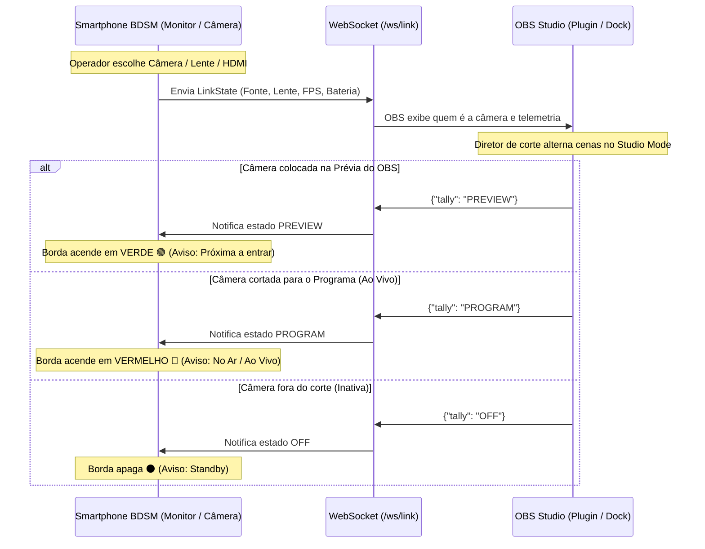

# BDSM - Integração com OBS Studio & Sistema de Tally Light
## Visão Geral, Arquitetura e Especificação Técnica

---

## 1. Visão Geral e Filosofia de Integração

O ecossistema **BDSM (Braga Digital Studio Mobile)** foi desenhado para atuar como uma câmera de estúdio profissional e monitor de retorno de alta performance integrado ao OBS Studio.

### Princípio de Operação:
- **Autoridade Local do Operador:** O operador de câmera no celular mantém controle manual exclusivo de suas configurações de câmera (exposição, foco, lente, LUT e enquadramento). **O OBS não envia comandos para alterar parâmetros da câmera**.
- **Envio de Mídia e Telemetria (Celular ➔ OBS):** O smartphone envia o feed de vídeo/áudio em tempo real via **NDI 6** e publica metadados contínuos via **WebSocket** (qual câmera/lente está ativa, FPS real, nível de bateria, temperatura e status de gravação).
- **Retorno Exclusivo de Tally Light (OBS ➔ Celular):** O OBS envia de volta ao smartphone apenas o estado do corte na transmissão (**PROGRAM / PREVIEW / STANDBY**), acionando os indicadores visuais coloridos no monitor do BDSM.

---

## 2. Arquitetura de Comunicação

O fluxo opera em dois canais desacoplados na rede local (Wi-Fi 6 ou cabo Ethernet/USB-C):



---

## 3. Funcionalidades Detalhadas

### 3.1 Identificação de Câmera em Tempo Real (Celular ➔ OBS)
Pelo canal WebSocket (`ws://<IP>:8080/ws/link`), o smartphone transmite a cada 500ms (2 Hz) ou instantaneamente ao trocar de lente/fonte:
- **Fonte Ativa:** Câmera Traseira (Wide, Ultrawide, Telefoto, Macro), Câmera Frontal ou Placa de Captura HDMI USB (UVC).
- **Parâmetros de Transmissão:** Resolução, FPS real de renderização e nome do stream NDI (`ndiStreamName`).
- **Saúde do Dispositivo:** Porcentagem de bateria, indicação de carregador conectado e status térmico.

#### Exemplo de Payload JSON (BDSM ➔ OBS):
```json
{
  "deviceName": "BDSM-CAM-01 (Galaxy S23 Ultra)",
  "captureSource": "INTERNAL_CAMERA",
  "cameraLens": "Ultrawide (0.5x - 13mm)",
  "fps": 60,
  "batteryLevel": 88,
  "isCharging": true,
  "microphone": "USB Interface (Rode Wireless PRO)",
  "ndiStreamName": "BDSM-STUDIO-CAM1"
}
```

---

### 3.2 Sistema de Tally Light com Retorno Colorido (OBS ➔ Celular)
O OBS Studio atua como o mestre de transmissão, enviando apenas o feedback visual de corte:

| Estado de Tally | Cor no Monitor BDSM | Significado para o Operador / Apresentador |
| :--- | :--- | :--- |
| **PROGRAM (PGM)** | 🔴 **Borda Vermelha** | **NO AR / AO VIVO.** A imagem desta câmera está sendo transmitida ou gravada na saída principal do OBS. O operador não deve alterar enquadramentos bruscos. *(Opcional: LED/Flash traseiro aceso para o apresentador)*. |
| **PREVIEW (PVW)** | 🟢 **Borda Verde (ou Âmbar)** | **PRÉ-SELEÇÃO.** Esta câmera está na tela de Preview do Modo Estúdio do OBS e será a próxima a entrar no ar na próxima transição. |
| **OFF / STANDBY** | ⚫ **Sem Borda Colorida** | **STANDBY.** A câmera está livre, fora do ar e fora da prévia. O operador pode reposicionar tripé, ajustar lentes ou trocar baterias. |

#### Exemplo de Mensagem de Retorno (OBS ➔ BDSM):
```json
{
  "event": "TALLY_UPDATE",
  "state": "PROGRAM",
  "program": true,
  "preview": false
}
```
*(Ou `"state": "PREVIEW"` / `"state": "OFF"`)*.

---

### 3.3 Painel de Monitoramento no OBS (OBS Dock)
No OBS Studio, o operador da mesa de corte tem um painel dedicado (Dock) que lista todos os dispositivos BDSM da rede:
- Cartões com identificação de cada câmera (ex: *CAM 1 - Palco*, *CAM 2 - Plateia*).
- Destaque com as cores do Tally no próprio painel do OBS (🔴 Vermelho para a câmera no ar, 🟢 Verde para a câmera em prévia).
- Leitura instantânea da lente em uso pelo cinegrafista antes de realizar o corte.
- Alerta visual caso a bateria de qualquer celular caia abaixo de 20%.

---

### 3.4 Gerenciamento de Arquivos e Assets (Sem Interromper a Câmera)
- **Upload de LUTs (`.cube`):** O computador pode enviar arquivos de calibração de cor via HTTP POST (`/api/luts/upload`) para a biblioteca do celular.
- **Download das Gravações Master:** Pós-evento, as gravações em 4K H.265 salvas no armazenamento interno ou SSD do celular podem ser baixadas diretamente para a ilha de edição no PC via HTTP GET (`/api/media/{id}/download`).

---

## 4. Formas de Integração no OBS Studio

1. **Dock de Navegador Personalizado (Funcional Imediatamente):**
   - O BDSM já serve um dashboard web responsivo com suporte nativo a WebSocket na rota `http://<IP_DO_CELULAR>:8080/`.
   - Adicionável diretamente em **Docks > Docks de Navegador Personalizados** no OBS.
2. **Plugin Nativo C++ / Qt 6:**
   - Plugin dedicado usando a API `libobs` para automatizar a leitura do estado de Preview/Program do OBS Studio e despachar o JSON de Tally via WebSocket com latência inferior a 5ms.
3. **OBS WebSocket Script (Python / Lua):**
   - Script leve rodando dentro do OBS que monitora os eventos de transição de cena (`CurrentPreviewSceneChanged` e `CurrentProgramSceneChanged`) e envia o pacote de Tally para os celulares correspondentes.
