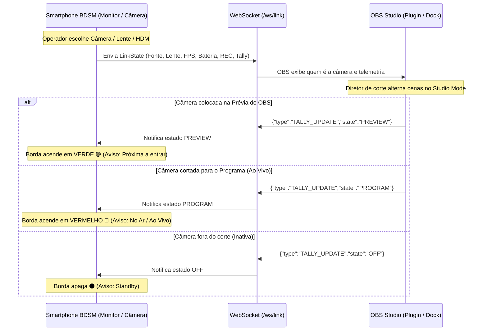
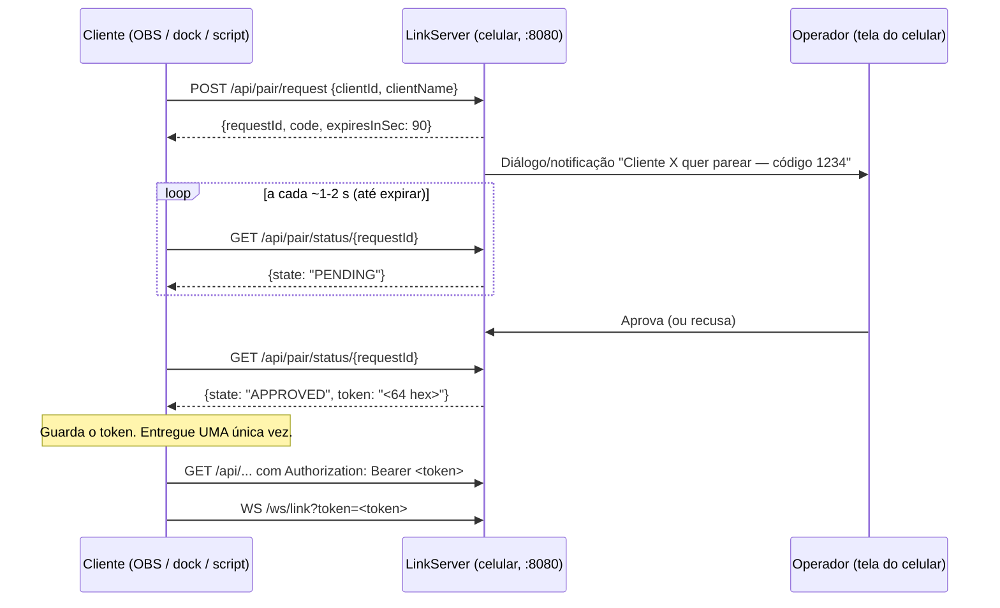

# BDSM - Integração com OBS Studio & Sistema de Tally Light
## Visão Geral, Arquitetura e Especificação Técnica

---

## 1. Visão Geral e Filosofia de Integração

O ecossistema **BDSM (Braga Digital Studio Mobile)** foi desenhado para atuar como uma câmera de estúdio profissional e monitor de retorno de alta performance integrado ao OBS Studio.

### Princípio de Operação:
- **Autoridade Local do Operador:** O operador de câmera no celular mantém controle manual exclusivo de suas configurações de câmera (exposição, foco, lente, LUT e enquadramento). **O OBS não envia comandos para alterar parâmetros da câmera**.
- **Envio de Mídia e Telemetria (Celular ➔ OBS):** O smartphone envia o feed de vídeo/áudio em tempo real via **NDI 6** e publica metadados contínuos via **WebSocket** (qual fonte/lente está ativa, FPS efetivo, nível de bateria e carga, microfone, nome do stream NDI e status de gravação).
- **Retorno Exclusivo de Tally Light (OBS ➔ Celular):** O OBS envia de volta ao smartphone apenas o estado do corte na transmissão (**PROGRAM / PREVIEW / STANDBY**), acionando os indicadores visuais coloridos no monitor do BDSM.

---

> Segurança: todo o tráfego descrito abaixo exige o token de pareamento (ver seção 5).

## 2. Arquitetura de Comunicação

O fluxo opera em dois canais desacoplados na rede local (Wi-Fi 6 ou cabo Ethernet/USB-C):



---

## 3. Funcionalidades Detalhadas

### 3.1 Identificação de Câmera em Tempo Real (Celular ➔ OBS)
Pelo canal WebSocket (`ws://<IP>:8080/ws/link?token=<token>`), o smartphone transmite o `LinkState` a cada 500 ms (2 Hz); trocas de lente/fonte aparecem no próximo ciclo (não há envio instantâneo):
- **Fonte Ativa (`captureSource`):** `"Câmera"` (câmera traseira interna; lentes Wide, Ultrawide, Telefoto, Macro no campo `cameraLens`), `"USB"` (placa de captura HDMI/UVC) ou `"Sony"`. A câmera frontal **não** é suportada.
- **Parâmetros de Transmissão:** FPS efetivo (`fps`), microfone ativo (`microphone`), estado de gravação local (`isRecording`) e nome do stream NDI (`ndiStreamName`, nulo com o NDI desligado). Resolução e status térmico **não** são publicados.
- **Saúde do Dispositivo:** Porcentagem de bateria e indicação de carregador conectado.

#### Exemplo de Payload JSON (BDSM ➔ OBS):
```json
{
  "deviceName": "Galaxy S20 FE",
  "batteryLevel": 88,
  "isCharging": true,
  "captureSource": "Câmera",
  "cameraLens": "Ultrawide",
  "fps": 30,
  "microphone": "Microfone interno",
  "isRecording": false,
  "ndiStreamName": "Galaxy S20 FE",
  "tally": "OFF"
}
```
Todos os campos são sempre enviados (`encodeDefaults = true`); `ndiStreamName` é `null` com o NDI desligado e `tally` é `OFF`, `PREVIEW` ou `PROGRAM`. Os valores de texto vêm do app e podem variar; não os use como enumeração.

> **Nome do NDI na rede:** o OBS/vMix mostram a fonte como `MÁQUINA (nome do sender)`. O BDSM fixa a máquina em `BDSM` (arquivo `ndi-config.v1.json` + `NDI_CONFIG_DIR`) e usa como sender o nome do aparelho (ou o definido pelo usuário). Exemplo: `BDSM (Galaxy S20 FE)`. O prefixo antigo `BDSM - ` não existe mais.

---

### 3.2 Sistema de Tally Light com Retorno Colorido (OBS ➔ Celular)
O OBS Studio atua como o mestre de transmissão, enviando apenas o feedback visual de corte:

| Estado de Tally | Cor no Monitor BDSM | Significado para o Operador / Apresentador |
| :--- | :--- | :--- |
| **PROGRAM (PGM)** | 🔴 **Borda Vermelha** | **NO AR / AO VIVO.** A imagem desta câmera está sendo transmitida ou gravada na saída principal do OBS. O operador não deve alterar enquadramentos bruscos. *(Opcional: LED/Flash traseiro aceso para o apresentador)*. |
| **PREVIEW (PVW)** | 🟢 **Borda Verde (ou Âmbar)** | **PRÉ-SELEÇÃO.** Esta câmera está na tela de Preview do Modo Estúdio do OBS e será a próxima a entrar no ar na próxima transição. |
| **OFF / STANDBY** | ⚫ **Sem Borda Colorida** | **STANDBY.** A câmera está livre, fora do ar e fora da prévia. O operador pode reposicionar tripé, ajustar lentes ou trocar baterias. |

#### Exemplo de Mensagem de Retorno (OBS ➔ BDSM):
```json
{
  "type": "TALLY_UPDATE",
  "state": "PROGRAM"
}
```
*(Ou `"state": "PREVIEW"` / `"state": "OFF"`.)* O campo é **`type`** (não `event`); campos extras são ignorados.

---

### 3.3 Painel de Monitoramento no OBS (OBS Dock)
No OBS Studio, o operador da mesa de corte tem um painel dedicado (Dock) que lista todos os dispositivos BDSM da rede:
- Cartões com identificação de cada câmera (ex: *CAM 1 - Palco*, *CAM 2 - Plateia*).
- Destaque com as cores do Tally no próprio painel do OBS (🔴 Vermelho para a câmera no ar, 🟢 Verde para a câmera em prévia).
- Leitura instantânea da lente em uso pelo cinegrafista antes de realizar o corte.
- Alerta visual caso a bateria de qualquer celular caia abaixo de 20%.

---

### 3.4 Gerenciamento de Arquivos e Assets (Sem Interromper a Câmera)
- **Upload de LUTs (`.cube`):** O computador (com token) pode enviar arquivos de calibração de cor via HTTP POST (`/api/luts/upload`) para a biblioteca do celular.
- **Download das Gravações Master:** Pós-evento, as gravações em 4K H.265 salvas no armazenamento interno ou SSD do celular podem ser baixadas diretamente para a ilha de edição no PC via HTTP GET (`/api/media/{id}/download`).

---

## 4. Formas de Integração no OBS Studio

1. **Dock de Navegador Personalizado (Funcional Imediatamente):**
   - O BDSM já serve um dashboard web responsivo com suporte nativo a WebSocket na rota `http://<IP_DO_CELULAR>:8080/`.
   - Adicionável diretamente em **Docks > Docks de Navegador Personalizados** no OBS.
2. **Plugin Nativo C++ / Qt 6:**
   - Plugin dedicado usando a API `libobs` para automatizar a leitura do estado de Preview/Program do OBS Studio e despachar o JSON de Tally via WebSocket com latência inferior a 5ms.
3. **OBS WebSocket Script (Python / Lua):**
   - Script leve rodando dentro do OBS que monitora os eventos de transição de cena (`CurrentPreviewSceneChanged` e `CurrentProgramSceneChanged`) e envia o pacote de Tally para os celulares correspondentes.

---

## 5. Protocolo de Pareamento e Autenticação (LinkServer)

Desde a introdução do `LinkAuthManager`, **nenhum endpoint do LinkServer entrega dados sem um token**. O token é obtido por um pareamento com **consentimento duplo**: o cliente (plugin OBS, dock ou script) pede, e o operador **aprova no celular**. Os dois lados veem o mesmo código de 4 dígitos, para o operador conferir que está aprovando o cliente certo.

### 5.1 Fluxo



### 5.2 Endpoints de pareamento (sem token)

| Método e rota | Corpo / resposta | Observações |
| :--- | :--- | :--- |
| `POST /api/pair/request` | Entrada: `{"clientId": "...", "clientName": "..."}` (máx. 2 KB). Saída: `{"requestId": "...", "code": "0427", "expiresInSec": 90}` | `clientId` é o identificador estável do cliente (gerado pelo servidor se vazio); `clientName` é sanitizado e limitado a 40 caracteres. Respostas: `400` JSON inválido, `413` corpo grande, `429` se já houver pedido pendente deste endereço, houver 3 pedidos pendentes ou o endereço foi recusado há pouco (cooldown). |
| `GET /api/pair/status/{requestId}` | `{"state": "PENDING" \| "APPROVED" \| "DENIED" \| "EXPIRED", "token"?: "..."}` | Só o mesmo endereço IP que fez o pedido pode consultar (`404` caso contrário). O `token` aparece **uma única vez**, na primeira consulta após `APPROVED`; depois é apagado da memória. O pedido expira em 90 s. |
| `GET /api/discovery/info` | Sem token: `{deviceName, deviceModel, appVersion, authRequired: true}`. Com token válido: informações completas do dispositivo | Única rota `/api` que responde sem token, e só com dados mínimos. |

### 5.3 Autenticação nas demais rotas

- **HTTP:** cabeçalho `Authorization: Bearer <token>`.
- **WebSocket:** `ws://<IP>:8080/ws/link?token=<token>` (o handshake do WebSocket de navegador não permite cabeçalhos customizados; o cabeçalho `Authorization` também é aceito por clientes nativos).
- Sem token ou token inválido: `401 Unauthorized` ("Pairing required"). O cliente deve descartar o token salvo e reiniciar o pareamento.
- O dashboard web (`GET /`) é servido sem token; ele mesmo executa o pareamento e guarda o token em `localStorage` (também aceita `/?token=...`).
- O servidor guarda apenas o **hash SHA-256** do token (em `SharedPreferences` `bdsm_link_auth`), junto de `clientId`, nome e data do pareamento. Um `clientId` tem um único token: parear de novo invalida o anterior.

### 5.4 Endpoints protegidos (exigem token)

| Rota | Função |
| :--- | :--- |
| `WS /ws/link` | Telemetria `LinkState` a 2 Hz (JSON) e mensagens de entrada do cliente (ver 5.5) |
| `GET /api/media` | Lista de gravações |
| `GET /api/media/{id}/download` | Download da gravação com `Range` (`206`, `416` em faixa inválida); só gravações concluídas |
| `GET /api/media/{id}/thumbnail` | Miniatura |
| `DELETE /api/media/{id}` | Exclui a gravação |
| `GET /api/luts` | Lista de LUTs |
| `POST /api/luts/upload` | Envia um `.cube` (validado; limite de tamanho, `413` se exceder) |
| `DELETE /api/luts/{path...}` | Remove uma LUT (caminho validado contra *path traversal*) |

### 5.5 Mensagens do cliente para o celular: `TALLY_UPDATE`

Pelo mesmo WebSocket autenticado, o cliente envia o estado de corte do OBS (formato descrito na seção 3.2; mensagens com mais de 1.024 caracteres ou de tipo diferente são ignoradas, e quadros WebSocket acima de 8 KB fecham a conexão):

```json
{ "type": "TALLY_UPDATE", "state": "PROGRAM" }
```

`state` é `PROGRAM`, `PREVIEW` ou `OFF`. O servidor repassa ao `LinkTelemetry.setTally(...)`, e o HUD desenha a borda vermelha (PROGRAM) ou verde (PREVIEW). Mensagens sem token válido (conexão não autenticada) nunca chegam a este ponto.

### 5.6 Revogação

- O operador vê a lista de **clientes pareados** no celular e pode revogar um (`revoke(clientId)`) ou todos (`revokeAll()`). O hash do token é apagado: a partir daí as requisições com aquele token recebem `401` e o cliente precisa parear de novo.
- Recusar ou deixar expirar um pedido (`DENIED`/`EXPIRED`) aplica um tempo mínimo de espera antes de aceitar outro pedido do mesmo endereço.
- Desligar o LinkServer (interruptor em Configurações ou ação "Desligar" da notificação; o padrão é ligado) encerra todas as conexões; os pareamentos persistem.

### 5.7 Implementação de referência para o plugin OBS

1. Gerar e persistir um `clientId` estável (UUID) por instalação do plugin.
2. Sem token salvo: `POST /api/pair/request`, mostrar `code` ao usuário, consultar `GET /api/pair/status/{id}` a cada 1-2 s até `APPROVED`, `DENIED` ou `EXPIRED`.
3. Guardar o `token` em armazenamento seguro do OBS; abrir o WebSocket com `?token=`.
4. Em `401` (HTTP ou fechamento do WS), apagar o token e voltar ao passo 2.

---

## 6. Script Python de referência (`obs-plugin/`)

> **Movido (2026-10-06):** o script e seus testes agora ficam em `scripts-python/` do repositório [Braga_Link](https://github.com/MauroBragaFilho/Braga_Link) (pasta local `D:\Projetos\Braga Link\scripts-python`). A pasta `obs-plugin/` foi removida deste repositório; trate os caminhos `obs-plugin/...` abaixo como `scripts-python/...` no Braga_Link.

Implementação da opção 3 da seção 4: o script `obs-plugin/bdsm_link_obs.py` (módulo `obspython`) usa apenas a biblioteca padrão do Python, junto do pacote `obs-plugin/bdsm_link/` (rede, pareamento, tally; sem dependência do OBS). Detalhes e solução de problemas em `obs-plugin/README.md`.

**Instalação:** configure o Python (3.12/3.13 recomendado) em *Ferramentas > Scripts > Configurações do Python*; adicione `bdsm_link_obs.py` em *Scripts* (a pasta `bdsm_link/` fica ao lado).

**Uso:** informe o IP do celular (ou use *Procurar na rede (mDNS)*), clique em *Parear*, confira o código de 4 dígitos (também no log do script) e aprove no celular. O tally (`PROGRAM`/`PREVIEW`/`OFF`) é calculado casando a fonte NDI do OBS (`ndi_source`/`ndi_source_name`) com `BDSM (<ndiStreamName>)`, com mapeamento manual opcional; só é enviado quando muda e ao (re)conectar. O token fica em `bdsm_link.json` (DPAPI no Windows) e nunca é logado.

**Status:** testado contra um **celular simulado** (`obs-plugin/tests/fake_phone.py`, que reproduz as rotas, os códigos HTTP e os limites do `LinkModule.kt`/`LinkAuthManager.kt`) e com um `obspython` falso. **Teste no OBS real e em aparelho real: pendentes.** Observação: o app registra `_bdsm._tcp` via NSD sem registros TXT; o script descobre o celular por PTR/SRV/A e o IP do remetente.

---

## 7. Plugin nativo (dock)

> **O plugin nativo mudou de lugar (2026-10-06):** agora vive em repositório próprio, [MauroBragaFilho/Braga_Link](https://github.com/MauroBragaFilho/Braga_Link) (pasta local `D:\Projetos\Braga Link`), com workflow, instalador e README próprios; as tags de release são `vX.Y.Z` lá. A pasta `obs-plugin-native/` e o workflow `obs-plugin-native.yml` foram removidos deste repositório. O texto abaixo descreve o plugin; trate caminhos `obs-plugin-native/...` como a raiz do repositório Braga_Link.

Implementação da opção 2 da seção 4, em C++17/Qt6: o repositório [Braga_Link](https://github.com/MauroBragaFilho/Braga_Link) contém o plugin `bdsm-link` (baseado no `obs-plugintemplate` oficial, alvo OBS **32.2.2** / Qt **6.11.1**), com um **dock acoplável "BDSM Link"** (*Exibir > Painéis (Docks)*) que lista os celulares (conexão, bateria com alerta < 20%, lente, fonte, FPS, REC, nome do NDI, tally Programa/Prévia), botões Parear/Esquecer/Remover/Procurar na rede (mDNS), o seletor da fonte NDI do OBS por dispositivo e a **integração com o DistroAV** (abaixo). Segue o mesmo protocolo das seções 5 e 6 (pareamento com consentimento duplo, `WS /ws/link?token=`, `TALLY_UPDATE` só quando muda, 1008 = revogado, token protegido por DPAPI e nunca logado). O Qt6 do OBS não traz Qt WebSockets, então o WebSocket é implementado em `core/ws_codec` sobre `QTcpSocket`.

### 7.1 Instalação (layout oficial do OBS)

Segue o [guia de plugins do OBS](https://obsproject.com/kb/plugins-guide): `C:\ProgramData\obs-studio\plugins\bdsm-link\bin\64bit\bdsm-link.dll` + `...\bdsm-link\data\locale\*.ini` (o nome da DLL = nome da pasta). O local legado `Program Files\obs-studio\obs-plugins\64bit` está obsoleto e não é usado.

- **Instalador `.exe`** (Inno Setup, `obs-plugin-native/installer/bdsm-link.iss`): padrão `%PROGRAMDATA%` (administrador); **somente ProgramData** (a pasta por usuário `%APPDATA%\obs-studio\plugins` não carregou o plugin no teste real com OBS 32.2.2); migra a cópia antiga; registra o desinstalador; pede para fechar o OBS; página **não bloqueante** de pré-requisitos (OBS Studio, DistroAV, NDI Runtime) com os links oficiais.
- **ZIP** com a pasta `bdsm-link\` no mesmo layout (sem `.pdb`), para extração manual em uma das duas pastas de plugins.
- Gerados pelo GitHub Actions (`.github/workflows/obs-plugin-native.yml`; release em tag `obs-plugin-v*`), que também valida a estrutura do ZIP e faz um teste de fumaça do instalador.
- **Não carregue o script Python e o plugin nativo ao mesmo tempo**: ambos enviam `TALLY_UPDATE`.

### 7.2 Integração com o DistroAV (NDI)

Decisão: o vídeo NDI é recebido pelo **DistroAV** (<https://github.com/DistroAV/DistroAV>, plugin NDI do OBS). O BDSM Link **não embute nem redistribui** o DistroAV nem o NDI (licenças; ver `PUBLICACAO_GOOGLE_PLAY.md`, seção 9): o usuário os instala. Conferido no código do **DistroAV 6.2.1** (tag `6.2.1`, 24/04/2026): fonte de entrada **`ndi_source`**, configuração **`ndi_source_name`** com o nome NDI completo `MAQUINA (nome)` (o celular anuncia `BDSM (<nome do aparelho>)`; fontes da própria máquina aparecem como `LOCALHOST (...)`). O DistroAV exige o **NDI Runtime** (6.3+ segundo o README dele; variável `NDI_RUNTIME_DIR_V6`) e não carrega sem ele.

No dock, por celular: indicador "DistroAV instalado?" (detecção por `obs_enum_source_types`, sem depender de arquivos) e o botão **"Adicionar fonte NDI à cena atual"**, que cria uma fonte `ndi_source` chamada `BDSM - <aparelho>` com `ndi_source_name = BDSM (<ndiStreamName>)` (ou **reutiliza** uma existente cujo nome NDI case, ignorando prefixo da máquina/caixa/espaços, sem duplicar; mostra em quais cenas ela já está) e **registra o mapeamento** celular → fonte para o tally. Sem DistroAV o botão fica desabilitado com explicação e "Como instalar o DistroAV". A decisão (criar/reutilizar) é lógica pura em `core/ndi_link` (testada); a chamada à API do OBS fica em `src/obs_ndi_integration.cpp`.

### 7.3 Tally ("NO AR")

O motor (`core/tally`) decide por celular **PROGRAM > PREVIEW > OFF**, considerando cenas aninhadas, grupos, itens ocultos (não contam) e Modo Estúdio (PREVIEW só nele). **Transição em andamento:** a cena de origem segue PROGRAM até o fim; quem está só no destino fica PREVIEW e vira PROGRAM quando a transição termina. O `TALLY_UPDATE` (`{"type":"TALLY_UPDATE","state":"PROGRAM|PREVIEW|OFF"}`, formato conferido em `core-network/.../LinkModule.kt`; limites 1.024 caracteres/8 KB) só é enviado quando o estado muda, é reenviado após reconexão e `OFF` é enviado ao fechar o OBS ou remover o celular. O dock mostra o estado com **cor e texto** (NO AR / PRÉVIA / FORA) por celular e o total "x celulares NO AR".

### 7.4 Status

A lógica pura (`core/`) foi compilada e passou em **79 testes** locais (g++, `-Wall -Wextra -Wpedantic` sem avisos). As chamadas à API do OBS foram validadas **apenas por sintaxe** contra os headers do OBS 32.2.2. A camada Qt/OBS, o CMake/CI, o instalador (incluindo o Pascal Script de pré-requisitos) e a integração com o DistroAV real **ainda não foram compilados nem testados** (primeiro build previsto no CI; depois, teste no OBS 32 com celular real). Detalhes, riscos e checklist: `obs-plugin-native/README.md`.
