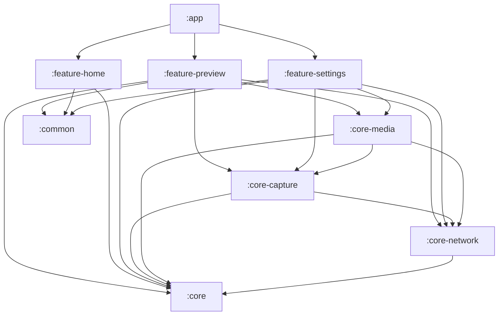

# BDSM - Braga Digital Studio Mobile
> Revisão final de 2026-10-03 contra o código real (estado vivo em `ANALISE_TECNICA_COMPLETA.md`; versão histórica em `ANALISE_TECNICA_INICIAL_2026-10-03.md`). Itens ainda não implementados estão marcados como **planejado**.

## Visão Técnica Geral, Arquitetura e Guia para Análise

---

## 1. Visão do Produto e Propósito

O **Braga Digital Studio Mobile (BDSM)** é um software profissional de monitoramento, gravação e transmissão de vídeo para a plataforma Android.

O objetivo do BDSM é transformar um smartphone Android em um equipamento de alta performance equivalente a monitores de referência de estúdio e campo (como **Atomos Ninja / Shogun**, **Blackmagic Video Assist** e **Feelworld**), aproveitando a flexibilidade e o poder de processamento gráfico dos chipsets modernos e a conectividade Android.

### Pilares Fundamentais:
1. **Monitor Externo Profissional:** Monitoramento em tempo real para câmeras DSLR, Mirrorless, filmadoras e consoles via captura HDMI USB (UVC), além de câmeras internas do smartphone.
2. **Renderização GPU de Baixa Latência:** Pipeline OpenGL ES 3.0 / NDK C++ para processamento visual em tempo real sem sobrecarregar a CPU.
3. **Ferramentas de Exposição e Foco:** Focus Peaking, False Color, Zebra, Scopes (Histograma, Waveform, Vetorscópio), 3D LUTs (.cube), Grids. (De-squeeze anamórfico e Safe Areas são **planejados**; false color hoje tem 3 faixas fixas e a zebra é estática.)
4. **Áudio Desacoplado:** Entradas de áudio independentes do sinal de vídeo, com VU meters em tempo real. Seleção de canal, ganho e monitor por fone são **planejados**.
5. **Gravação de Alta Fidelidade:** Gravação em H.264 / H.265 em **MP4** (bitrates 25/50/100 Mbps; HDR10/HLG opcional). Grava em `getExternalFilesDir` e, ao final, copia para o destino escolhido: pasta (SAF) ou Galeria (`MediaStore`, Android 10+); o destino é um seletor único nas Configurações. MOV, 150 Mbps e gravação direta em SD/SSD são **planejados**.
6. **Transmissão e Conectividade de Estúdio:** NDI 6 nativo para envio de vídeo pela rede local com baixa latência, e servidor HTTP/WebSocket embutido (LinkServer) para controle remoto e sincronização de assets (LUTs, mídias, telemetria).
7. **Filosofia Sem IA no Runtime:** O aplicativo não utiliza SDKs de Inteligência Artificial/Machine Learning em tempo de execução para garantir previsibilidade, determinismo e foco em renderização/latência zero.

---

## 2. Stack Tecnológica

| Camada / Função | Tecnologias Utilizadas |
| :--- | :--- |
| **Linguagem Principal** | Kotlin 2.3.21 / Kotlin Coroutines & Flow |
| **Linguagem Nativa (Core Media)** | C++17, Android NDK (CMake, Clang) |
| **Interface de Usuário (UI)** | Jetpack Compose, Material Design 3, Compose Navigation |
| **Injeção de Dependências** | Google Dagger Hilt 2.58 |
| **Renderização Gráfica** | OpenGL ES 3.0, EGL, GLSL Shaders, SurfaceTexture / OES Textures |
| **Captura de Vídeo** | Android Camera2 API, USB Video Class (UVC / V4L2) |
| **Codificação de Vídeo/Áudio** | Android MediaCodec (H.264 / HEVC / AAC), MediaMuxer |
| **Streaming / Protocolos** | NDI 6 SDK (libndi C++), Ktor Server (somente engine Netty: HTTP, WebSockets, PartialContent), mDNS/NSD, BSP (H.264 sobre RTP/UDP, em desenvolvimento) |
| **Persistência de Dados** | Room Database (SQLite), DataStore Preferences |
| **Serialização** | Kotlinx Serialization (JSON) |
| **Build System** | Gradle Kotlin DSL (`build.gradle.kts`), Android Gradle Plugin (AGP 8.13.2), Gradle 8.14.5, KSP2, convention plugins em `build-logic`, catálogo `gradle/libs.versions.toml`; compileSdk 36, targetSdk 35, minSdk 26; detekt + ktlint |

---

## 3. Arquitetura do Sistema e Modularização

O projeto adota princípios de **Clean Architecture**, **MVVM (Model-View-ViewModel)** e **Modularização por Camadas/Features**:



> `common` e `core` não dependem de nenhum módulo do projeto. `core-network` e `core-capture` são `implementation` (não `api`), por isso `core-media`, `feature-preview` e `feature-settings` declaram `core-network` por conta própria (`LinkTelemetry`, tally, Link). `SonyCameraStatus` mora em `:core`.

### Detalhamento dos Módulos:

### 3.1 `:core-media` (Coração Gráfico e Multimídia)
- **Engine Nativa C++ (`GlesEngine.cpp`, `GlesEngine.h`):**
  - Gerenciamento de contexto EGL e Surfaces nativas (`ANativeWindow`).
  - Textura OES externa para captura de vídeo em zero-copy.
  - Shaders customizados GLSL ES 3.0, embutidos como strings no `GlesEngine.cpp` (um passe por saída, nesta ordem: preview, gravação, BSP e NDI por último, pulado sem receptor; REC/BSP/NDI saem limpos, overlays só no preview; mais o passe de scopes):
    - **Focus Peaking:** Detecção de arestas por matriz Laplaciana / filtro Sobel em tempo real, com thresholds ajustáveis e cores configuráveis (Vermelho, Verde, Azul, Amarelo, Branco).
    - **False Color:** Mapeamento de luminância IRE (0 a 100) em cores falsas para calibração de exposição e tons de pele.
    - **Zebra Pattern:** Linhas diagonais estáticas ou animadas com limiar de IRE customizável para identificar superexposição.
    - **3D LUT (Look-Up Table):** Textura 3D (`sampler3D`) carregando cubos `.cube` (17, 33 e 65 pontos) com interpolação trilinear por hardware (ajuste de meio texel, `RGBA16F`) e controle de intensidade (`uLutMix`); a LUT é aplicada só no monitor.
    - **Transformações:** Rotação, correção de espelhamento e Pan & Zoom. (De-squeeze anamórfico: **planejado**.)
- **NDI Nativo (`NdiEngine.cpp`, `libndi.so`):**
  - Integração C++ com o NDI 6 SDK.
  - Envio de frames RGBA para a rede local: um `ImageReader` RGBA_8888 recebe o passe limpo e o frame é copiado (`memcpy`) para o NDI. O PBO é usado apenas pelos scopes.
- **MediaGraph (`MediaGraph.kt`):**
  - Dono único da sessão de captura (câmera, GL, REC/NDI/BSP, áudio); a tela de Preview é só um consumidor opcional, e o `CaptureForegroundService` (`camera|microphone`) mantém REC/NDI/BSP vivos com a tela apagada ou na Home.
  - Orquestrador central de mídia. Garante que qualquer entrada de vídeo (`CaptureDevice`) seja roteada concorrentemente para a preview local, para o gravador (`RecordManager`, também em `core-media`), para o transmissor NDI (`NdiManager`) e para o BSP (`BspManager`).

### 3.2 `:core-capture` (Captura de Vídeo e Áudio)
> A gravação **não** está neste módulo: o `RecordManager` vive em `:core-media` e o áudio vem do `AudioCaptureService` daqui. A pasta `corecapture/recording/` está vazia.
- **`CaptureDevice` (Interface Abstrata):**
  - Permite plugar qualquer fonte de vídeo sem mudar a arquitetura.
- **`Camera2Device.kt`:**
  - Controle manual absoluto da câmera do smartphone: ISO manual, Shutter Speed (tempo de exposição), Balanço de Branco (temperatura Kelvin), Foco manual e seleção de lentes (Ultra Wide, Wide, Telefoto, Macro).
- **`UvcCaptureDevice.kt`:**
  - Gerenciamento de placas de captura HDMI USB / Webcams via protocolo USB Video Class e UVC nativo.
- **`SonyRemoteCaptureDevice.kt`, `CameraDiscoveryEngine.kt`, `AudioCaptureService.kt`:**
  - Fonte Sony por Wi-Fi (liveview), descoberta de câmeras internas/UVC e captura de áudio PCM que alimenta o `RecordManager` e o NDI.

### 3.3 `:core-network` (BDSM Link & Sincronização)
- **`LinkServer.kt`:**
  - Servidor Ktor/Netty embutido, expondo APIs REST e WebSockets para a rede local (plugin OBS, painel web). Todas as rotas `/api/**` (exceto pareamento e `discovery/info` mínimo) e `/ws/**` exigem token obtido por pareamento com aprovação no celular (`auth/LinkAuthManager`; ver `BDSM_PLUGIN_OBS.md` §5). Não implementa NDI. Roda em foreground service (`service/LinkServerService`).
- **`LutLibraryService.kt` / `MediaLibraryService.kt` / `DeviceInfoService.kt`:**
  - Sincronização bidirecional de arquivos `.cube` (LUTs).
  - Listagem, download e streaming de gravações realizadas.
  - Telemetria de bateria, temperatura da bateria e espaço livre no armazenamento (CPU/GPU não são medidos).
- **`DiscoveryService.kt`:** Anúncio do serviço via mDNS/NSD (Network Service Discovery).

### 3.4 `:core` e `:common` (Modelos, Banco e Base)
- **Room Database (`BdsmDatabase.kt`):**
  - `RecordingDao` / `RecordingEntity`: Metadados das gravações (resolução, bitrate, fps, duração, codec, thumbnail).
  - `LutDao` / `LutEntity`: Biblioteca de LUTs instaladas, metadados e estado ativo.
- **Hardware Telemetry (`HardwareMonitorService.kt`):**
  - Monitoramento de bateria, temperatura da bateria, armazenamento e Wi-Fi (CPU, memória e FPS foram removidos).
- **Video Scopes Logic (`VideoScopes.kt`):**
  - Estruturas de dados para Histogramas (RGB/Luma), Waveform e Vetorscópio.

### 3.5 `:feature-preview` (Interface do Monitor)
- **`PreviewScreen.kt` & HUD (`PreviewHud.kt` + `Hud*.kt`):**
  - O HUD (`CameraHUDOverlay`) foi dividido por região em `HudTopBars`, `HudToolsCluster`, `HudBottomBar`, `HudRecControls`, `HudManualControls`, `HudDialPopovers`, `HudMenus`, `HudAudioMeters` e `HudStatusOverlays`, com `HudTheme`, `HudFormatters` e `HudLogic` compartilhados; `PreviewHud.kt` só compõe os blocos.
  - Interface do monitor de câmera com controles rápidos em overlay.
  - Barra de ferramentas profissionais (Peaking, False Color, Zebra, LUT, Grids, Aspect Ratios, Scopes).
  - Gestos: toque simples alterna o HUD; zoom e pan por gestos. Tap-to-focus é **planejado**.
- **Scopes Components (`HistogramScope.kt`, `WaveformScope.kt`, `VectorscopeScope.kt`, `ScopesOverlay.kt`):**
  - Desenho vetorial de histogramas e osciloscópios sobre a imagem.

### 3.6 `:feature-home` e `:feature-settings`
- Galeria de gravações (em `feature-settings`) com ações em lote e exportação; o player é externo. `feature-home` contém apenas Splash e Home.
- Gerenciamento de LUTs (importação `.cube`, preview, remoção).
- Configurações de NDI (nome do stream, resolução, framerate).
- Diagnósticos de sistema e parâmetros de captura.

---

## 4. O Fluxo de Dados de Vídeo (Pipeline de Baixa Latência)

```
[ Camera2 / UVC HDMI Capture ]
             │
             ▼ (SurfaceTexture OES)
     ┌───────────────┐
     │  GlesEngine   │ (C++ OpenGL ES 3.0)
     └───────┬───────┘
             │
 ┌───────────┼──────────────────────────┐
 │ (Render)  │ (glReadPixels / PBO)     │ (Surface Input)
 ▼           ▼                          ▼
[ EGL Surface ]  [ NdiEngine / libndi.so ]   [ MediaCodec Encoder ]
(Tela/HUD)       (Transmissão NDI Rede)     (Gravação MP4/MOV)
```

1. A entrada de vídeo gera frames diretamente em uma textura OES externa gerenciada pelo `GlesEngine`.
2. Os shaders aplicam em tempo real (em 1 único passe ou passes otimizados) transformações de matriz, de-squeeze, 3D LUT, Focus Peaking, False Color e Zebras.
3. O frame processado é apresentado na Surface da tela do dispositivo em 60fps constantes.
4. Concorrentemente, se a transmissão NDI estiver ativa, os buffers são enviados ao `NdiEngine` via NDK.
5. Se a gravação estiver ativa, o `RecordingEngine` consome os quadros no codificador de hardware (`MediaCodec`) e grava via `MediaMuxer`.

---

## 5. Pontos Críticos para Análise do Claude e Próximas Melhorias

Ao analisar o código para propor correções e melhorias, os seguintes pontos prioritários devem ser avaliados:

### 5.1 Melhorias na Interface do Monitor (`:feature-preview`)
1. **Ergonomia e Design de Monitor Profissional:**
   - Redesenhar o HUD para seguir a usabilidade dos monitores Atomos / SmallHD / Blackmagic: botões minimalistas com feedback tátil, barras laterais colapsáveis, acesso rápido a ferramentas essenciais (Peaking, Zebra, False Color, LUT, Scopes) sem poluir a área do vídeo.
   - Sistema de Tally Light integrado: Borda Vermelha pulsante (PROGRAM / No Ar), Borda Verde (PREVIEW / Prévia de corte no OBS) e Standby (Sem borda), acionado via WebSocket com latência zero.
   - Indicador de Gravação Local destacado no topo e no timecode.
   - VU meters estéreo responsivos no HUD com indicadores de pico e clipping (-inf a 0 dB).
   - Timecode em tempo real (HH:MM:SS:FF) com contador de tempo restante de gravação baseado no espaço em disco.
2. **Interação por Gestos:**
   - Aprimorar o Pinch-to-Zoom e Double Tap para zoom 100% (Pixel-to-Pixel) e 200% com indicador de viewport miniatura (quadro de navegação).
   - Sliders de ajuste rápido de Peaking Sensitivity e Zebra Threshold diretamente na tela com toque contínuo.

### 5.2 Scopes de Vídeo em Tempo Real
1. **Otimização de Performance:**
   - Garantir que o cálculo dos Scopes (Histograma, Waveform e Vetorscópio) seja executado via GPU (Compute Shader ou amostragem reduzida em FBO/Render-to-Texture) para não provocar gargalos de CPU na thread principal.
   - Opções de exibição de Scopes: Luma Waveform, RGB Parade, Histograma RGB e Vetorscópio com escala IRE.

### 5.3 Pipeline de Gravação e Áudio
1. **Formato MOV e Codecs Profissionais:**
   - Suporte nativo à gravação em container `.mov` além de `.mp4`.
   - Suporte a H.265 (HEVC) com bitrates altos configuráveis (50 Mbps a 150 Mbps para 4K).
2. **Gerenciamento de Áudio:**
   - Suporte robusto a interfaces de áudio USB externas (Focusrite, Rode, Boya, etc.), permitindo selecionar canal L/R, ganho e monitoramento com fone de ouvido em baixa latência (OpenSL ES / AAudio).

### 5.4 Estabilidade e Detecção UVC (Placas de Captura HDMI)
1. **Hotplug de Dispositivos USB:**
   - Garantir reconexão automática sem crash quando uma placa de captura HDMI USB for conectada ou desconectada.
   - Suporte a seleção de formatos MJPEG e YUY2 / NV12 negociados com a placa UVC.

---

## 6. Convenções e Regras Obrigatórias para Desenvolvimento

1. **Nunca adicionar dependências de IA/ML ao app** (OpenAI, Gemini, TensorFlow Lite, ML Kit, etc.). O app deve permanecer 100% nativo, determinístico e de alta performance.
2. **Manter o isolamento do `MediaGraph`:** Telas e ViewModels não devem se comunicar diretamente com APIs de baixo nível (Camera2, UVC, OpenGL, NDI). Toda a orquestração passa pelo `MediaGraph` e seus repositories/services.
3. **Respeitar a Clean Architecture e Injeção com Hilt:** StateFlows expostos para a UI, UseCases e Repositories bem definidos.
4. **Foco em Latência Mínima:** Evitar alocações de memória ou leituras síncronas bloqueantes dentro do loop de renderização da GPU.
