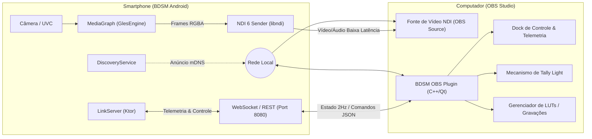

# BDSM - Plugin para OBS Studio
## Visão Geral, Arquitetura e Especificação Técnica

---

## 1. Visão Geral e Conceito

O ecossistema **BDSM (Braga Digital Studio Mobile)** não se limita a ser um monitor de campo isolado: ele foi concebido para atuar como uma **câmera de estúdio profissional e monitor de retorno integrado ao ecossistema de produção ao vivo**.

O **Plugin do BDSM para OBS Studio** tem como objetivo conectar perfeitamente um ou múltiplos smartphones Android rodando o BDSM ao OBS Studio em computadores (Windows, macOS e Linux), permitindo:
- Recepção de vídeo e áudio sem fio em altíssima qualidade e baixa latência via **NDI 6**.
- **Dock de Telemetria e Monitoramento Centralizado** dentro do OBS (nível de bateria, temperatura do aparelho, FPS real, lente ativa, status de carregamento).
- **Controle Remoto Total da Câmera** (ISO, Shutter, Balanço de Branco, Foco, Lentes, LUTs ativas) diretamente da interface do OBS sem precisar tocar no celular.
- **Tally Light Bidirecional** (quando a cena com o celular entra em Programa no OBS, a borda do monitor BDSM acende em vermelho).
- **Sincronização de Gravação e Assets** (disparo remoto de gravação local de alta fidelidade e envio de arquivos `.cube` de LUTs para todos os celulares da rede).

---

## 2. Arquitetura de Comunicação

O ecossistema opera em dois canais de comunicação paralelos e desacoplados na rede local (Wi-Fi 6 / Ethernet USB-C):

---

## 3. Principais Funcionalidades do Plugin OBS

### 3.1 Fonte de Vídeo Inteligente (`BDSM Source`)
- **Descoberta Automática (Zero-Config):** O plugin escuta a rede via mDNS/Bonjour e lista automaticamente todos os dispositivos BDSM disponíveis em um menu suspenso no OBS.
- **Auto-Reconexão com Buffer de Segurança:** Em caso de oscilação momentânea de Wi-Fi, o plugin mantém o último frame ou exibe um cartão de standby sem travar o compositor do OBS, reconectando instantaneamente.
- **Áudio Desacoplado:** Recepção do áudio mixado no smartphone (ex: microfone USB conectado ao celular) sincronizado com timestamp de hardware.

---

### 3.2 Painel de Telemetria e Monitoramento (OBS Dock)
O plugin adiciona um painel acoplável (Dock) no OBS que exibe em tempo real o estado de cada dispositivo conectado:

| Métrica / Status | Descrição |
| :--- | :--- |
| **Bateria & Carregamento** | Nível percentual da bateria com alerta visual caso caia abaixo de 20%, e indicador de carga rápida/alimentação externa. |
| **Temperatura & Saúde Térmica** | Monitoramento da temperatura da CPU/Bateria para prevenir *thermal throttling* durante transmissões longas. |
| **Taxa de Quadros (FPS Real)** | Contador de FPS real de renderização e envio para checagem de fluidez. |
| **Fonte & Lente Ativa** | Informa se a fonte é Câmera Traseira (Wide, Ultrawide, Tele) ou Placa de Captura HDMI USB (UVC). |
| **Microfone Conectado** | Identificação do dispositivo de áudio em uso (Microfone Interno, Interface USB, Headset). |
| **Espaço de Armazenamento** | Espaço livre restante no smartphone ou SSD externo conectado ao USB-C. |

---

### 3.3 Controle Remoto de Câmera (Camera Remote Control)
Permite ao operador de estúdio ajustar parâmetros fotográficos do smartphone diretamente pelo OBS:
- **Exposição:** Controle manual de ISO (50 a 6400+) e Shutter Speed (1/24s a 1/8000s).
- **Temperatura de Cor:** Balanço de branco manual em Kelvin (2000K a 10000K) e Tint (Verde/Magenta).
- **Foco Remoto:** Foco manual por slider ou Autofocus contínuo com seleção de ponto de foco.
- **Zoom & Lentes:** Alternância entre lentes (0.5x, 1x, 3x, 5x, 10x) e zoom digital suave.
- **Aplicação de LUTs:** Selecionar e trocar a 3D LUT ativa no smartphone remotamente.

---

### 3.4 Sistema de Tally Light Bidirecional
- **Preview (Verde / Âmbar):** Quando a câmera do smartphone estiver na cena de *Preview* do OBS Studio, uma indicação visual sutil aparece no smartphone.
- **Program (Vermelho):** Quando a cena contendo o smartphone vai para *Program* (ao vivo na transmissão ou gravação principal), o monitor BDSM no smartphone exibe uma borda vermelha pulsante (Tally Border) e acende o LED/Flash traseiro (opcional) para avisar o apresentador.

---

### 3.5 Sincronizador de LUTs e Biblioteca de Mídia (Media Sync)
- **Distribuição de LUTs em Lote:** O operador pode arrastar arquivos `.cube` para o plugin no OBS e enviá-los simultaneamente para todos os smartphones na rede via endpoint `/api/luts/upload`.
- **Download Remoto de Gravações:** Após o término de uma gravação multicâmera, o plugin permite baixar os arquivos de vídeo em qualidade master (gravados localmente em H.265 pelo smartphone) diretamente para o disco rígido da ilha de edição no PC via `/api/media/{id}/download`.

---

## 4. Implementação Técnica

### 4.1 Fase 1 (Já Suportada Nativamente): OBS Custom Browser Dock
Graças ao `LinkServer.kt` embutido no BDSM, qualquer versão atual do OBS Studio pode se conectar ao dispositivo sem instalar plugins binários adicionais:
1. No OBS Studio, acessar **Docks > Docks de Navegador Personalizados**.
2. Definir a URL como `http://<IP_DO_CELULAR>:8080/`.
3. O OBS carrega o painel web responsivo dark mode integrado com comunicação WebSocket em tempo real.

### 4.2 Fase 2: Plugin Nativo em C++ / Qt 6
- **Estrutura do Projeto:**
  - Baseado na API oficial `libobs` (OBS Studio Plugin SDK).
  - Interface construída com **Qt 6 / C++20**.
  - Biblioteca HTTP/WebSocket assíncrona (`ixwebsocket` ou `Boost.Asio`).
  - Integração com `libndi` para captura direta de vídeo sem depender do plugin OBS-NDI genérico.

### 4.3 Endpoints Consumidos no BDSM LinkServer:
- `ws://<ip>:8080/ws/link`: Stream WebSocket a 2Hz com o JSON de telemetria em tempo real (`LinkState`).
- `GET /api/discovery/info`: Metadados do dispositivo (modelo, versão, bateria, armazenamento).
- `GET /api/media`: Lista de gravações salvas com metadados e miniaturas.
- `GET /api/media/{id}/download`: Download do arquivo de vídeo original.
- `GET /api/luts` e `POST /api/luts/upload`: Listagem e envio de LUTs 3D `.cube`.

---

## 5. Resumo de Benefícios para Produções Audiovisuais

1. **Custo-Benefício Extremo:** Substitui setups de estúdio de milhares de dólares por smartphones conectados via rede sem fio ou cabo USB.
2. **Confiabilidade:** O operador no OBS tem visibilidade total da saúde do dispositivo (temperatura e bateria), evitando desligamentos surpresa durante eventos ao vivo.
3. **Agilidade no Fluxo de Trabalho:** Ajuste fino de iluminação, foco e cor de todas as câmeras a partir de uma única tela no computador de transmissão.
